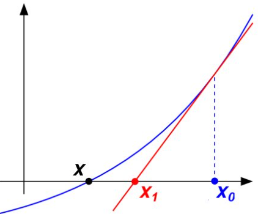
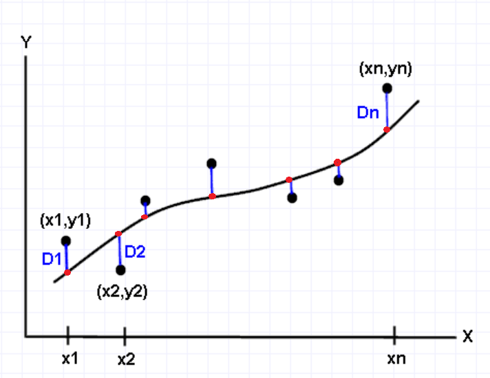

<style type="text/css">

/* Table of content - navigation */
div#TOC li {
    list-style:none;
    background-color:lightgray;
    background-image:none;
    background-repeat:none;
    background-position:0;
    font-family: Arial, Helvetica, sans-serif;
    color: #780c0c;
}


/* Title fonts */
h1.title {
  font-size: 24px;
  color: darkblue;
  text-align: center;
  font-family: Arial, Helvetica, sans-serif;
  font-variant-caps: normal;
}
h4.author { 
  font-size: 18px;
  font-family: Arial, Helvetica, sans-serif;
  color: navy;
  text-align: center;
}
h4.date { 
  font-size: 18px;
  font-family: Arial, Helvetica, sans-serif;
  color: darkblue;
  text-align: center;
}

/* Section headers */
h1 {
    font-size: 22px;
    font-family: "Times New Roman", Times, serif;
    color: darkred;
    text-align: left;
}

h2 {
    font-size: 18px;
    font-family: "Times New Roman", Times, serif;
    color: navy;
    text-align: left;
}

h3 { 
    font-size: 15px;
    font-family: "Times New Roman", Times, serif;
    color: darkred;
    text-align: left;
}

h4 {
    font-size: 18px;
    font-family: "Times New Roman", Times, serif;
    color: darkred;
    text-align: left;
}

/* Decoration of hyperlinks  */

/* unvisited link */
a:link {
  color: green;
}

/* visited link */
a:visited {
  color: purple;
}

/* mouse over link */
a:hover {
  color: red;
}

/* selected link */
a:active {
  color: yellow;
}
</style>


```{r setup, include=FALSE}
options(repos = list(CRAN="http://cran.rstudio.com/"))
# code chunk specifies whether the R code, warnings, and output 
# will be included in the output files.
if (!require("knitr")) {
   install.packages("knitr")
   library(knitr)
}

knitr::opts_chunk$set(echo = TRUE,       
                      warning = FALSE,   
                      result = TRUE,   
                      message = FALSE,
                      comment = NA)
```


# Introduction

Once a distribution is selected to approximate the population, we then take a random sample to estimate the population parameters to determine the population. Different methods can be used for this purpose. We focus on two of the commonly use ones: the method of moments (MM) and the maximum likelihood method. We still use univariate continuous distribution as an example to illustrate these methods.

The general set-up of both methods is based on a random sample from a population $F(x, \theta)$, denoted by $\{x_1, x_2, \cdots, x_n \}$, where $F()$ is the know CDF,  $\theta$ is a vector of parameters, and $n$ is the sample size. The parameter $\theta$ will be estimated from the data set of the random sample.

Before discussing estimation methods, we introduce a few technical terms that will be used throughout this note and subsequent notes.

**Identically Independently Distributed (I.I.D) Samples** - The sample data taken independently from the same population. A iid sample is required for most statistical inferences. All estimation methods in this note are based on iid samples.

**Estimate** - An **estimate** of a parameter is the numerical value calculated from a data set. For example, if $\{ 1, 2, 3, 2, 2, 1\}$ is a random sample taken from a population $f(x)$, then the estimate of the population mean is $(1+2+3+3+2+1)/6 = 2$. $2$ is numeric value.

**Estimator** - An estimator of a parameter is a formula that tells how to calculate the estimated values of the parameter from a given sample. For example, assume you have a IID random sample $\{X_1, X_2, \cdots, X_{50} \}$ from a population $f(x)$, then
$$
\bar{X} =\frac{\sum_{i=1}^{50}X_i}{50}
$$

is an estimator of the population mean since it gives only the formula (not a specific numerical value). 

Upper case $X_i$'s are `the names` of actual observed data values to be randomly and independently taken from population $f(x)$. This is why we also call $\{X_1, X_2, \cdots, X_{50} \}$ a set of IID random variables that have the same distribution $f(x)$. The lower case $\{ x_1, x_2, \cdots, x_{50} \}$ is a set of `observed data values` from $f(x)$. In many cases, we simply use lowercase notation to represent the set of random variables and a set of realizations of the random variables (i.e., the data set). 


# Method of Moments

The general idea of this method is to calculate a few moments and approximate the theoretical moments with their corresponding empirical moments (also called sample moments). Then solve the system of nonlinear (only occasionally linear) equations. This process involves Newton's methods in Calc. III (or Numerical Analysis, or Optimization Methods). 

The number of theoretical moments to be calculated is at least equal to the number of parameters.

## Normal Distribution

As an example, we use the normal distribution. Since the estimation does not involve nonlinear estimation, we can find the closed form of the estimated parameters.

Let $\{x_1, x_2, \cdots, x_n \}$ be a ransom sample taken from normal distribution $N(\mu, \sigma^2)$, where $\mu$and $\sigma^2$ are population mean and variance. Note that the first and the second moments of the normal distribution are given respectively by

$$
E[X] = \int_{-\infty}^{\infty} x\times\frac{1}{\sqrt{2\pi}\sigma} e^{-\frac{(x-\mu)^2}{2\sigma^2}}dx=\cdots=\mu
$$
and

$$
E[X^2] = \int_{-\infty}^{\infty} x^2\times\frac{1}{\sqrt{2\pi}\sigma} e^{-\frac{(x-\mu)^2}{2\sigma^2}}dx=\cdots=\sigma^2 + \mu^2
$$
On the other hand, the first and second sample moments are given respectively by

$$
\frac{\sum_{i=1}^n x_i}{n} \ \ \text{ and } \ \ \frac{\sum_{i=1}^n x_i^2}{n}.
$$

The method of moment estimator (MME) of the parameters $\mu$ and $\sigma^2$ is the solution to the following system of equations

$$
\begin{cases} 
\mu = \frac{\sum_{i=1}^n x_i}{n} ,    \\ 
\sigma^2 + \mu^2 = \frac{\sum_{i=1}^n x_i^2}{n}. 
\end{cases} 
$$

Solving the above equation, we have the MME of $\mu$ and $\sigma^2$, denoted by $\bar{\mu}$ and $\bar{\sigma}^2$, in the following

$$
\begin{cases} 
\bar{\mu} = \frac{\sum_{i=1}^n x_i}{n} ,    \\ 
\bar{\sigma}^2 = \frac{\sum_{i=1}^n x_i^2}{n} - \left( \frac{\sum_{i=1}^n x_i}{n} \right)^2. 
\end{cases} 
$$

This completes the estimation of the unknown population parameter from a random data set taken from the population.

The question is how good this estimation is. We will open a separate section to address this question,


## Expoential Distribution

Consider one-parameter exponential distribution with density $f(x) = \lambda e^{-\lambda x}$ for $x > 0$. Assume $\{ x_1, x_2, \cdots, x_n\}$ to be a set of random sample from the exponential distribution (i.e,  population). To find the moment estimator, we need to find only the first moment (since there is only one parameter) in the following

$$
E[X] = \int_0^{\infty} x \times \lambda e^{-\lambda x}dx = \cdots = \frac{1}{\lambda}.
$$

Therefore, the MME of $\lambda$ is the solution to

$$
\frac{1}{\lambda} = \frac{\sum_{i=1}^n x_i}{n} = \bar{x}.
$$

That is, the MME of $\lambda$ is given by

$$
\bar{\lambda} = \frac{1}{\bar{x}}.
$$

## Weibull Distribution

The MMEs of parameters of both normal and exponential distributions have closed forms. This subsection explores the MME of Weibull distribution.

Assume $\{ x_1, x_2, \cdots, z_n \}$ is a random sample taken from the two-parameter Weibull distribution with density function $f(x) = \alpha \beta x^{\beta -1} e^{-\alpha x^\beta}$, where $x >0$.

Note that the first and second moments are calculated in the following:

$$
E[X] = \int_0^\infty x \times \alpha \beta x^{\beta -1} e^{-\alpha x^\beta} dx \\ = -\int_0^\infty x d e^{-\alpha x^\beta} = \int_0^\infty e^{-\alpha x^\beta}dx.
$$
Let $y=x^\beta$, then $x = y^{1/\beta}$. Therefore, $dx = \frac{1}{\beta} y^{1/\beta-1}dy$. By substitution, we have

$$
E[X] = \int_0^\infty e^{-\alpha x^\beta}dx = \int_0^\infty e^{-\alpha y} \frac{1}{\beta} y^{1/\beta-1}dy\\ = \frac{\alpha^{-1/\beta}}{\beta}\int_0^\infty u^{1/\beta-1} e^{-u} du = \frac{\alpha^{-1/\beta}}{\beta} \Gamma(1/\beta).
$$

To calculate the second moment, we will do substitution first to simplify the calculation.

$$
E[X^2] = \int_0^\infty x^2 \times \alpha \beta x^{\beta -1} e^{-\alpha x^\beta} dx \\ = \int_0^\infty x \times \alpha \beta x^{\beta } e^{-\alpha x^\beta} dx
$$

Consider substitution $y = \alpha x^\beta$, i.e.,
$$
x = \left( \frac{y}{\alpha} \right)^{1/\beta}
$$

Taking differential forms of both sides of the above equation, we have 

$$
dx = \frac{1}{\alpha \beta} \left( \frac{y}{\alpha}\right)^{1/\beta-1}dy
$$

We re-express the above second moment as

$$
E[X^2] = \int_0^\infty x \times \alpha \beta x^{\beta } e^{-\alpha x^\beta} dx \\ = \int_0^\infty \left( \frac{y}{\alpha} \right)^{1/\beta} \beta y  \frac{1}{\alpha \beta} \left( \frac{y}{\alpha}\right)^{1/\beta-1} e^{-y}dy \\ = \alpha^{-2/\beta}\int_0^\infty y^{2/\beta} e^{-y} dy = \alpha^{-2/\beta } \Gamma(2/\beta +1).
$$

The MME of $\alpha$ and $\beta$, denoted by $\bar{\alpha}$ and $\bar{\beta}$, is the solution to the following system of equations

$$
\begin{cases} 
\frac{\alpha^{-1/\beta}}{\beta} \Gamma(1/\beta) = \frac{\sum_{i=1}^n x_i}{n} ,    \\ 
\alpha^{-2/\beta } \Gamma(2/\beta +1) = \frac{\sum_{i=1}^n x_i^2}{n}. 
\end{cases} 
$$

There is no closed form of the solution to the above equation, therefore, we need numerical methods to solve the above nonlinear equations.

**Note**:  Don't be frustrated with this nonlinear system, this first research work will focus on optimizing the likelihood function to be introduced in the next section. We neeNewton'son method to maximize the likelihood function of parameters.


# Maximum Likelihood Estimation (MLE)

Maximumum likelihood estimation (MLE) is one of the most commonly used methods in statistics and related areas. It was developed a century ago by French mathematician R. A. Fisher. 

The logic of the **Maximum Likelihood Estimation (MLE)** is that, *under the assumed statistical model (i.e., parametric distributions and models such as regression models), the observed data is most probable* - This means that the **true values** of the parameters in the model maximize the likelihood function (of parameters). 

The above logic outlines the steps for *estimating the true values* of corresponding parameters in the model by maximizing the likelihood function to approximate the true values of the unknown parameters - **Finding MLE is essentially a numerical optimization problem**.   


 

## Some Technical Terms

We need to know several important terms in the likelihood method.

**Likelihood** - the term *likelihood* is probability. For discretcasesse, $P(X=x)$ represents the probability of observing $X= x$. In the continuous cases, instead of finding the likelihood of observing $X = x$ using $P(X = x)$ (which is 0), we use $P(x\le X \le x +\Delta x) = \int_x^{x+\Delta x}f(x) dx$, that is, the likelihood is proportional to the density for the continuous distribution. **The likelihood of observing $X = x_i$ is either the probability distribution function (like binomial or Poisson distribution) or the density function evaluated at $x_i$**.

**The likelihood of observing two values from the same distribution** - Mathematically, this likelihood is $P(X_1=x_1 \cap X_2 = x_2)$. That is, this is a joint probability! If the two values are observed independently, then $P(X_1 = x_1 \cap X_2 = x_2) = P(X_1 = x_1)\times P(X_2 = x_2) = f_1(x_1)\times f_2(x_2).$ Furthermore, if the two values are independently observed from the same distribution $f(x)$ (i.e, i.i.d sample), then the likelihood is $P(X_1 = x_1 \cap X_2 = x_2) = f(x_1)\times f(x_2) = \prod_{i=1}^2 f(x_i)$. 


In general, **the likelihood of observing an i.i.d. sample** data set $\{ x_1, x_2, \cdots, x_n\}$  from $f(x)$ is given by

$$
 L = P\left( \bigcap_{i=1}^n [X_i = x_i] \right) = \prod_{i}^n P(X_i=x_i) = \prod_{i=1}^n f(x_i).
$$

**Likelihood of observing an iid sample is a function of parameters** - this should be obvious because the data values are observed and the parameters in underlying density are unknown. Therefore, a likelihood function is typically written as

$$
L(\theta) = \prod_{i=1}^n f(x_i; \theta).
$$

Some specific examples will be given in the subsequent sections.


## Frame Work of MLE

The general framework of MLE was developed in the 1930s. The likelihood principle is that the estimated parameters should maximize the probability of observing the sample data set. In other words, the MLE of parameters $\theta$, denoted by $\hat{\theta}$, in the population is the one that maximizes $L(\theta)$. That is,

$$
\hat{\theta} = \max_{\text{all }\theta} L(\theta) \equiv \arg\max_{\text{all } \theta} L(\theta)
$$

Next, we give a few illustrative examples in the subsequent sections.


## Normal Distribution

Let $\{x_1, x_2, \cdots, x_n  \}$ be an IID sample taken from $N(\mu, \sigma^2)$. Find the MLE of $\mu$ and $\sigma$.

First, we write the likelihood function 

$$
L(\mu, \sigma^2) = \prod_{i=1}^n \left[ \frac{1}{\sqrt{2\pi\sigma^2}} \exp\left(-\frac{(x_i-\mu)^2}{2\sigma^2} \right) \right] \\ = (2\pi\sigma^2)^{n/2} \exp\left[ - \frac{\sum_{i=1}^n (x_i-\mu)^2}{2\sigma^2} \right],
$$

where $x_i$'s are known data values and $\mu$ and $\sigma^2$ are unknowns. We should $\sigma^2$ as a parameter like $\beta$ when doing optimization.

Finding the solution to the optimization problem of the above likelihood function directly is challenging because we have to use multiplicative and exponential rules with many components. It is easier to work with the **logarithmic likelihood** function instead. Note that the log-likelihood function is

$$
l(\mu,\sigma^2) = -\frac{n}{2} \log(2\pi) - \frac{n}{2}  \log (\sigma^2) -\frac{\sum_{i=1}^n (x_i-\mu)^2}{2\sigma^2}.
$$

To maximize the above log-likelihood function, we take first-orderr partial derivatives of $l(\mu, \sigma^2)$ with respect to $\mu$ and $\sigma^2$ and set them to zero to get a system of **score equations sometimes also called normal equations)** in the following

$$
\begin{cases} 
\frac{\partial l(\mu, \sigma)}{\partial \mu} = 0 ,    \\ 
\frac{\partial l(\mu, \sigma^2)}{\partial \sigma^2}= 0.
\end{cases} 
$$

The explicit score equations are given by

$$
\begin{cases} 
2\sum_{i=1}^n (x_i-\mu) = 0 ,    \\ 
-\frac{n}{2\sigma^2} + \frac{\sum_{i=1}^n (x_i-\mu)^2}{4\sigma^4} = 0. 
\end{cases} 
$$
Solving the above system, we obtain the closed form of the MLE of $\mu$ and $\sigma^2$ 
by

$$
\begin{cases} 
\hat{\mu} = \frac{\sum_{i=1}^n x_i}{n},    \\ 
\hat{\sigma}^2 = \frac{\sum_{i=1}^n (x_i-\mu)^2}{n},   
\end{cases} 
$$

We can see that the MLE of the population mean and variance is almost identical to the formulas introduced in introductory statistics.


## Exponential Distribution

We consider the MLE of parameter $\lambda$ in the exponential distribution with density function $f(x) = \exp(-\lambda x^{\lambda x})$. Assume that the IID sample is given by $\{x_1, x_2, \cdots, x_n\}$. The likelihood function of $\lambda$ is given by

$$
L(\lambda) = \prod_{i=1}^n \left[ \lambda \exp (-\lambda x_i)\right] = \lambda^n \exp\left( \lambda \sum_{}^n x_i\right).
$$

The corresponding log-likelihood function is

$$
l(\lambda) = n\log(\lambda) +\lambda \sum_{i=1}^n x_i
$$

Taking first order derive of $l(\lambda)$ and set to 0, we have


$$
l'(\lambda) = \frac{n}{\lambda} + \sum_{i=1}^n x_i
$$

$$
\hat{\lambda} = \frac{n}{\sum_{i=1}^n x_i}.
$$

We still need to check whether $\hat{\lambda}$ maximizes or minimize the s log-likelihood function. To this end, we check the second-order derivative

$$
\frac{d^2 l(\lambda)}{d \lambda^2} = - \frac{n}{\lambda} < 0.
$$

The log-likelihood function is concave down.  This implies $\hat{\lambda}$ maximizes the loglikelihood function. Therefore, $\hat{\lambda}$ is the MLE of parameter $\lambda$.

**Remarks**:

1. We observe that MME and MLE are identical. **In general, MLE and MME are not always identical!**

2. Most MLEs do not have closed forms, a numerical optimization is needed for most cases.


## Weibull Distribution

This subsection uses the two-parameter Weibull distribution as an example to illustrate the case of finding MLE-based numerical optimization. 

Assume $\{ x_1, x_2, \cdots, z_n \}$ is a random sample taken from the two-parameter Weibull distribution with density function $f(x) = \alpha \beta x^{\beta -1} e^{-\alpha x^\beta}$, where $x >0$.


By the definition, the likelihood of observing the data is given by

$$
L(\alpha, \beta) = \prod_{i=1}^n \alpha \beta x_i^{\beta -1} e^{-\alpha x_i^\beta}. 
$$

The log-likelihood function is

$$
l(\alpha, \beta) = n[\log(\alpha) + \log (\beta)] + (\beta -1)\sum_{i=1}^n\log (x_i)-\alpha\sum_{i=1}^n x_i^\beta
$$

Taking partial derivatives of the above log-likelihood function with respect to $\alpha$ and $\beta$, we have the following score equations.

$$
\begin{cases} 
\frac{\partial l(\alpha, \beta)}{\partial \alpha} = \frac{n}{\alpha} + \sum_{i=1}^n x_i^\beta= 0 ,    \\ 
\frac{\partial l(\alpha, \beta)}{\partial \beta}= \frac{n}{\beta} + \sum_{i=1}^n \log(x_i) - \alpha \sum_{i=1}^n x_i^\beta \log(x_i)= 0.
\end{cases} 
$$

The above system of equations of $\alpha$ and $\beta$ is nonlinear and has no closed-form solution, a numerical algorithm such as Newton Raphson or related algorithm must be used to approximate the solution of the nonlinear system.


# Numerical Optimization

Numerical optimization (maximization/minimization) is the fundamental computational tool in statistics and data science (particularly in the field of machine learning). This section outlines primarily Newton-Raphson's method and its variants.

## Univariate Optimization

Consider target function $L(x)$, the objective is to find $r_0$ that maximizes $L(x)$ (assuming such $r_0$ exists). The mathematical representation of this maximization problem is

$$
r_0 = \arg\max_{x\in D} L(x).
$$

The technical steps for solving this optimization problem are given in the following.


**Step 1   (Optional)** 

If possible, we re-express the target function into a form that is easier to perform optimization. For example, maximizing the likelihood function is harder than maximizing the corresponding log-likelihood function.

**Step 2 Gradient**

Take the first-order derivative with respect to the unknowns to get the *gradient (also called the score function in statistics)* and set it to zero. That is,

$$
\frac{dL(x)}{dx} = L^\prime (x) \stackrel{\text{def}}{\equiv} f(x) = 0.
$$


**Step 3 Root Finding - Newton-Raphson Method**


Let's consider a general function $f(x)$. For the starting point $x_0$, the slope of the tangent line at the point $(x_0,f(x_0))$ is $f\prime(x_0)$ so the equation of the tangent line is $y-f(x_0)=f\prime(x_0)(x-x_0)$. We look at the intersection between the tangent line and $x$-axis: $(x_1, 0)$

```{r echo=FALSE, fig.align ="center",  out.width = '40%'}

```

where $x_1$ is the root of $0-f(x_0)=f^\prime(x_0)(x-x_0)$. solving the equation, we have $x_1= x_0 - f(x_0)/f^\prime(x_0)$. In the above figure, we can see $x_1$ is closer to the true root $x$. If we draw the tangent line at $(x_1, f(x_1))$ and look at the intersection between the x-axis and this tangent line, the x-coordinate $x_2 = x_1 - f(x_1)/f^\prime(x_1)$. 

```{r echo=FALSE, fig.align ="center",  out.width = '55%'}
if (knitr:::is_latex_output()) {
  knitr::asis_output('\\url{https://github.com/pengdsci/MAT325/raw/main/w04/img/w04-NewtonIterationGIF.gif}')
} else {
  knitr::include_graphics("img/w04-NewtonIterationGIF.gif")
}
```

Starting with $x_1$  and repeating this process we have $x_2  = x_1 - f(x_1)/f^\prime (x_1)$, we get $x_3=x_2-f(x_2)/f^\prime(x_2)$;  and so on. In general, the Newton-Raphson method is formulated in the following.

**Newton-Raphson Algorithm**

Assume that $f(x)\in C^2[a,b]$. Let $x_0 \in [a, b]$ be an approximation to $p$, **the root of $f(x) = 0$**, such that $f(x_0) \ne 0$ and $|p-x_0|$ is “small.” 

Consider the first Taylor polynomial for $f(x)$ expanded about $x_0$ and evaluated at $x = p$. 
$$
f(p) = f(x_0) + (p - x_0)f^\prime(x_0) + \frac{(p - x_0)^2}{2}f^{\prime\prime}(\xi(p))
$$
where $\xi(p)$ is some number in $[\min{x_0, p}, \max{p, x_0}]$. Since $f(p) = 0$ and $|p-x_0|$ is "small", therefore, $0 \approx  f(x_0) - (p - x_0)f^\prime(x_0)$.  This yields
$$
p \approx x_0 -\frac{f(x_0)}{f^\prime(x_0)} \to x_1
$$ 

As demonstrated in the previous section, continuing this process, we have $\{x_n\}_{n = 0}^\infty$, where
$$
x_{n+1} = x_n - \frac{f(x_n)}{f^\prime(x_n)} \text{ for } n \ge 0,
$$

to approximate the root of equation $f(x) = 0$.

**Remark** The choice of the initial value $x_0$ matters. A good initial value $x_0$ will identify the approximated root in a few iterations while a bad choice could result in a diverged sequence that will not approach the root of $f(x) = 0$.


**Pseudo-code of Newton-Raphson**

```{}
INPUT:   initial x0;
         TOL;
         M = maximum iterations.
         f(x)
         f'(x)
OUTPUT:  Approximated root and optional information.

STEP 1:  n = 0    (initial counter)
         x = x0   (initial value)
         ERR = |f(x)/f'(x)|
STEP 2: WHILE ERR > TOL DO:
           n = n + 1
           x = x -f(x)/f'(x)
           ERR = |f(x)/f'(x)|
           IF ERR < TOL DO:
              OUTPUT (result and related info)
              STOP
           ENDIF
           IF ERR >= TOL DO:
              OUTPUT (intermediate info and messages)
           ENDIF
           IF n = M DO:
              OUTPUT (message: max iterations achieved!)
              STOP
           ENDIF
        ENDWHILE

```

**A Numerical Example**

The following code is developed based on the following example.

**Example** Find the root of equation $f(x) = x^3 - x + 3 =0$.


```{r}
# Define f(x) and f'(x)

fn = function(x) x^3 - x +3
dfn = function(x) 3*x^2 - 1

# initial values
n = 0
x = -1
M = 200
TOL = 10^(-6)
ERR = abs(fn(x)/dfn(x))
# loop begins
while(ERR > TOL){
  n = n + 1
  x = x - fn(x)/dfn(x)
  ERR = abs(fn(x)/dfn(x))
  if(ERR < TOL){
     cat("\n\nAlgorithm converges!")
     cat("\nThe approximated root:", x, ".")
     cat("\nThe absolute error:", ERR, ".")
     cat("\nThe number of iterations n =",n,".")
     break
    } else{
      cat("\nIteration n =",n, ", approximate root:",x,", absolute error:", ERR,".")
    } 
    if (n ==M){
      cat("\n\nThe maximum iterations attained!")
      cat("\nThe algorithm did not converge!")
      break
    }
}
```

**Remark**: 

1. The analyses of approximation error and convergence rate are out of the scope of this note but can be found from any textbook of Numerical Analysis.

2. Whether the optimization is maximization or minimization, we need to test for concavity. Let $r_0$ be one of the solutions to the optimization if $f''(r_0) < 0$, $f(r_0)$ is a local maximum (the curve is locally concave down); if $f''(r_0) > 0$, $f(r_0)$ is a local minimum (the curve is locally concave up); if $f''(r_0) = 0$, $f(r_0)$ is neither local minimum nor local maximum;


## Multivariate Optimization

Consider the target function of optimization $f(x,y)$. The optimization problem is defined to be

$$
(r_x, r_y) = \arg \max_{(x,y) \in D_X \times D_Y} f(x,y).
$$


where $(r_x, r_y)$ maximizes $f(x,y)$ (i.e., the solution to the above optimization).

**Remark** When the target function is the log-likelihood function of parameters, say $\alpha$ and $\beta$, and a random sample $\{x_i \}_{i=1}^n$. The optimization problem becomes

$$
(\alpha_0, \beta_0) = \arg \max_{(\alpha,\beta) \in D_\alpha \times D_\beta} l(\alpha,\beta).
$$


This section focuses on the general bivariate target function $f(x,y). $Similar to the case of univariate optimization, we can follow a few steps to solve the optimization problem.

**Step 1**: (Optional) If necessary, re-express the target function to an equivalent form that is easier to optimize.

**Step 2**: Taking the partial derivatives of $f(x,y)$ with respect to $(x,y)$ to obtain the following system of nonlinear score equations.

$$
\left\{
\begin{array}{lclcl}
\frac{\partial f(x,y)}{\partial x} & \stackrel{\text{def}}{\equiv} & f_1(x,y) & = & 0, \\
\frac{\partial f(x,y)}{\partial y} & \stackrel{\text{def}}{\equiv} & f_2(x,y) & = & 0.
\end{array}
\right.
$$

$(f_1(x,y), f_2(x,y))$ is also called **gradient vector**.


**Step 3** Solve the nonlinear system with the Newton-Raphson method. There are several notations involved in this step. They will be used to make inferences in the subsequent notes.

As we did in a single function equation, we take the first order derivative of both $f_1(x,y)$ and $f_2(x,y)$ at the initial value $(x_0,y_0)$ in the following

$$
\left\{
\begin{array}{lcl}
f_1(x,y) & = & f_1(x_0, y_0) + \frac{\partial f_1(x_0, y_0)}{\partial x}(x-x_0) + \frac{\partial f_1(x_0,y_0)}{\partial y}(y-y_0) \\
f_2(x,y) & = & f_2(x_0, y_0) + \frac{\partial f_2(x_0, y_0)}{\partial x}(x-x_0) + \frac{\partial f_2(x_0,y_0)}{\partial y}(y-y_0)
\end{array}
\right.
$$ 

The above system can be re-written in the following matrix equation

$$
\left[
\begin{array}{cc}
\frac{\partial f_1(x_0, y_0)}{\partial x} & \frac{\partial f_1(x_0,y_0)}{\partial y}\\
\frac{\partial f_2(x_0, y_0)}{\partial x} & \frac{\partial f_2(x_0,y_0)}{\partial y}
\end{array}
\right]
\left[
\begin{array}{cc}
x-x_0 \\
y-y_0
\end{array}
\right]
~=~
-
\left[
\begin{array}{cc}
f_1(x_0,y_0)\\
f_2(x_0,y_0)
\end{array}
\right]
$$

Or equivalently,

$$
\left[
\begin{array}{cc}
\frac{\partial^2 f(x_0, y_0)}{\partial x^2} & \frac{\partial^2 f(x_0,y_0)}{\partial y \partial x}\\
\frac{\partial^2 f(x_0, y_0)}{\partial x \partial y} & \frac{\partial^2 f(x_0,y_0)}{\partial y^2}
\end{array}
\right]
\left[
\begin{array}{cc}
x-x_0 \\
y-y_0
\end{array}
\right]
~=~
-
\left[
\begin{array}{cc}
\frac{\partial f(x_0,y_0)}{\partial x}\\
\frac{\partial f(x_0,y_0)}{\partial y}
\end{array}
\right]
$$


The $2\times2$ matrix in the above matrix equation 

$$
\left[
\begin{array}{cc}
\frac{\partial^2 f(x_0, y_0)}{\partial x^2} & \frac{\partial^2 f(x_0,y_0)}{\partial y \partial x}\\
\frac{\partial^2 f(x_0, y_0)}{\partial x \partial y} & \frac{\partial^2 f(x_0,y_0)}{\partial y^2}
\end{array}
\right]
$$

is called **Jacobian** matrix (denoted by **$J**) of the nonlinear system (gradient equations). In statistics, it is usually called the **Hessian** matrix of the target function, denoted by **H**. If the Jacobian (or Hessian) matrix is non-singular, we have


$$
\left[
\begin{array}{cc}
x-x_0 \\
y-y_0
\end{array}
\right]
~=~ -
\left[
\begin{array}{cc}
\frac{\partial f_1(x_0, y_0)}{\partial x} & \frac{\partial f_1(x_0,y_0)}{\partial y}\\
\frac{\partial f_2(x_0, y_0)}{\partial x} & \frac{\partial f_2(x_0,y_0)}{\partial y}
\end{array}
\right]^{-1}
\left[
\begin{array}{cc}
f_1(x_0,y_0)\\
f_2(x_0,y_0)
\end{array}
\right]
$$ 

which is equivalent to

$$
\left[
\begin{array}{cc}
x \\
y
\end{array}
\right]
~=~
\left[
\begin{array}{cc}
x_0 \\
y_0
\end{array}
\right]
-
\left[
\begin{array}{cc}
\frac{\partial f_1(x_0, y_0)}{\partial x} & \frac{\partial f_1(x_0,y_0)}{\partial y}\\
\frac{\partial f_2(x_0, y_0)}{\partial x} & \frac{\partial f_2(x_0,y_0)}{\partial y}
\end{array}
\right]^{-1}
\left[
\begin{array}{cc}
f_1(x_0,y_0)\\
f_2(x_0,y_0)
\end{array}
\right].
$$

The Newton method of the above system of two nonlinear equations is based on the following recursive relationship

$$
\left[
\begin{array}{cc}
x_{k+1} \\
y_{k+1}
\end{array}
\right]
~=~
\left[
\begin{array}{cc}
x_k \\
y_k
\end{array}
\right]
-
\left[
\begin{array}{cc}
\frac{\partial f_1(x_k, y_k)}{\partial x} & \frac{\partial f_1(x_k,y_k)}{\partial y}\\
\frac{\partial f_2(x_k, y_k)}{\partial x} & \frac{\partial f_2(x_k,y_k)}{\partial y}
\end{array}
\right]^{-1}
\left[
\begin{array}{cc}
f_1(x_k,y_k)\\
f_2(x_k,y_k)
\end{array}
\right].
$$ 


The above recursive equation defines the Newton-Raphson algorithm.

**Pseudo Code**

```         
 INPUT: fn,       (vector of the system of nonlinear equations)
        J,        (Jacobian matrix based on fn)
        ini.val,   
        TOL, 
        maxit 
OUTPUT: sol, etc.        

STEP 1: initialization 
         iterator: i = 1
         err = 1  (any number that is bigger than TOL)
         sol      (initialize the matrix to store output information) 
STEP 2: WHILE err > TOL AND i < maxit DO
        h = inverse(J)xY
        new.x = ini.x + h  (updating x vector)
        ENDWHILE
STEP 3: RETURN sol
```

**Example**: Solve the following system of nonlinear equations 

$$
\left\{
\begin{array}{lcl}
x^2 + y^2 & = & 4 \\
xy & = & 1
\end{array}
\right.
$$

which corresponds to finding the intersection points of a circle and a hyperbola in the plane.


**Solution**: In order to use the Newton method, we need to find the Jacobian matrix. Denote $f_1(x,y) = x^2 + y^2 -4$ and
$f_2(x,y) = xy -1$. Then


$$
J(x,y) = \left[
\begin{array}{cc}
\frac{\partial f_1(x_k, y_k)}{\partial x} & \frac{\partial f_1(x_k,y_k)}{\partial y}\\
\frac{\partial f_2(x_k, y_k)}{\partial x} & \frac{\partial f_2(x_k,y_k)}{\partial y}
\end{array}
\right]
~=~
\left[
\begin{array}{cc}
2x & 2y\\
y & x
\end{array}
\right]
$$


```{r}
##  system of non-linear equations
fn.vec=function(ini.val){
 x=ini.val[1]
 y=ini.val[2]
 f1 = x^2+y^2 -4
 f2 = x*y-1
 c(f1,f2)
}
## Jacobian Matrix
Jacobian=function(ini.val){
 x=ini.val[1]
 y=ini.val[2]
 f1.x = 2*x
 f1.y = 2*y
 f2.x = y
 f2.y = x
 m=matrix(c(f1.x, f1.y, f2.x, f2.y), ncol=2, byrow=T)
 m
}
## Newton-Raphson iterative process for root finding
Newton=function(fn.vec, Jacobian, ini.val, tol, maxit=100){
 x=ini.val[1]
 y=ini.val[2]
 ### initialization
 err=1
 i = 1
 sol.mtx = matrix(0, nrow=maxit, ncol=length(ini.val))
 err.vec = rep(0, maxit)
 fn.mtx = matrix(0, nrow=maxit, ncol=length(ini.val))
 while(err > tol  && i < maxit){
   h = - solve(Jacobian(ini.val))%*%fn.vec(ini.val)
   new.val = ini.val + h 
   err=max(abs(h))
   ## store intermediate outputs
   err.vec[i] = err
   sol.mtx[i,] = as.vector(new.val)
   fn.mtx[i,] = fn.vec(new.val)
   ## updating the root and the iteration ID
   ini.val=new.val
   i = i + 1
 }
 id = which(err.vec==0)[1]-1   # locate the starting rows with all zero cells
 list(solution = sol.mtx[1:id,], error = err.vec[1:id], fn.values = fn.mtx[1:id,])
}

# function call
Newton(fn.vec, Jacobian, ini.val=c(1,1.5), tol=10^(-4))
```


**Some Remarks on Local Minima and Maxima**

1.  we recall some of the results in Calculus. Let $f(x,y$ be a two-
variable real function. $f(x,y$ has a local maximum at $(a,b)$ if
$f(x,y) \le f(a,b)$ when $(x,y)$ is in the neighborhood of $(a,b)$.
$f(a,b)$ is the local maximum value. $f(x,y$ has a local maximum at
$(a,b)$ if $f(x,y) \ge f(a,b)$ when $(x,y)$ is in the neighborhood of
$(a,b)$. $f(a,b)$ is the local minimum value.

2.  If $f(x,y)$ has a local maximum or minimum at $(a,b)$ and
the first order partial derivatives of $f(x,y)$ exist, the
$f_x(a,b) = 0$ and $f_y(a,b) = 0$.

3.  Suppose the second order partial derivative of $f(x,y)$
are continuous on a disk with center $(a,b)$ (i.e., the neighborhood of
$(a,b)$), and assume that $f_x(a,b) = 0$ and $f_y(a, b) = 0$ [that is,
$(a,b)$ is a critical point of $f(x,y)$]. Let

$$
D(a, b) = f_{x^2}(a,b)f_{y^2}(a,b) - [f_{xy}(a,b)]^2.
$$ 

  (a). If $D > 0$ and $f_{x^2}(a,b) > 0$, then $f(a, b)$ is a local minimum.

  (b). If $D > 0$ and $f_{x^2}(a,b) < 0$, then $f(a, b)$ is a local maximum.

  (c). If $D < 0$ , then $f(a, b)$ is not a local minimum or maximum.


## BFGS Method - Quasi Newton-Raphson

The Broyden, Fletcher, Goldfarb, and Shanon (BFGS) Algorithm is a type of second-order optimization algorithm that searches for the solution to an optimization problem locally. It uses the second-order derivative of an objective function belonging to a class of algorithms referred to as Quasi-Newton methods that **approximate the second derivative (called the Hessian)** for optimization problems where the second derivative **cannot** be calculated.

The BFGS algorithm is perhaps one of the most widely used second-order algorithms for numerical optimization.  It has been implemented in R function **optim()**. We will not discuss how the Hessian matrix was approximated in BGFS algorithm. Instead, we will use a numerical example to illustrate how to R function **optim()** to perform optimization.


Next, we use the least square estimation of polynomial regression as an example to define the target function for optimization.

```{r echo=FALSE, fig.align ="center",  out.width = '40%'}

```

The solid curve is the theoretical (or hypothetical) regression curve. The black dots are observed points and red points on the curves are estimated points based on the hypothetical regression curve.  The distance between the observed and the corresponding estimated points is called residuals (also called regression errors). The target function of the regression coefficients of least square estimation is the sum of squared residuals: $D_1^2 + D_2^2 + \cdots + D_n^2$.


**Example** Consider fitting a quadratic regression to the following data set.

```{r}
datfile = data.frame(x=c(6, 9, 12, 14, 30, 35, 40, 47, 51, 55, 60),
                 y=c(14, 28, 50, 70, 89, 94, 90, 75, 59, 44, 27))
kable(datfile)
```
```{r}
plot(datfile$x, datfile$y)
```

The above scatter plot shows that a quadratic regression is appropriate for the data set. Assume the quadratic regression model has the following form

$$
y = ax^2 + bx + c.
$$


The sum of squared errors is defined to be

$$
Q(a,b,c) = \sum_{i=1}^{11} (ax_i^2 + bx_i + c - y_i)^2
$$


$$
= (a\times 6^2+ b\times 6 + c - 14)^2 + \cdots + (a\times 60^2+ b\times 60 + c - 27)^2
$$


The gradient functions given respectively by

$$
\left\{
\begin{array}{lcl}
G_a & = & \sum_{i=1}^{11}2(ax_i^2 + bx_i + c - y_i)x_i^2 \\
G_b & = & \sum_{i=1}^{11}2(ax_i^2 + bx_i + c - y_i)x_i \\
G_c & = & \sum_{i=1}^{11}2(ax_i^2 + bx_i + c - y_i)
\end{array}
\right.
$$


Next, we use the BGFS to find the regression coefficients. Two required arguments are needed for **optim()** to implement the BGFS algorithm.

```{r}
### Data set
  x=c(6, 9, 12, 14, 30, 35, 40, 47, 51, 55, 60)
  y=c(14, 28, 50, 70, 89, 94, 90, 75, 59, 44, 27)
  
### The target function
objFun = function(P){
  x=c(6, 9, 12, 14, 30, 35, 40, 47, 51, 55, 60)
  y=c(14, 28, 50, 70, 89, 94, 90, 75, 59, 44, 27)
  A = P[1]
  B = P[2]
  C = P[3]
 sum((A*x^2 + B*x + C - y)^2)
}
### Gradient function
GrFun = function(P){
  A = P[1]
  B = P[2]
  C = P[3]
  ## gradient
  ga = sum(2*(A*x^2 + B*x + C - y)*x^2)
  gb = sum(2*(A*x^2 + B*x + C - y)*x)
  gc = sum(2*(A*x^2 + B*x + C - y))
  c(ga, gb, gc)
}
### Calling optim()

optim(par = c(-1,1,1), fn = objFun, gr = GrFun, method = "BFGS", hessian = TRUE)
```


**Caution**: It is important to check the `convergence code' when using `optim()` If the code is not 0, the algorithm did not converge. The resulting estimated parameters are not correct.


# A Case Study

The Design of a new product calls for the laser-welded junction of components. There is a design requirement for the tensile strength of the welded junction to be 6.0 lbs minimum. n order to assess the adequacy of the manufactured weld, fifteen samples were pulled and tested until failure with the following results: 6.75, 6.83, 7.23, 7.30, 7.50, 7.55, 7.75, 7.89, 7.90,7.94, 8.12, 8.27, 8.32, 8.53, and 8.74 lbs.

The objective is to fit the following two-parameter Weibull distribution to the above data to estimate the two parameters of the model.

$$
f(x) = \alpha \beta x^{\beta -1} e^{-\alpha x^\beta}.
$$


The log-likelihood of observing the data is a function of $\alpha$ and $\beta$

$$
l(\alpha, \beta) = n[\log(\alpha) + \log (\beta)] + (\beta -1)\sum_{i=1}^n\log (x_i)-\alpha\sum_{i=1}^n x_i^\beta
$$

The score equations are given by

$$
\begin{cases} 
\frac{\partial l(\alpha, \beta)}{\partial \alpha} = \frac{n}{\alpha} + \sum_{i=1}^n x_i^\beta= 0 ,    \\ 
\frac{\partial l(\alpha, \beta)}{\partial \beta}= \frac{n}{\beta} + \sum_{i=1}^n \log(x_i) - \alpha \sum_{i=1}^n x_i^\beta \log(x_i)= 0.
\end{cases} 
$$

Next, we use BGFS method to find the MLE of $\alpha$ and $\beta$ by calling function `optim()`

```{r}
# Data set
x = c(6.75, 6.83, 7.23, 7.30, 7.50, 7.55, 7.75, 7.89, 7.90,7.94, 8.12, 8.27, 8.32, 8.53, 8.74)
n = length(x)
## log-likelihood
negLogLik = function(A){
  a = A[1]
  b = A[2]
  n*log(a) + n*log(b) + (b-1)*sum(log(x)) - a*sum(x^b)
}
## gradient function
grFun = function(A){
  a = A[1]
  b = A[2]
  ga = n/a +sum(x^b)
  gb= n/b +sum(log(x)) -a*sum(x^b*log(x))
  c(ga,gb)
}
## calling R function optim()
optim(par = c(1,1), 
      fn = negLogLik, 
      gr = grFun, 
      method = "BFGS", 
      control = list(maxit = 20000,fnscale = -1), 
      hessian = TRUE)
# note: fnscale = negative-value will convert the minimization to 
#       the maximization problem! The default optim() minimize the objective
#       function with default argument fnscale to be positive in control().
```

According to the discussions of local minima and local maxima at the end of section 4.2, the determinant of the Hessian matrix is positive and the top-left corner of the Hessian matrix is less than zero, that is $(\alpha, \beta) = (1.4929771, 0.3664338)$ maximizes the log-likelihood function locally. This means the fitted Weibull distribution has the following density

$$
f(x) = 1.4929771\times 0.3664338\times x^{0.3664338 -1} e^{-1.4929771 x^{0.3664338}}.
$$


**Caution**: By default `optim()` performs minimization, we need to set the control statement in the list to a negative value, for example `fnscale = -1`,  when maximizing the log-likelihood. This is another important point that we need to pay attention to in addition to the convergence code!


# Concluding Remarks

Nonlinear optimization could be a major challenge in implementing algorithms in computational statistics, machine learning, and related areas. The challenge comes from various sources such as the effectiveness of the algorithms and the choice of the initial values required by many algorithms. 

Depending on the applications, some algorithms are highly sensitive to the choice of initial values. No theory guides the choice of initial values to start the iterations of the algorithm. In practice, the choice of initial values is random. Only in some special situations in which the prior information about the parameter is available, we use the information to choose initial values based on educated guesses.

The Newton-Raphson method is the backbone of several other optimization methods (also called quasi-Newton methods) that modify the Hessian matrix in different ways to handle the potential singularity of the Hessian matrix. The step size of each iteration is also dependent on the Hessian. Modifying the Hessian matrix appropriately will boost the convergence rate of the algorithm.


Finally, the Hessian matrix contains information about the covariance of the MLE of the model parameters which will be addressed in detail in the next note.


