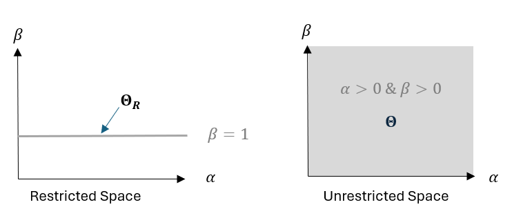

<style type="text/css">

/* Table of content - navigation */
div#TOC li {
    list-style:none;
    background-color:lightgray;
    background-image:none;
    background-repeat:none;
    background-position:0;
    font-family: Arial, Helvetica, sans-serif;
    color: #780c0c;
}


/* Title fonts */
h1.title {
  font-size: 24px;
  color: darkblue;
  text-align: center;
  font-family: Arial, Helvetica, sans-serif;
  font-variant-caps: normal;
}
h4.author { 
  font-size: 18px;
  font-family: Arial, Helvetica, sans-serif;
  color: navy;
  text-align: center;
}
h4.date { 
  font-size: 18px;
  font-family: Arial, Helvetica, sans-serif;
  color: darkblue;
  text-align: center;
}

/* Section headers */
h1 {
    font-size: 22px;
    font-family: "Times New Roman", Times, serif;
    color: darkred;
    text-align: left;
}

h2 {
    font-size: 18px;
    font-family: "Times New Roman", Times, serif;
    color: navy;
    text-align: left;
}

h3 { 
    font-size: 15px;
    font-family: "Times New Roman", Times, serif;
    color: darkred;
    text-align: left;
}

h4 {
    font-size: 18px;
    font-family: "Times New Roman", Times, serif;
    color: darkred;
    text-align: left;
}

/* Decoration of hyperlinks  */

/* unvisited link */
a:link {
  color: green;
}

/* visited link */
a:visited {
  color: purple;
}

/* mouse over link */
a:hover {
  color: red;
}

/* selected link */
a:active {
  color: yellow;
}
</style>


```{r setup, include=FALSE}
options(repos = list(CRAN="http://cran.rstudio.com/"))
# code chunk specifies whether the R code, warnings, and output 
# will be included in the output files.
if (!require("knitr")) {
   install.packages("knitr")
   library(knitr)
}

knitr::opts_chunk$set(echo = TRUE,       
                      warning = FALSE,   
                      result = TRUE,   
                      message = FALSE,
                      comment = NA)
```


\


# Likelihood Review

Let $\theta$ be an unknown parameter or a vector of unknown parameters. Assume that $\{X_1, X_2, \cdots, X_n \}$ is a set of IID random variables with distribution $F(x; \theta)$. When the distribution is discrete, the probability mass function (PMF) is used in the likelihood function. If the distribution is continuous, the probability distribution density function (PDF) is used in the likelihood function.

We only focus on continuous distributions in this series of research tutorials. In the rest of this note, we assume $\{X_1, X_2, \cdots, X_n \}$ is a set of IID continuous random variables with density function $f(x; \theta)$. **Discrete distributions such as binomial and Posson distributions are used occasionally to explain some concepts.** 


Recall that the likelihood of observing an IID random sample $\{x_1, x_2, \cdots, x_n \}$ from the distribution with density function $f(x;\theta)$ is given by

$$
L(\theta| \mathbf{x}) = \prod_{i = 1}^n f(x_i: \theta)
$$

The MLE of $\theta$, denoted by $\hat{\theta}$ is te solution to the optimization problem

$$
\hat{\theta} = \arg \max_{\theta \in \Omega} L(\theta: \mathbf{x}).
$$

Since the logarithm of the likelihood is easier to handle in mathematics, we define the above optimization problem using the log-likelihood, that is

$$
\hat{\theta} = \arg\max_{\theta \in \Omega} l(\theta: \mathbf{x}),
$$

where $l(\theta: \mathbf{x}) = \log [L(\theta: \mathbf{x})]$.

The method of moment (MM) and the maximum likelihood estimation (MLE) provide a single estimated value from a random sample to approximate the unknown parameter. This estimation is called **point estimation**. This note will focus on inferences based on MLE. 


## Some Basic Concepts

We briefly review some of the concepts introduced in an earlier note.

**Parameter and Statistic**: A parameter is a numerical characteristic of a population. A statistic is a numerical value calculated from a sample taken from the population.

**Estimation, Estimator, and Estimate**: An estimation is a method. An estimator is a formula or function defined based on a data set. An estimate is a value calculated using the formula (i.e., estimator) from the data set.

**Point Estimate**: a point estimate is a single value used to estimate the population parameter. It is a random number because the sample is random.

**Interval estimate**: an interval estimate is a range (interval) of values that contains the true value of the unknown parameter. 


**Remark** - The point estimate is only a descriptive statistic based on the sample, not the population. For example, when considering the average starting salaries of recent statistics graduates at a university, we take a random sample of students and calculate the average salary, say \$55,000. We can not say the average starting salary of all statistics graduates at the university is \$55,000. A better way to describe the starting salary of the population of statistics graduates is that the starting salary is **around \$55,000** - This is a range! That is, *we need an interval estimate to generalize the information from the sample to the population - confidence interval method!*


# Goodness Measures of Point Estimate

Several measures are commonly used to assess the goodness of a point estimate. Before introducing these measures, please keep in mind that an estimate from a random sample is also random. This means that a point estimate has a distribution. We will discuss the probability distribution in a subsequent section. For now, we only assume a distribution associated with the point estimate so that we can define these measures rigorously using the definition of statistical expectation.

Assume that $\hat{\theta}$ is a point estimate of $\theta$ based on an estimation method. The measures of goodness of point estimate are based on estimation error which is defined to be $\text{error}(\hat{\theta}) = \hat{\theta}- \theta$


**Bias**: the bias of point estimate $\hat{\theta}$ is defined to be $\text{bias} (\hat{\theta}) = E(\hat{\theta} - \theta) = E(\hat{\theta}) - \theta$. 

The bias of a point estimate could be positive, negative, or zero. When the bias is zero, $E(\hat{\theta}) = \theta$, the corresponding point estimate is called **unbiased point estimate**. The **unbiasedness** is a good feature for a point estimate.  


**Mean Square Error (MSE)**: The MSE of point estimate $\hat{\theta}$ is defined to be $\text{MSE} (\hat{\theta}) = E[(\hat{\theta}-\theta)^2]$. 

MSE calculates the average of squared error. It is a legitimate measure of the goodness of a point estimate. **The smaller the MSE, the better the point estimate.**


**Relationship among Bias, MSE, and Variance**: $\text{MSE}(\hat{\theta}) = \text{var}(\hat{\theta}) +[\text{bias} (\hat{\theta})]^2$

The derivation of the above relationship is straightforward by noting that $(\hat{\theta} - \theta)^2 = \{ [(\hat{\theta} - E(\hat{\theta})] + [E(\hat{\theta})-\theta]\}^2.$. Expanding this binomial with some algebraic clean-up, you will see the relationship.


**Absolute Estimation Error** is defined to be $\epsilon = |\hat{\theta} - \theta|$.


We can not evaluate the above goodness measures unless the true value of the population parameter is available. *This is a dilemma: we try to measure the goodness of the point estimate of an unknown parameter, but calculating these measures requires the true value of the unknown parameter.*

In fact, we use measures in different ways:

1. In simulation studies, we assume the true value of the population parameter and generate random samples,

2. If prior information on the population parameter is available, we can approximate these measures based on a random sample.

3. We can use these measures to derive other inferential procedures such as confidence intervals.


# Interval Estimates

One issue with a point estimate is that it has information about accuracy and precision. When we say the value of the population parameter is close to the sample statistics, but we don’t know how close it is, and how close is considered as *close*. This section introduces the general framework to derive the confidence interval for a population parameter $\theta$ based on its point estimate $\hat{\theta}$ **with the assumption that $\hat{\theta}$ has a known density $f(\hat{\theta})$.**


We consider imposing a bound to the absolution estimation error $\epsilon = |\hat{\theta} - \theta| < b$, we can then calculate the probability 

$$
P(|\hat{\theta} - \theta| < b) = P(\theta - b <\hat{\theta} <\theta + b ) = \int_{\theta-b}^{\theta +b} f(\hat{\theta}) d\hat{\theta} = p_0
$$

The above $p_0$ is the derived probability that the absolute estimation error is bounded by given $b$ with $\theta$ being known. Under these assumptions, the inequality $\theta - b <\hat{\theta} <\theta + b$ in the middle of the above equation tells how the point estimate is close to the parameter with probability $p_0$. **That is, with known $\theta, b$, and $f_{\hat{\theta}}(\cdot)$, we can calculate the probability that $\hat{\theta}$ falls into interval $(\theta - b, \theta +b)$**. 


Next, we look at the above equation under different assumptions: assume we choose the value of $p_0$, say $p_0 = 0.95 = 95\%$. $\hat{\theta}$ is calculated from a random sample and $b$ is a known error bound. Note that the above equation can re-expressed into the following form

$$
P(|\hat{\theta} - \theta| < b) = P(\hat{\theta} - b <\theta <\hat{\theta} + b )= p_0.
$$

The above equation says that the random interval $(\hat{\theta} - b, \hat{\theta} + b )$ has $100p_0\%$ chance to include the true value of the parameter - This is the confidence interval with confidence level $100p_0\% = 95\%$ with the choice of $p_0 = 0.95$. 

**One piece of information that needs to be addressed is how to get $b$ in the above discussion.**

In one-sample confidence intervals of the population mean, we use either the central limit theorem of the strong assumption of normality of the population, the sample mean as the point estimate of the population mean $\mu$ has a normal distribution, then b is the margin of error (i.e., absolution error bound of point estimation) that has the following form

$$
b = Z_{1-\alpha/2} \frac{s}{\sqrt{n}}
$$

where $\alpha = 1 - \text{given confidence level}$ which is called the significance level in testing hypotheses. $Z_{1-\alpha/2}$ is the quantile of the distribution of point estimate $\hat{\mu} = \bar{X}$ which is normal in the one sample confidence of population mean. 


Therefore, the critical information required in deriving the confidence interval of a population parameter is the distribution of the point estimate of the parameter. It is customarily called the sampling distribution of the point estimate.


# Sampling Distribution of MLE

Recall the central limit theorem concerning the distribution of sample means we introduced in the elementary statistics:

**Central Limit Theorem** 

*Assume that a random sample $\{x_1, x_2, \cdots, x_n \}$ is taken from a population with mean $\mu$ and standard deviation $\sigma$. Define $\bar{X} = \sum_{i =1}^n x_i / n$ to be the point estimate of population mean $\mu$. If the sample is large, $\bar{X} \sim N(\mu, \sigma/\sqrt{n})$*

**Remark**: The central limit theorem (CLT) **does not assume** a specific distribution of the population but unknown mean $\mu$ and variance $\sigma^2$. The only vague condition is that the sample size is large. **Any results derived from the CLT are called large sample (asymptotic) results**.

One of the objectives of this note is to develop asymptotic results for the MLE that are similar to the above CLT so that we can make statistical inferences such as constructing confidence intervals and testing hypotheses. In the next few sections, we introduce the building blocks to be used in the MLE-based inferences.


## Basic Set-up and Notations

Let $\{x_1, x_2, \cdots, x_n \} \stackrel{\text{i.i.d}}{\sim} f_\theta(x)$, $\theta = (\theta_1, \theta_2, \cdots, \theta_k)$ is a vector of $k$ parameters (could be a single parameter when $k = 1$). The likelihood of observing the data is given by

$$
L(\theta) = \prod_{i=1}^n f_\theta(x_i)
$$

\noindent with corresponding log-likelihood function in the following

$$
l(\theta) = \sum_{i=1}^n \log f_\theta (x_i).
$$


### Gradient Vector and Score Equations

The system of score equations is given by

$$
\begin{cases} 
\frac{\partial l(\theta)}{\partial \theta_1} =  0 ,    \\ 
\frac{\partial l(\theta)}{\partial \theta_2} = 0,      \\
\cdots \cdots \cdots                                   \\
\frac{\partial l(\theta)}{\partial \theta_k} = 0. 
\end{cases} 
$$
The above system can be written in the following form

$$
\frac{\partial l(\theta)}{\partial \theta} = \mathbf{0} \ \ \text{ or } \ \ \nabla_\theta l(\theta) = \mathbf{0}
$$

The mathematical notation $\nabla$ (read */'na.bla/*) is a differential operator. It is commonly used in Calculus.

The gradient vector of $l(\theta)$ is defined to be

$$
\nabla_\theta l(\theta) = \left( \frac{\partial l(\theta)}{\partial \theta_1}, \frac{\partial l(\theta)}{\partial \theta_2}, \cdots , \frac{\partial l(\theta)}{\partial \theta_k}\right)
$$


## Expected Value of Score Functions

To derive the asymptotic normality of the MLE, we need to use the following result from advanced real analysis: the order of differentiation and integration is exchangeable. The proof of general results requires more advanced mathematical tools in the abstract measure theory (to be covered in the doctoral-level real analysis course).

**Lemma 1**: Suppose that $f(x,\theta)$ is differentiable in $\theta$ and there exists a function $g(x,\theta)$ such that

1. $\big| \frac{\partial f(x, \vartheta)}{\partial \vartheta} \big| \le g(x, \theta)$ for all $x$ and $\theta$ such that $|\vartheta - \theta|\le \delta_0$;

2. $\int_{-\infty}^\infty g(x, \theta) dx < \infty$ for all $\theta$.

Then

$$\frac{d}{d\theta} \int_{-\infty}^\infty f(x,\theta) dx = \int_{-\infty}^\infty \frac{\partial f(x, \theta)}{\partial \theta} dx.
$$


We will not prove the lemma in this note. For the likelihood function, the regularity conditions are satisfied. So we can use the lemma in statistical inference.

**Fact**. The expected value of the score function is equal to zero.

**Proof**: We will use the definition of expectation and the above lemma in the following proof. Without loss of generality, we consider the log-likelihood of observing a single data point $f(x:\theta)$ and assume $\theta$ to be a univariate parameter.

$$
E\left[ \frac{\partial \log f(x, \theta)}{\partial \theta} \right] \stackrel{\text{def}}{=} \int_{-\infty}^\infty \frac{\partial \log f(x, \theta)}{\partial \theta} f(x, \theta) dx 
$$

$$
= \int_{-\infty}^\infty \left[\frac{\partial f(x, \theta)/\partial \theta}{f(x,\theta)}\right] f(x, \theta) dx = \int_{-\infty}^\infty \frac{\partial f(x, \theta)}{\partial \theta} dx
$$

$$
\stackrel{\text{switch}}{=} \frac{\partial}{\partial \theta} \int_{-\infty}^\infty f(x, \theta) dx = \frac{\partial}{\partial \theta} (1) = 0.
$$


**Remarks** Lemma 1 introduced in this subsection is related to several *big* theorems in mathematics (advanced calculus and real analysis).

1. The two conditions in Lemma 1 are also called *regularity conditions*. Many statistical theorems (or procedures) require some regularity conditions needed in mathematical proofs and derivations. Make sure that the regularity conditions are satisfied in practical applications.

2. If the integral is definite with scalar integral limits, then above Lemma 1 is a special case of **Leibniz Rule** in Calculus. 

3. More general forms of the above Lemma 1 are introduced in the real analysis textbooks under various convergence theorems such as **Lebesgue Dominant Convergence (i.e., bounded convergence theorem) and Monotone convergence theorem**.

4. Since the derivative is the limit of the rate of change (instantaneous rate), there is also a rule of exchange in the order of integral and limit.

5. The integral is also viewed as an *infinite sum*, there is also a rule of exchange of the order of summation and derivative (or summation and limit).

6. <font color = "red">**\color{red}These types of exchange order operations are frequently used in statistics deriving asymptotic statistical results.**</font>


\

To conclude this subsection, we use the same idea in Lemma 1 to derive the following Lemma concerning the second-order derivative of the log-likelihood function. Lemma 2 links the two definitions of the **Fisher Information** to be introduced in the next subsection.

**Lemma 2**: Under some similar regularity conditions (as stated in Lemma 1), we have 

$$
E\left[ \frac{\frac{\partial^2}{\partial \theta^2}f(x,\theta)}{f(x,\theta)}\right] = 0.
$$


**Proof**:  Using the definition of expectation and the exchange of the order of the derivative and the integral, we have 

$$
E\left[ \frac{\frac{\partial^2}{\partial \theta^2}f(x,\theta)}{f(x,\theta)}\right] = \int \left[ \frac{\frac{\partial^2}{\partial \theta^2}f(x,\theta)}{f(x,\theta)}\right] f(x,\theta)dx
$$

$$
= \int \frac{\partial^2}{\partial \theta^2}f(x,\theta) dx \stackrel{\text{switch}}{=}  \frac{\partial^2}{\partial \theta^2} \int f(x,\theta) dx = \frac{\partial^2}{\partial \theta^2} (1) = 0.
$$

\


## Fisher Information Matrix

The information on the **variance and covariance of the MLE** is contained in the Fisher information matrix. It must be explicitly specified when making inferences about the MLE of model parameters. To better understand the concept, we start with the case with single-parameter models.


### Fisher Information Number

Assume that $\theta$ is a univariate parameter of the population with density $f(x,\theta)$. Let $\{x_1, x_2, \cdots, x_n \} \sim f(x, \theta)$ be an IID sample. We use vector $\mathbf{x}$ to denote the set of random samples. The log-likelihood of observing the data is a function of $\theta$ that has the following form

$$
l(\theta:\mathbf{x}) = \log L(\theta: \mathbf{x}) = \sum_{i=1}^n \log f(x_i, \theta).
$$


The **Fisher Information Number** based on a random sample with size $n$ is defined to be of the following form

$$
I_n(\theta) \stackrel{\text{def}}{=} E_{\mathbf{x}}\left[ \left(\frac{\partial}{\partial \theta} \log L(\mathbf{x}, \theta) \right)^2\right].
$$

Lemma 1 in the previous subsection says that

$$
E_X\left[ \frac{\partial}{\partial \theta} f(X_i, \theta)\right] = 0 \ \ \text{for} \ \ i = 1, 2, \cdots, n.
$$

Therefore,

$$
\left\{E_{\mathbf{x}}\left[ \frac{\partial}{\partial \theta} \sum_{i=1}^n \log f(x_i, \theta)\right] \right\}^2 =\left\{ E_{\mathbf{x}}\left[ \frac{\partial }{\partial \theta} \log L(\theta: \mathbf{x})\right] \right\}^2 = 0
$$

Using the formula $\text{Var}(X) = E(X^2) - [E(X)]^2$ for all random variable $X$, we have the following important result.

\

<font color="red">**\color{red}Property**:</font> Let $L(\theta)$ be the likelihood function defined based on the iid sample data $\{x_1, x_2, \cdots. x_n \} \sim f_\theta(x)$. Then  

$$
I_n(\theta) \stackrel{\text{def}}{=} E_{\mathbf{x}}\left[ \left(\frac{\partial}{\partial \theta} \log L( \theta: \mathbf{x}) \right)^2\right] - \left\{E_{\mathbf{x}}\left[ \frac{\partial}{\partial \theta}  \log L(\theta: \mathbf{x})\right] \right\}^2 = \text{Var}_{\mathbf{x}}\left[\log L(\theta: \mathbf{x})\right].
$$

\

This means that **the Fisher Information $I_n(\theta)$ is the variance of the score function**.


Next, we present an alternative definition of the Fisher Information. Note that

$$
\frac{\partial^2}{\partial \theta^2}\left[ \log L(\theta: \mathbf{x}) \right] = \frac{\partial}{\partial \theta} \left\{ \frac{\partial }{\partial \theta} \left[ \log L( \theta: \mathbf{x})\right]\right\} =\frac{\partial}{\partial \theta} \left\{ \left[ \frac{\partial L(\theta: \mathbf{x})/\partial \theta}{L(\theta: \mathbf{x})}\right]\right\}
$$
Using the multiplicative rule of derivative, we have

$$
= \frac{L(\theta:\mathbf{x})\frac{\partial^2}{\partial\theta^2}L(\theta:\mathbf{x}) - \left[\frac{\partial}{\partial\theta}L(\theta:\mathbf{x})\right]^2}{L^2(\theta: \mathbf{x})}
$$

$$
=\frac{\frac{\partial^2}{\partial\theta^2}L(\theta:\mathbf{x}) }{L(\theta: \mathbf{x})} - \left[\frac{\frac{\partial}{\partial\theta}L(\theta:\mathbf{x}) }{L(\theta: \mathbf{x})}\right]^2.
$$


From Lemma 2, the first term of the above equation is zero. Therefore,

$$
\frac{\partial^2}{\partial \theta^2}\left[ \log L(\theta: \mathbf{x}) \right] = - \left[\frac{\frac{\partial}{\partial\theta}L(\theta:\mathbf{x}) }{L(\theta: \mathbf{x})}\right]^2.
$$


This means we can also define the Fisher Information number can also be derived as

$$
I_n(\theta) = - E \left\{\frac{\partial^2}{\partial \theta^2}\left[ \log L(\theta: \mathbf{x}) \right]\right\}. 
$$

This means that the Fisher Information number is the negative expectation of the second-order derivative of the log-likelihood.

\

Since we assume an IID sample in most cases, we can derive the relationship between the Fisher information number associated with the entire observed data set and that based on the individual observation in the data set. Denote $I_0(\theta)$ as the Fisher information number of a single observation of an IID sample.

$$
I_n(\theta) = - E \left\{\frac{\partial^2}{\partial \theta^2}\left[ \log L(\theta: \mathbf{x}) \right]\right\} = -E\left\{\frac{\partial^2}{\partial \theta^2}\left[\sum_{i=1}^n \log f(\theta: x_i) \right]\right\}
$$

$$
= \sum_{i=1}^n \left\{- E\left[\frac{\partial^2}{\partial \theta^2}  \log f(\theta: x_i) \right] \right\} = nI_0(\theta).
$$


**Remarks** Some comments on the Fisher Information: 

1. The Fisher information is only a function of the parameter since it is defined as an expectation (with respect to $\mathbf{X}$) of the log-likelihood.

2. If we replace the parameter with an estimated one such as MLE, we obtain $\widehat{I_n(\theta)} = I_n(\hat{\theta})$.  <font color = "red">**\color{red}$\widehat{I_n(\theta)}$ is called observed Fisher information number!**</font>

3. <font color = "red">**\color{red}The Fisher information number is always positive.**</font>

4. The Fisher information number is dependent on the sample size. This will be used in developing the asymptotic normality for the MLE in the next section.

\

**Example**: Consider an IID sample $\{x_1, x_2, \cdots, x_n\} \sim f(x,\theta) = \theta e^{-\theta x}$. Find the Fisher information number.

Note that the log-likelihood function of $\theta$ is given by

$$
l(\theta: \mathbf{x}) = n \log \theta -\theta \sum_{i=1}^n x_i.
$$

The second order derivative of $l(\theta)$ with respect to $\theta$ is

$$
\frac{\partial^2}{\partial \theta^2} l(\theta) = \frac{\partial}{\partial \theta}\left( \frac{n}{\theta} - \sum_{i=1}^n x_i \right) = -\frac{n}{\theta^2}.
$$

By definition,

$$
I_n(\theta) = -E\left( \frac{\partial^2}{\partial \theta^2} l(\theta, \mathbf{x})\right) = -E(-\frac{n}{\theta^2}) = \frac{n}{\theta^2}.
$$

The exponential density function has another form (i.e., reparametrization) $f(x,\beta) = \frac{1}{\beta} e^{-x/\beta}$. A natural question is whether we need to repeat the same calculation in the above example to find the Fisher information $I_n(\beta)$. The answer is unnecessary.  We can *reparametrization* in the Fisher information number. 

Let $\eta = \psi(\theta)$ and $\psi(\cdot)$ is invertible, that is, $\theta = \psi^{-1}(\eta)$ exists. Assume that two density forms of $X$ are $f(x, \theta)$ and $g(x, \eta)$. Clearly, $g(x, \eta) = f(x, \psi^{-1}(\eta))$ <font color = "red">*(why?)*</font>.  Assume further that $I_n(\theta) = I_n[\psi^{-1}(\eta)]$ is known. 

Due to reparametrization, the same random variable has different forms of density function. When we work on the expectation with the random variable, we should specify the associated density function. Next, we express $I_g(\eta)$ with respect to $I_f(\theta)$. 

$$
I_{n,g}(\eta) = E_g\left[ \left(\frac{\partial}{\partial \eta} \log g(x, \eta)  \right)^2 \right] = E_g\left[ \left(\frac{\partial}{\partial \eta} \log f(x, \psi^{-1}(\eta))  \right)^2 \right]
$$

$$
= E_g\left[ \left(\frac{\partial}{\partial \eta} \log f(x, \psi^{-1}(\eta)) \times \frac{\partial}{\partial \eta} \psi^{-1}(\eta)\right)^2 \right]
$$

$$
= E_g\left[ \left(\frac{\partial}{\partial \eta} \log f(x, \psi^{-1}(\eta)) \right)^2 \times \left(\frac{\partial}{\partial \eta} \psi^{-1}(\eta)\right)^2 \right]
$$

$$
= E_g\left[ \left(\frac{\partial}{\partial \eta} \log f(x, \psi^{-1}(\eta)) \right)^2  \right]\times \left(\frac{\partial}{\partial \eta} \psi^{-1}(\eta)\right)^2 = I_{n,f}(\theta)\times \left(\frac{\partial}{\partial \eta} \psi^{-1}(\eta)\right)^2.
$$

That is,

$$
I_{n,g}(\eta)=I_{n,f}(\theta)\times \left(\frac{\partial}{\partial \eta} \psi^{-1}(\eta)\right)^2.
$$


### Fisher Information Matrix

For multi-parameter models (distributions), we need a Fisher information matrix to characterize the covariance structure of the MLE of the vector of multiple parameters. Denote $f(x; \mathbf{\theta})$ be the density function of $X$ with a k-dimensional parameters $\mathbf{\theta} = (\theta_1, \theta_2, \cdots, \theta_k)$ <font color = "red"> *\color{red}(Caution: if not specified, all vectors in this series of note are column vectors. This is also true in most mathematics and statistics books and literature)*</font>

Under the same setup, the likelihood function of observing $\{x_1, x_2, \cdots, x_n \}\sim f(x, \mathbf{\theta})$ is given by 

$$
L(\mathbf{\theta}:\mathbf{x}) = \prod_{i=1}^n f(x_i, \mathbf{\theta})
$$

The gradient vector of the log-likelihood is 

$$
\frac{\partial}{\partial \theta} \log L(\theta, \mathbf{x}) = \left( \frac{\partial}{\partial \theta_1} \log L(\theta, \mathbf{x}),  \frac{\partial}{\partial \theta_2} \log L(\theta, \mathbf{x}), \cdots, \frac{\partial}{\partial \theta_k} \log L(\theta, \mathbf{x}),\right).
$$

Denote

$$
\frac{\partial}{\partial \theta^T} \log L(\theta, \mathbf{x}) = \left( \frac{\partial}{\partial \theta_1} \log L(\theta, \mathbf{x}),  \frac{\partial}{\partial \theta_2} \log L(\theta, \mathbf{x}), \cdots, \frac{\partial}{\partial \theta_k} \log L(\theta, \mathbf{x}),\right)^T
$$

The **Fisher information matrix** of the k-dimensional parameter $\theta$ is defined to be

$$
\mathbb{I}_n(\mathbf{\theta}) = E\left( \frac{\partial}{\partial \theta} \log L(\theta, \mathbf{x})\frac{\partial}{\partial \theta^T} \log L(\theta, \mathbf{x}) \right).
$$

The explicit matrix form of the two-parameter case is

$$
\mathbb{I}_n(\mathbf{\theta}) = E \left[\left( \frac{\partial}{\partial \theta_1} \log L(\theta, \mathbf{x}), \frac{\partial}{\partial \theta_2} \log L(\theta, \mathbf{x}) \right) \left( \frac{\partial}{\partial \theta_1} \log L(\theta, \mathbf{x}), \frac{\partial}{\partial \theta_2} \log L(\theta, \mathbf{x}) \right)^T\right]
$$


$$
= E \begin{bmatrix}
    \left(\frac{\partial}{\partial \theta_1} \log L(\theta, \mathbf{x}) \right)^2 & \frac{\partial}{\partial \theta_1} \log L(\theta, \mathbf{x})\frac{\partial}{\partial \theta_2} \log L(\theta, \mathbf{x})  \\
    \frac{\partial}{\partial \theta_1} \log L(\theta, \mathbf{x})\frac{\partial}{\partial \theta_2} \log L(\theta, \mathbf{x}) & \left(\frac{\partial}{\partial \theta_2} \log L(\theta, \mathbf{x}) \right)^2
\end{bmatrix}.
$$

<font color = "red">**\color{red} Remarks**</font>

1. The Fisher information matrix is a <font color = "red">**square matrix**</font>. Its dimension is dependent on the dimension of the vector of parameters. For the case of a k-dimensional parameter vector, the dimension of the corresponding Fisher information matrix is $k\times k$. 

2. The individual cell element in the Fisher information matrix is expressed in the following

$$
[\mathbb{I}_n(\mathbf{\theta})]_{i,j} = \frac{\partial}{\partial \theta_i} \log L(\theta, \mathbf{x})\frac{\partial}{\partial \theta_j} \log L(\theta, \mathbf{x}) 
$$


3. The Fisher information matrix is the covariance matrix of the gradient vector $\partial \log L(\theta: \mathbf{x})/\partial \theta$.

4. The Fisher information at each individual observed data point $x_i$ is still a $k\times k$ square matrix and is similarly given by

$$
I_0(\theta)= E \begin{bmatrix}
    \left(\frac{\partial}{\partial \theta_1} \log L(\theta, x_i) \right)^2 & \frac{\partial}{\partial \theta_1} \log L(\theta, x_i)\frac{\partial}{\partial \theta_2} \log L(\theta, x_i)  \\
    \frac{\partial}{\partial \theta_1} \log L(\theta, x_i)\frac{\partial}{\partial \theta_2} \log L(\theta, x_i) & \left(\frac{\partial}{\partial \theta_2} \log L(\theta, x_i) \right)^2
\end{bmatrix}.
$$

5. For an IID sample $\{x_1, x_2, \cdots, x_n\} \sim f(\mathbf{x}: \theta)$,

$$
I_n(\theta) = nI_0(\theta).
$$

*Analogous to the case of single parameter distributions, we also have the following alternative definition of the Fisher information matrix for multi-parameter distributions*

$$
\mathbb{I}_n(\mathbf{\theta}) = -E\left( \frac{\partial^2}{\partial \theta \partial \theta^T} \log L(\theta:\mathbf{x})\right).
$$

where

$$
\mathbb{H}_n(\theta, \mathbf{x})=\frac{\partial^2}{\partial \theta \partial \theta^T} \log L(\theta:\mathbf{x}) =
\begin{bmatrix}
     \frac{\partial^2}{\partial \theta_1^2} \log L(\theta, x_i) & \frac{\partial^2}{\partial \theta_1 \partial \theta_2} \log L(\theta, x_i)  & \cdots & \frac{\partial^2}{\partial \theta_1 \partial \theta_k} \log L(\theta, x_i)  \\
    \frac{\partial^2}{\partial \theta_2 \partial \theta_1} \log L(\theta, x_i)) & \frac{\partial^2}{\partial \theta_2^2} \log L(\theta, x_i)   & \cdots & \frac{\partial^2}{\partial \theta_2 \partial \theta_k} \log L(\theta, x_i)  \\
    \vdots & \vdots & \vdots \\
    \frac{\partial^2}{\partial \theta_k \partial \theta_1} \log L(\theta, x_i)& \frac{\partial^2}{\partial \theta_k \partial \theta_2} \log L(\theta, x_i) & \cdots &  \frac{\partial^2}{\partial \theta_k^2 } \log L(\theta, x_i) 
\end{bmatrix}_{k\times k}
$$

is the well-known **Hessian matrix**. **Hessian Matrices** are widely used in optimization problems. 


<font color = "red">**\color{red}Caution**</font>:  **Hessian Matrix and Jacobian Matrix** are sometimes confusing. 

1. The **Hessian matrix** is the square matrix of second-order partial derivatives of the objective function to be optimized.

2. The **Jacobian matrix** is the first-order derivatives of a vector of functions such as $(f_1(\theta), f_2(\theta), \cdots, f_k(\theta))$ where $\theta = (\theta_1, \theta_2, \cdots, \theta_k)$. The **Jacobian matrix** associated with the vector of functions is defined by

$$
J(\theta) = \begin{bmatrix}
     \frac{\partial}{\partial \theta_1} f_1(\theta) & \frac{\partial}{\partial \theta_2} f_1(\theta)  & \cdots & \frac{\partial}{\partial \theta_k} f_1(\theta) \\
    \frac{\partial}{\partial \theta_1} f_2(\theta) & \frac{\partial}{\partial \theta_2} f_2(\theta)  & \cdots & \frac{\partial}{\partial \theta_k} f_2(\theta)  \\
    \vdots & \vdots & \vdots \\
    \frac{\partial}{\partial \theta_1} f_k(\theta) & \frac{\partial}{\partial \theta_2} f_k(\theta)  & \cdots & \frac{\partial}{\partial \theta_k} f_k(\theta)
\end{bmatrix}_{k\times k}
$$

3. When finding the MLE of unknown parameters from the objective log-likelihood function $l(\theta)$, we first calculate gradient functions 

$$
\left(\frac{\partial l(\theta)}{\partial \theta_1}, \frac{\partial l(\theta)}{\partial \theta_2}, \cdots, \frac{\partial l(\theta)}{\partial \theta_k}\right) \stackrel{\text{def}}{\equiv} [f_1(\theta), f_2(\theta), \cdots, f_k(\theta)]
$$

$\hspace{5mm}$  Then the **Hessian Matrix** associated with the objective function $l(\theta)$ and the **Jacobian Matrix**  associated with gradient (score) functions <font color = "red">**\color{red}are identical**</font>.


## Multiple Random Variables and Random Vectors

We first introduce the concept of covariance and properties associated with multiple random variables.

Let $X$ and $Y$ be two variables, the covariance that measures the linear relationship between two random variables is defined by

$$
\text{cov}(X,Y) = E\{[X-E(X)][Y-E(Y)]\}.
$$

**Some properties of covariance**:

1. $\text{cov}(X,Y) = \text{cov}(Y,X)$.

2. When $X = Y$, $\text{cov}(X,Y) = \text{var}(X)$.

3. Let $a$ and $b$ are scalars, 

  + $\text{cov}(aX, Y) = a \times \text{cov}(X,Y)$;
  + $\text{cov}(aX, bY) = ab \times \text{cov}(X,Y)$;
  + $\text{cov}(aX + b, Y) = a\times \text{cov}(X,Y)$

3. Let $Z = aX + bY$, $E(Z) = E[aX + bY] = aE[X] + bE[Y]$ and $\text{var}(Z) = a^2\text{var}(X) = 2ab\cdot \text{cov}(X,Y) + b^2 \text{var}(Y)$. <font color = "red">*\color{red} (Prove this using the definition of the variance.)*</font>

4. The (*linear*) correlation coefficient between $X$ and $Y$ is given by
$$
\rho = \frac{\text{cov}(X, Y)}{\sqrt{\text{var}(X)\text{var}(Y)}}
$$

For a given sample $\{(x_1, y_1), (x_2, y_2), \cdots, (x_n, y_n) \}$, the sample correlation coefficient is given by

$$
r = \frac{\left[\sum_{i=1}^n (x_i-\bar{x})(y_i-\bar{y})\right]/n}{\sqrt{\frac{\sum_{i=1}^n (x_i-\bar{x})^2}{n}\frac{\sum_{i=1}^n (y_i-\bar{y})^2}{n}}} = \frac{\sum_{i=1}^n (x_i-\bar{x})(y_i-\bar{y})}{\sqrt{\sum_{i=1}^n (x_i-\bar{x})^2\sum_{i=1}^n (y_i-\bar{y})^2}}.
$$

The variance of the linear combination of random variables $X$ and $Y$, $Z = aX + bY$, involves covariance of $X$ and $Y$. In general, we can consider the linear combination of a sequence of random variables $\{X_1, X_2, \cdots, X_p \}$, say $W = \sum_{i=1}^p a_iX_i$, we can calculate the variance of $W$ in the following

$$
\text{var}(W) = \sum_{i=1}^p a_i^2 \text{var}(X_i) + \sum_{i\ne j} a_ia_j \text{cov}(X_i, X_j)
$$

The above variance of $W$ is obtained based on the definition of variance and binomial expansion. However, we can write the linear combination of the random variance in the vector form

$$
W = (a_1, a_2, \cdots, a_p) \begin{bmatrix}
      X_1    \\ 
      X_2    \\ 
      \vdots \\ 
      X_p
\end{bmatrix}.
$$

Therefore, $W$ is the dot product of a scalar vector (coefficient of the linear combination) and a random vector. This motivates us to study random vectors.

\

**Random Vectors and Properties**


We have discussed the distribution of single random variables and the related characterization. If we have a vector of $p$ random variables 

$$
\mathbf{X} = \begin{bmatrix}
      X_1    \\ 
      X_2    \\ 
      \vdots \\ 
      X_p
\end{bmatrix}.
$$. 

Each random variable has support (i.e., domain) $\mathbb{R}_i \subseteq \mathbb{R}$ for $i = 1, 2, \cdots, p$. Let 

$$
\mathbf{x} = \begin{bmatrix}
      x_1    \\ 
      x_2    \\ 
      \vdots \\ 
      x_p
\end{bmatrix}.
$$. 

be the realization (i.e., observed data values) of random variable $\mathbb{X}$. This means

$$
\mathbf{x} \in (\mathbb{R}_1 \times \mathbb{R}_2 \times \cdots \times \mathbb{R}_p)^T.
$$

The **mean of the random vector** is

$$
E(\mathbf{X}) \stackrel{\text{def}}{\equiv} \begin{bmatrix}
      E(X_1) \\ 
      E(X_2) \\ 
      \vdots \\ 
      E(X_p)
\end{bmatrix}
=  \begin{bmatrix}
      \mu_1  \\ 
      \mu_2  \\ 
      \vdots \\ 
      \mu_p
\end{bmatrix}
.
$$

The **variance-covariance matrix** is defined by

$$
V[\mathbf{X}] \stackrel{\text{def}}{\equiv} 
\begin{bmatrix}
     \text{var} (X_1) & \text{cov}(X_1, X_2)  & \cdots & \text{cov}(X_1, X_p) \\
     \text{cov} (X_2,X_1) & \text{var}(X_2)  & \cdots & \text{cov}(X_2, X_p) \\
     \vdots & \vdots & \vdots & \vdots\\
     \text{cov} (X_k,X_1) & \text{cov}(X_p,X_2)  & \cdots & \text{var}(X_p) 
\end{bmatrix}_{p\times p}
$$

**Some Properties of Random Vectors**

1. A constant vector a (vector of constants) satisfies $E[a] = a$.

2. For random vectors $\mathbf{X}$ and $\mathbf{Y}$, $E[\mathbf{X} + \mathbf{Y}] = E[\mathbf{X}] + E[\mathbf{Y}]$

3. Let $\mathbf{a}$ be a scalar (column) vector and $\mathbf{X}$ be a (column) random vector. $\mathbf{a}^T\mathbf{X}$ is well defined. Then $\text{var}(\mathbf{a}^T\mathbf{X}) = \mathbf{a}^T\text{cov}(\mathbf{X})\mathbf{a}$.

**Example** Derive the variance of $Z = aX + bY$ using the properties of random vectors. Let $\mathbf{d} = (a,b)$

$$
\text{var}(Z) = \text{var}(\mathbf{d}^T\mathbf{Z}) = \mathbf{d}^T\text{cov}(\mathbf{Z})\mathbf{d}
$$

$$
= [a,b]\begin{bmatrix}
       \text{var}(X)   &  \text{cov}(X,Y) \\
       \text{cov}(Y, X) & \text{var}(Y)
      \end{bmatrix}
      \begin{bmatrix}
        a\\
        b
      \end{bmatrix}
$$

Expand the above matrix to get the quadratic form 

$$
\text{var}(Z) = a^2 \text{var}(X) + 2ab\times \text{cov}(X,Y) + b^2 \text{var}(Y).
$$


\


## Multivariate Normal Distribution

Recall the density function of univariate random variable $X$ with mean $\mu$ and variance $\sigma^2$ is given by

$$
f(x) = \frac{1}{\sqrt{2\pi}\sigma}e^{-\frac{(x-\mu)^2}{2\sigma^2}}, \ \ \text{ for } \ -\infty < x < \infty.
$$

**Example**: Suppose $X$ is the height (in inches) and $Y$ is the weight (in pounds) of a male student in a large university. Furthermore suppose that $X$ and $Y$ follow normal distribution with parameters $\mu_X=69$, $\mu_Y=155$, $\sigma_X=2.5$, and $\sigma_Y=20$. Furthermore, the correlation coefficient between $X$ and $Y$ is $\rho=0.55$. There may be different distributions that satisfy the given conditions. However, the given conditions uniquely determine the bivariate normal distribution that has the following joint density function

$$
f(x,y)=\frac{1}{2\pi\sigma_x\sigma_y\sqrt{1-\rho^2}}\exp\left\{-\frac{1}{2(1-\rho^2)} \left[ \left(\frac{x-\mu_x}{\sigma_x} \right)^2 + \left(\frac{y-\mu_y}{\sigma_y} \right)^2 -\rho\left(\frac{x-\mu_x}{\sigma_x} \right)\left(\frac{y-\mu_y}{\sigma_y} \right) \right] \right\}.
$$

Obviously, the density for the Bivariate Normal is ugly, and it only gets worse when we consider higher dimensional joint densities of more normal distributions. We can write the density in a more compact form using matrix notation,

Denote

$$
\mathbf{x} = \begin{bmatrix}
             x \\
             y
             \end{bmatrix}, \ \ \ \
\mu = \begin{bmatrix}
             \mu_x \\
             \mu_y
             \end{bmatrix} \ \ \ \
\mathbf{\Sigma} = \begin{bmatrix}
             \sigma_x^2 & \rho\sigma_x\sigma_y \\
             \rho\sigma_x\sigma_y & \sigma_y^2 
             \end{bmatrix} \ \ \ \
$$

The matrix form of the bivariate normal distribution is given by

$$
f(\mathbf{x}) = \frac{1}{2\pi} (\text{det}\mathbf{\Sigma})^{-1/2}\exp\left[-\frac{1}{2}(\mathbf{x}-\mu)^T \mathbf{\Sigma}^{-1}(\mathbf{x}-\mu)\right].
$$

$\Sigma$ is the covariance matrix of $\mathbf{x}$. The above expression can be generalized to multivariate normal distribution. The multivariate normal distribution is uniquely determined if the covariance matrix is specified.


<font color = "red">*\color{red}With the above example*</font>, we can specify the vector and covariance matrix required in the bivariate normal distribution.

$$
\mu = \begin{bmatrix}
       69 \\
       155
      \end{bmatrix} \ \ \text{ and } \ \
\mathbf{\Sigma} = \begin{bmatrix}
       2.5^2  &  0.55\times 2.5 \times 20\\
       0.55\times 2.5 \times 200   & 20^2
      \end{bmatrix} = 
      \begin{bmatrix}
       6.25  &  27.5\\
       27.5  & 400
       \end{bmatrix}
$$

$$
\text{det}\mathbf{\Sigma} = 6.25\times 400 - 27.5^2 = 1743.75.
$$
and

$$
\mathbf{\Sigma}^{-1} = \frac{1}{6.25\times 400 - 27.5^2}\begin{bmatrix}
                                                         400   & -27.5 \\
                                                         -27.5 & 6.25
                                                        \end{bmatrix}
                     = \begin{bmatrix}
                        0.2293907  &  -0.01577061 \\
                        -0.01577061 & 0.003584229
                       \end{bmatrix}.
$$

$$
f(\mathbf{x}) = 0.0038\exp \left[-\frac{1}{2}(x-69, y-155) \begin{bmatrix}
                        0.2294  &  -0.0158 \\
                        -0.0158 & 0.0036
                       \end{bmatrix} 
                       \begin{bmatrix}
                        x-69 \\
                        y-155 
                       \end{bmatrix} 
                       \right].
$$

**Notation of General Multivariate Normal Distribution**

Let 

$$
\mathbf{X} = \begin{pmatrix}
X_1 \\
X_2 \\
\vdots \\
X_k
\end{pmatrix}, \ \ \
\mathbf{\mu} = \begin{pmatrix}
\mu_1 \\
\mu_2 \\
\vdots \\
\mu_k
\end{pmatrix}, \ \ \text{ and } \ \
\mathbf{\Sigma} = \begin{pmatrix}
\sigma_1^2 & \sigma_{12} & \sigma_{13} & \cdots & \sigma_{1k}  \\
\sigma_{21} & \sigma_2^2 & \sigma_{23} & \cdots & \sigma_{2k}  \\
\vdots & \vdots  & \vdots & \vdots  & \vdots \\
\sigma_{k1} & \sigma_{k2} & \sigma_{k3} & \cdots & \sigma_{kk} 
\end{pmatrix}.
$$

We use the following notation to denote the k-dimensional normal distribution

$$
\mathbf{X} \sim  \mathcal{N}_k(\mu, \mathbf{\Sigma}).
$$

<font color = "red">**\color{red}Properties of Multivariate Normal Distributions**</font> 

Let $\mathbf{X} = [X_1, X_2, \cdots, X_k]^T$ and $\mu = E[\mathbf{X}]$, and $\text{cov}(\mathbf{X}) = \mathbf{\Sigma} = (\sigma_{ij})$. The multivariate normal distribution is given by

$$
\mathbf{X} \rightarrow_p \mathcal{N}_k(\mu, \mathbf{\Sigma}).
$$

The following are properties of multivariate normal distributions that will be used in the subsequent note.

1. All **marginal distributions** <font color = "blue">*\color{blue}(distribution of individual component of multivariate normal)*</font> of a multivariate normal distribution are **normal distributions**.

2. All **conditional distributions** of a multivariate normal distribution are **normal distribution**.

3. All **linear combinations of the components** of multivariate normal distribution are also **normal distributions**.


\

## Asymptotic Normality of MLE

Recall the MLE of $\mathbf{\theta}$ based on IID $\{x_1, x_2, \cdots, x_n \} \stackrel{\text{iid}}{\sim} f(x:\theta)$, denoted by $\hat{\theta}$, is the solution to the following optimization problem

$$
\hat{\mathbf{\theta}} = \arg\min_{\theta \in \Theta} \log L(\theta: \mathbf{x})
$$

where $L(\theta)$ is the likelihood of $\theta$ that given explicitly in the following

$$
L(\theta: \mathbf{x}) = \prod_{i=1}^n f(x_i:\theta).
$$

The **Fisher Information** of $\theta$ is given by

$$
\mathbb{I}_n(\theta) = E\left[ \left(\frac{\partial}{\partial \theta} \log L(\theta:\mathbf{x})\right) \left( \frac{\partial}{\partial \theta} \log L(\theta:\mathbf{x}) \right)^T\right]
$$

$$
= - E\left[ \frac{\partial^2}{\partial \theta \partial \theta^T} \log L(\theta:\mathbf{x})\right].
$$

Denote the **Fisher Information Matrix** based on individual observed data points by 

$$
\mathbb{I}_0(\theta) =- E\left[ \frac{\partial^2}{\partial \theta \partial \theta^T} \log L(\theta:x)\right] = \frac{\mathbb{I}_n(\theta)}{n}.
$$

With the above discussions and notations, we have the following sampling distribution of MLE of $\theta$.


\

### MLE Normality for Normal Distribution

To discuss the normality of MLE of a parametric distribution, we first derive the normality of the MLE of $\mu$ and $\sigma^2 \equiv \theta$ in the normal distribution.

\

**A Non-numerical Example**: Assume that $\{x_1, x_2, \cdots, x_n\} \sim N(\mu, \sigma^2)$ with density function

$$
f(x: \mu, \sigma^2) = \frac{1}{\sqrt{2\pi}\sigma}e^{-\frac{(x-\mu)^2}{2\sigma^2}}.
$$

The likelihood function is given by

$$
L(\mu, \sigma^2) = \prod_{i=1}^n \frac{1}{\sqrt{2\pi}\sigma}e^{-\frac{(x_i-\mu)^2}{2\sigma^2}} = \left[\frac{1}{2\pi}\right]^{n/2} (\sigma^2)^{-n/2} e^{-\frac{\sum_{i=1}^n(x_i-\mu)^2}{2\sigma^2}}.
$$
The log-likelihood function is given by

$$
l(\mu, \sigma^2) = -\frac{n}{2}\log(2\pi) - \frac{n}{2} \log(\sigma^2) - \frac{1}{2\sigma^2}\sum_{i=1}^n (x_i-\mu)^2
$$

To simplify the notation, we let $\theta = \sigma^2$. Since the derivative of a constant is always zero. The reduced log-likelihood function is given by

$$
l(\mu,\theta) = - \frac{n}{2} \log(\theta) - \frac{1}{2\theta}\sum_{i=1}^n (x_i-\mu)^2.
$$

The score equations are given by

$$
\frac{\partial l(\theta, \mu)}{\partial \mu} = \frac{1}{\theta}\sum_{i=1}^n(x_i - \mu).
$$


$$
\frac{\partial l(\theta, \mu)}{\partial \theta} = -\frac{n}{2}\frac{1}{\theta}+\frac{\sum_{i=1}^n (x_i-\mu)^2}{2\theta^2} = \frac{1}{2\theta}\left[ n- \frac{\sum_{i=1}^n (x_i-\mu)^2}{\theta}\right],
$$

Solving the above score equation, we have 

$$
\hat{\mu} = \frac{\sum_{x_i}^n}{n} \ \ \text{ and } \ \ \hat{\theta} = \frac{\sum_{i=1}^n(x_i-\hat{\mu})^2}{n}.
$$

To find the Hessian matrix, we first find the following second-order partial derivatives.

$$
\frac{\partial^2 l(\theta, \mu)}{\partial \mu^2} =-\frac{n}{\theta}.
$$

$$
\frac{\partial^2 l(\theta, \mu)}{\partial \mu\partial \theta} = -\frac{\sum_{i=1}^n(x_i-\mu)}{\theta^2},
$$


$$
\frac{\partial^2 l(\theta, \mu)}{\partial \theta^2} = \frac{1}{\theta^2}\left[\frac{n}{2}-\frac{\sum_{}^n(x_i-\mu)^2}{\theta} \right],
$$


To calculate the Fisher Information matrix, we need to expectations of the second-order partial derivatives of the log-likelihood function. Note that


$$
E_X\left[ \sum_{i=1}^n (X_i - \mu)^2 \right] = n\theta \ \ \text{ and } \ \ E_X\left[ \sum_{i=1}^n (X_i - \mu) \right] = 0.
$$

Then the Fisher Information Matrix is defined to be

$$
\mathbb{I}_n(\theta, \mu) = \begin{bmatrix}
     E_X \left(-\frac{\partial^2 l(\theta, \mu)}{\partial \mu^2} \right) &
     E_X \left(-\frac{\partial^2 l(\theta, \mu)}{\partial \mu \partial \theta} \right)  \\
     E_X \left(- \frac{\partial^2 l(\theta, \mu)}{\partial \theta\partial \mu}\right) & 
     E_X \left(-\frac{\partial^2 l(\theta, \mu)}{\partial \theta^2} \right)
 \end{bmatrix}   
  = \begin{bmatrix}
    \frac{n}{\theta}  &  0 \\
   0 & \frac{n}{2\theta^2}
  \end{bmatrix}.
$$

After simple algebra, we have the inverse of Fisher Information matrix $\mathbb{I}^{-1}(\mu, \theta)$ in the following form

$$
\mathbb{I}^{-1}(\mu, \theta) = \begin{bmatrix}
                                \frac{\theta}{n} & 0 \\
                                0  & \frac{2\theta}{n}
                               \end{bmatrix}.
$$

Note that calculate the variance of the MLE of $\mu$ and $\theta$ directly in the following

$$
\text{var}(\hat{\mu}) = \text{var}\left( \frac{\sum_{i=1}^n X_i}{n}\right)= \frac{n\text{var}(X_1)}{n^2} = \frac{\sigma^2}{n} \equiv \frac{\theta}{n}.
$$

$$
\text{var}(\hat{\theta}) = \text{var}\left( \frac{\sum_{i=1}^n (X_i-\mu)^2}{n}\right)= \frac{\text{var}\left(\sum_{i=1}^k \sigma\left[\frac{X_1-\mu}{\sigma}\right]^2\right)}{n^2}
$$

$$
= \frac{\sigma^2\text{var}\left(\sum_{i=1}^kZ_i^2\right)}{n^2} = \frac{ \theta\text{var}\left(\chi_n^2\right)}{n^2} = \frac{\theta\times 2n}{n^2} = \frac{2\theta}{n} \equiv \frac{2\sigma^2}{n}.
$$

Therefore, 

$$
\text{var}\begin{bmatrix}
\hat{\mu}\\
\hat{\theta}
\end{bmatrix}
=
\begin{bmatrix}
\frac{\theta}{n} & 0\\
0 &\frac{2\theta}{n}
\end{bmatrix}
=
\mathbb{I}_n^{-1}(\mu, \theta)
$$
We can show that

$$
\begin{bmatrix}
\hat{\mu}\\
\hat{\theta}
\end{bmatrix}
\to_d
\mathcal{N}\left(
\begin{bmatrix}
\mu \\
\theta
\end{bmatrix},
\begin{bmatrix}
\frac{\theta}{n} & 0\\
0 &\frac{2\theta}{n}
\end{bmatrix} \equiv \mathbb{I}_n^{-1}(\mu, \theta)\right).
$$
Since $\mathbb{I}_n(\mu, \theta) = n\mathbb{I}_0(\mu, \theta)$, which means $\mathbb{I}^{-1}_n(\mu, \theta) = \frac{1}{n}\mathbb{I}^{-1}_0(\mu, \theta)$, the above result can be re-written as


$$
\sqrt{n}\begin{bmatrix}
\hat{\mu} - \mu\\
\hat{\theta} - \theta
\end{bmatrix}
\to_d
\mathcal{N}\left(
\begin{bmatrix}
0 \\
0
\end{bmatrix},
\begin{bmatrix}
\theta & 0\\
0 & 2\theta
\end{bmatrix} \equiv \mathbb{I}_0^{-1}(\mu, \theta)\right).
$$

The above expression is also called $\sqrt{n}$- convergence (in distribution). Note that limit distribution in the square-root convergent sequence is independent of the sample size!

<font color = "red">**\color{red}COUTION**</font>: In R functions `optim()` and `nlm()`, the reported Hessian matrices are based on the entire sample, that is, $\mathbb{I}_n$! We need to use

$$
\begin{bmatrix}
\hat{\mu} - \mu\\
\hat{\theta} - \theta
\end{bmatrix}
\to_d
\mathcal{N}\left(
\begin{bmatrix}
0 \\
0
\end{bmatrix},
 \mathbb{I}_n^{-1}(\mu, \theta)\right).
$$


The Fisher Information matrix based on a single observation is given by

$$
\mathbb{I}_0(\theta, \mu) = \frac{\mathbb{I}(\theta, \mu)}{n} = \begin{bmatrix}
   -\frac{1}{2\theta^2} &  0 \\
   0 & -\frac{1}{\theta}
  \end{bmatrix}.
$$

The inverse of $\mathbb{I}(\theta, \mu)$ is

$$
\mathbb{I}_0^{-1}(\theta, \mu) = \begin{bmatrix}
   2\theta^2 &  0 \\
   0 & \theta
  \end{bmatrix}.
$$

$$
\sqrt{n}\begin{bmatrix}
   \hat{\theta} \\
   \hat{\mu}
  \end{bmatrix} \to N\left( \begin{bmatrix}
   \theta \\
   \mu
  \end{bmatrix},  \begin{bmatrix}
   2\theta^2 &  0 \\
   0 & \theta
  \end{bmatrix} \right).
$$

This means $\text{var}(\hat{\theta}) = \text{var}(\widehat{\sigma^2}) = 2\theta^2 = 2\sigma^4.$, $\text{var}(\hat{\mu}) = \theta = \sigma^2$, and $\text{cov}(\widehat{\sigma^2}, \hat{\mu}) = \text{cov}( \hat{\mu}, \widehat{\sigma^2}) = 0$.

\

<font color = "red">**\color{red}Comments**</font>: When deriving the variance of the MLE of $\mu$ and $\theta = \sigma^2$ above, we used the following basic facts: let $\{Z_1, Z_2, \cdots, Z_k\}$ be IID standard normal random variables. We know that $Z_i^2 = \chi_1^2$ for $i = 1, 2, \cdots, k$. It can be shown that 
$$
\sum_{i=1}^k Z_i^2 = \underbrace{\chi_1^2 + \cdots + \chi_1^2}_\text{k terms} = \chi_k^2 
$$

\

\


**Example**:  Consider 100 data values generated from the standard normal distribution $N(\mu = 0, \theta = 1)$.  We next use another R function `nlm()` - nonlinear maximization algorithm to find the MLE of $\mu$ and $\theta = \sigma^2$. <font color = "blue">**\color{blue}`nlm()` minimizes a target function, we need to take the negative of log-likelihood in the minimization.**</font> 

```{r}
#x = rnorm(100, 0, 1)
x=c(1.792805419, 0.342860677, -0.255317312, -1.364983233, -0.056015367, -1.218466020,
1.794767102, 1.384529093, 1.219889332, 0.276775271, 1.384123185, 1.041670342,
0.413670003, 0.618146851, -1.637490879, 0.268310316, -0.947094897, 0.939817150,
0.984654871, -0.336352078, -0.561400723, 0.718517844, 1.082629274, 0.671479957,
0.527354934, 0.579240071, -0.554011351, -0.413788772, 0.206899723, -1.212571475,
-0.639332501, -1.442404296, -1.135050924, -0.815642573, -0.623510346, -0.914910322,
-0.124001632, -1.452480378, -1.199932611, -0.363336267, -1.377401513, -0.178908888,
0.817410999, 0.341526532, 0.473276632, 0.405464974, 0.633386932, 0.712173086,
0.861740783, 1.383002535, -1.146744310, -0.836828115, 0.633655387, -0.685368285,
-1.017187821, -2.031682582, 0.287353704, 0.524274343, -0.847569723, -0.519261653,
0.127991838, -0.082759387, -0.971874441, -1.440512775, 0.733544637, -0.137988641,
1.194088165, 0.431961137, -0.104938116, -0.383744374, 1.958910903, 1.172291214,
0.417051786, 0.177727313, -1.014603979, -0.600795761, 2.029299608, -0.005692817,
0.342174616, 0.538847659, 1.603139491, -1.833839110, -0.371162834, 0.369336123,
0.513809154, 1.401956500, -0.629441943, -0.720552255, 0.882058910, 1.272037143,
2.171273073, -0.219238137, 0.170988722, -1.929036793, 1.890392692, -1.053202796,
-0.222000459, -0.232437479, 1.882390377, -0.531731514)
n = length(x)
###
negLogLik0 = function(A){
  a = A[1]
  b = A[2]
  (n/2)*log(2*pi) + (n/2)*log(b) + (1/(2*b))*sum((x-a)^2)
}
nlm(negLogLik0, p = c(0,1), hessian=TRUE)
```

Note that the above observed Fisher Information Matrix is *close to* the following theoretical Fisher Information Matrix.

$$
\mathbb{I}_{n}(\theta, \mu)    
  = \begin{bmatrix}
    \frac{n}{\theta}  &  0 \\
   0 & \frac{n}{2\theta^2}
  \end{bmatrix}
  =
  \begin{bmatrix}
    \frac{100}{1}  &  0 \\
   0 & \frac{100}{2\times 1}
  \end{bmatrix}  
  =
  \begin{bmatrix}
    100  &  0 \\
   0 & 50
  \end{bmatrix} .
  $$

\


### The Normality of MLE for General Cases


For ease of presentation, we consider the likelihood function with two parameters $\mathbb{\theta} = (\alpha,\beta)$. To study the property of MLE, let $\hat{\mathbb{\theta}} = (\hat{\alpha}, \hat{\beta})$ be the MLE estimated from random sample $\{x_1, x_2, \cdots, x_n \} \sim f_{\theta}(x)$. Denote the data likelihood function

$$
l(\alpha, \beta) = \sum_{i=1}^n \log f_\theta(x_i).
$$

We take Taylor expansion of the system of score function $\partial l(\hat{\alpha}, \hat{\beta})/\partial \alpha \approx 0$ and $\partial l(\hat{\alpha}, \hat{\beta})/\partial \beta \approx 0$ at $(\alpha, \beta)$ in the following

$$
0 \approx \frac{\partial l(\hat{\alpha}, \hat{\beta})}{\partial \alpha}\approx \frac{\partial l({\alpha}, {\beta})}{\partial \alpha} + \frac{\partial^2 l(\alpha, \beta)}{\partial \alpha^2} (\hat{\alpha}-\alpha) + \frac{\partial^2 l(\alpha, \beta)}{\partial\alpha \partial \beta}(\hat{\beta}-\beta).
$$

$$
0 \approx \frac{\partial l(\hat{\alpha}, \hat{\beta})}{\partial \beta}\approx \frac{\partial l({\alpha}, {\beta})}{\partial \beta} + \frac{\partial^2 l(\alpha, \beta)}{\partial \beta \partial\alpha} (\hat{\alpha}-\alpha) + \frac{\partial^2 l(\alpha, \beta)}{\partial \beta^2}(\hat{\beta}-\beta).
$$

We rewrite the above two equations in the matrix form and obtain

$$
\begin{pmatrix}
0 \\
0
\end{pmatrix} 
=
\begin{pmatrix}
\frac{\partial l(\alpha, \beta)}{\partial \alpha} \\
\frac{\partial l(\alpha, \beta)}{\partial \beta}
\end{pmatrix} + 
\begin{pmatrix}
\hat{\alpha} - \alpha \\
\hat{\beta} - \beta
\end{pmatrix}
\begin{pmatrix}
\frac{\partial^2 l(\alpha, \beta)}{\partial \alpha^2} & \frac{\partial^2 l(\alpha, \beta)}{\partial \alpha \partial \beta} \\
\frac{\partial^2 l(\alpha, \beta)}{\partial \beta \partial \alpha } & \frac{\partial^2 l(\alpha, \beta)}{\partial \beta^2}
\end{pmatrix}.
$$

If the second-order partial derivative matrix is invertible, we reexpress the above matrix equation inti the following form

$$
\sqrt{n}\begin{pmatrix}
\hat{\alpha} - \alpha \\
\hat{\beta} - \beta
\end{pmatrix} = -\sqrt{n}
\begin{pmatrix}
\frac{\partial l(\alpha, \beta)}{\partial \alpha} \\
\frac{\partial l(\alpha, \beta)}{\partial \beta}
\end{pmatrix}
\begin{pmatrix}
\frac{\partial^2 l(\alpha, \beta)}{\partial \alpha^2} & \frac{\partial^2 l(\alpha, \beta)}{\partial \alpha \partial \beta} \\
\frac{\partial^2 l(\alpha, \beta)}{\partial \beta \partial \alpha } & \frac{\partial^2 l(\alpha, \beta)}{\partial \beta^2}
\end{pmatrix}^{-1}.
$$

Note that

$$
-\begin{pmatrix}
\frac{\partial^2 l(\alpha, \beta)}{\partial \alpha^2} & \frac{\partial^2 l(\alpha, \beta)}{\partial \alpha \partial \beta} \\
\frac{\partial^2 l(\alpha, \beta)}{\partial \beta \partial \alpha } & \frac{\partial^2 l(\alpha, \beta)}{\partial \beta^2}
\end{pmatrix}^{-1} \to_p \mathbb{I}^{-1}_n(\alpha, \beta) \ \ \text{ and } \ \ \begin{pmatrix}
\frac{\partial l(\alpha, \beta)}{\partial \alpha} \\
\frac{\partial l(\alpha, \beta)}{\partial \beta}
\end{pmatrix} \to_d \mathcal{N}\left(
\begin{pmatrix}
0 \\
0
\end{pmatrix},
\mathbb{I}_n(\alpha, \beta)
\right)
$$

Using the formula $\text{var}(AX) = A^T \text{var}(X) A$ for any scalar matrices, we have

$$
\text{var}\left\{ -\sqrt{n}
\begin{pmatrix}
\frac{\partial l(\alpha, \beta)}{\partial \alpha} \\
\frac{\partial l(\alpha, \beta)}{\partial \beta}
\end{pmatrix}
\begin{pmatrix}
\frac{\partial^2 l(\alpha, \beta)}{\partial \alpha^2} & \frac{\partial^2 l(\alpha, \beta)}{\partial \alpha \partial \beta} \\
\frac{\partial^2 l(\alpha, \beta)}{\partial \beta \partial \alpha } & \frac{\partial^2 l(\alpha, \beta)}{\partial \beta^2}
\end{pmatrix}^{-1} \right\} =
n [\mathbb{I}_n^{-1}(\alpha, \beta)]^T\text{var}\left[ 
                        \begin{pmatrix}
\frac{\partial l(\alpha, \beta)}{\partial \alpha} \\
\frac{\partial l(\alpha, \beta)}{\partial \beta}
\end{pmatrix}
                        \right] \mathbb{I}_n^{-1}(\alpha, \beta)
$$

$$
=n [\mathbb{I}_n^{-1}(\alpha, \beta)]^T\mathbb{I}(\alpha, \beta) \mathbb{I}_n^{-1}(\alpha, \beta) = n\mathbb{I}_n^{-1}(\alpha,\beta) = \left(\frac{\mathbb{I}_n(\alpha, \beta)}{n}\right)^{-1} = \mathbb{I}_0^{-1}(\alpha, \beta).
$$

We used the fact that the Fisher Information Matrix is symmetric in the above derivation. To summarize, we have the following theorem

\

**Theorem**: (*Asymptotic normality of MLE*) Under some regularity conditions, the MLE of $\theta$ based on $\{x_1, x_2, \cdots, x_n \}\stackrel{\text{iid}}{\sim} f(x:\theta)$ has the following asymptotic normality

$$
\sqrt{n}(\hat{\theta} - \theta) \stackrel{\text{approx}}{\rightarrow_d} \mathcal{N}\left[\mathbf{0}, \mathbb{I}_0^{-1}(\theta)\right].
$$

$\rightarrow_d$ means the convergence to a distribution. Since $\theta$ in the covariance matrix $\mathbb{I}_0^{-1}$ is unknown. When making inferences, we use $\widehat{\mathbb{I}_0(\theta)} = \mathbb{I}_0(\hat{\theta})$.


\

<font color = "red">**\color{red}Remarks**:</font>

2. $\sqrt{n}(\hat{\theta} - \theta)$ can be considered as a sequence of random variables (indexed by the sample size $n$). $\rightarrow_p$ stands for **converges in distribution**.


2. $(\hat{\theta} - \theta)$ is approximately normally distributed when the sample size is large. The variance of $(\hat{\theta} - \theta)$ is $\mathbb{I}_n^{-1}(\theta)$. That is,

$$
(\hat{\theta} - \theta) \sim \mathcal{N}\left[ \mathbb{0}, \mathbb{I}^{-1}_n(\theta)\right].
$$

\


**Example**: The following data represent active repair times (in hours) for an airborne communication transceiver.

0.2, 0.3, 0.5, 0.5, 0.5, 0.5, 0.6, 0.6, 0.7, 0.7, 0.7, 0.8, 0.8, 1.0, 1.0, 1.0, 1.0, 1.1, 1.3, 1.5, 1.5,
1.5, 1.5, 2.0, 2.0, 2.2, 2.5, 3.0, 3.0, 3.3, 3.3, 4.0, 4.0, 4.5, 4.7, 5.0, 5.4, 5.4, 7.0, 7.5, 8.8, 9.0,
10.3, 22.0, 24.5.

Assuming the above data set was taken from a Weibull distribution with density function $f(x, \alpha, \beta) = \alpha\beta x^{\beta-1} e^{-\alpha x^\beta}$.

As we derived in the previous note, the log-likelihood of observing the data is a function of $\alpha$ and $\beta$

$$
l(\alpha, \beta) = n[\log(\alpha) + \log (\beta)] + (\beta -1)\sum_{i=1}^n\log (x_i)-\alpha\sum_{i=1}^n x_i^\beta
$$

```{r}
library(plotly)
# Data set
dat = c(0.2, 0.3, 0.5, 0.5, 0.5, 0.5, 0.6, 0.6, 0.7, 0.7, 0.7, 0.8, 0.8, 1.0, 1.0, 
        1.0, 1.0, 1.1, 1.3, 1.5, 1.5, 1.5, 1.5, 2.0, 2.0, 2.2, 2.5, 3.0, 3.0, 3.3, 
        3.3, 4.0, 4.0, 4.5, 4.7, 5.0, 5.4, 5.4, 7.0, 7.5, 8.8, 9.0, 10.3, 22.0, 24.5)
n = length(dat)
x1 = seq(0.1, 0.5, length = 50)
y1 = seq(0.1, 1, length = 50)
## log-likelihood
zfun <- function(x1,y1){
  exp(n*log(x1) + n*log(y1) + (y1-1)*sum(log(dat)) - x1*sum(dat^y1))
}
z = outer(x1, y1, zfun)
plot_ly(x = x1, y = y1, z = z) %>% add_surface()
```


The score equations are given by

$$
\begin{cases} 
\frac{\partial l(\alpha, \beta)}{\partial \alpha} = \frac{n}{\alpha} - \sum_{i=1}^n x_i^\beta= 0 ,    \\ 
\frac{\partial l(\alpha, \beta)}{\partial \beta}= \frac{n}{\beta} + \sum_{i=1}^n \log(x_i) - \alpha \sum_{i=1}^n x_i^\beta \log(x_i)= 0.
\end{cases} 
$$

We next write R code to find the MLE and the Hessian matrix (the negative observed Fisher Information Matrix).

<font color = "red">**\color{red}CAUTION**</font>:  <font color = "blue">*\color{blue}in the R optimization function `optim()` reports the hessian matrix based on `entire observations`*</font>.


```{r}
# Data set
x = c(0.2, 0.3, 0.5, 0.5, 0.5, 0.5, 0.6, 0.6, 0.7, 0.7, 0.7, 0.8, 0.8, 1.0, 1.0, 1.0, 1.0, 
      1.1, 1.3, 1.5, 1.5, 1.5, 1.5, 2.0, 2.0, 2.2, 2.5, 3.0, 3.0, 3.3, 3.3, 4.0, 4.0, 4.5, 
      4.7, 5.0, 5.4, 5.4, 7.0, 7.5, 8.8, 9.0, 10.3, 22.0, 24.5)
n = length(x)
## log-likelihood
negLogLik = function(A){
  a = A[1]
  b = A[2]
  n*log(a) + n*log(b) + (b-1)*sum(log(x)) - a*sum(x^b)
}
## gradient function
grFun = function(A){
  a = A[1]
  b = A[2]
  ga = n/a - sum(x^b)
  gb= n/b +sum(log(x)) -a*sum(x^b*log(x))
  c(ga,gb)
}
## calling R function optim()
results = optim(par = c(.5,.5), fn = negLogLik, gr = grFun, method = "BFGS", 
      control = list(maxit = 20000,fnscale = -1), hessian = TRUE)
MLE = results$par
Counts = results$counts
Convergence = results$convergence
Hessian = results$hessian
I0.inv = -solve(Hessian)
out = list(MLE = MLE, Counts = Counts, Convergence = Convergence, Hessian = Hessian, I0.inv = I0.inv)
out
```

We evaluate the gradient vector at the MLE in the following. Theoretically speaking, the gradient vector is supposed to be close to 0. However, how the gradient vector is close to zero is dependent on the shape of the likelihood surface near the MLE.

```{r}
grFun(c(0.3377259, 0.8896178)) 
```


Therefore, the sampling distribution of $(\hat{\alpha}, \hat{\beta})$ is given by

$$
\begin{pmatrix}
 \hat{\alpha} - \alpha  \\
 \hat{\beta} - \beta 
\end{pmatrix} \rightarrow_p \mathcal{N} \left[ 
                               \begin{pmatrix}
                               0 \\
                               0
                               \end{pmatrix},
                               \begin{pmatrix}
                               0.005848388 & -0.005527848 \\
                               -0.005527848 & 0.009221250
                               \end{pmatrix}
                               \right]
$$

<font color = "red">**\color{red}Remarks**</font>

1. <font color = "blue">**\color{blue}Caution: **</font> <font color = "red">*\color{red}The  Hessian matrix $\mathbb{H}$ reported in `optim()` is negative observed Fisher information: $-\widehat{\mathbb{I}_n(\theta)} = -\mathbb{I}_n(\hat{\theta})$!*</font>

2. The covariance matrix in the asymptotic normality of MLE requires $\mathbb{I}_0(\theta)$. The observed Fisher information $\mathbb{\hat{\theta}}$ is equal to the Hessian matrix, $\mathbb{H}_n$, divided by sample size $n$. That is, $\mathbb{I}_0(\hat{\theta}) = -\mathbb{H(\theta:\mathbf{x})}/n.$

3. $\text{var}[\hat{\alpha}-\alpha] = \text{var}(\hat{\alpha}) = 0.005848388$; $\text{var}(\hat{\beta}) = 0.4149552/45 \approx  0.009221227$; and $\text{cov}(\hat{\alpha}, \hat{\beta}) = -0.2487531/45 = -0.005527847$.


4. Let $\hat{\omega} = c\hat{\alpha} + d\hat{\beta}$. Then $\text{var}(\hat{\omega}) = \text{var}[ c\hat{\alpha} + d\hat{\beta}]$ $= c^2\text{var}(\hat{\alpha}) + d^2\text{var}(\hat{\beta}) + 2cd\text{cov}(\hat{\alpha}, \hat{\beta})$ $= 0.005848411c^2 + 0.009221227d^2 - 2\times 0.005527847cd$.


\

In the following, we use `nlm()` to find the MLE of $\alpha$ and $\beta$. Note that the hessian matrix is reported in `nlm()` at the minimum. Hence, it is a positive semi-definite matrix. It is different from the hessian matrix reported in `optim()` which is negative semi-definite.

```{r}
# Data set
x = c(0.2, 0.3, 0.5, 0.5, 0.5, 0.5, 0.6, 0.6, 0.7, 0.7, 0.7, 0.8, 0.8, 1.0, 1.0, 1.0, 1.0, 
      1.1, 1.3, 1.5, 1.5, 1.5, 1.5, 2.0, 2.0, 2.2, 2.5, 3.0, 3.0, 3.3, 3.3, 4.0, 4.0, 4.5, 
      4.7, 5.0, 5.4, 5.4, 7.0, 7.5, 8.8, 9.0, 10.3, 22.0, 24.5)
n = length(x)
##
negLogLik0 = function(A){
  a = A[1]
  b = A[2]
  -(n*log(a) + n*log(b) + (b-1)*sum(log(x)) - a*sum(x^b))  # negate log-likelihood!
}
nlm(negLogLik0, p = c(1,1), hessian=TRUE)
```

\

# Inference of MLE

Two types of inferences will be discussed in this section: confidence intervals, and significance tests. Among many MLE-based hypothesis tests, we will introduce the three most important tests.

## Confidence Intervals

Because MLEs are asymptotically normally distributed, we can use the same procedure as we used in introductory statistics. Assuming the confidence level in the subsequent discussion is $95\%$. 

For convenience, we consider a two-parameter case. Let $(\hat{\theta}_1, \hat{\theta}_2)$ be the MLE of $(\theta_1, \theta_2)$ based on an IID sample $\{x_1, x_2, \cdots, x_n \} \stackrel{\text{i.i.d}}{\sim} f(x, \theta_1, \theta_2)$. Let $\mathbb{I}_n(\theta_1, \theta_2)$ be the Hessian matrix based on the entire sample. $\mathbb{I}_0(\theta_1, \theta_2) = \mathbb{I}_n(\theta_1, \theta_2)/n$.

We will use the Hessian matrix reported in the R function `optim()`. For convenience, we denote

$$
\mathbb{I}^{-1}_n(\theta_1, \theta_2) = \begin{pmatrix}
      \sigma_1^2  & \sigma_{12} \\
      \sigma_{12} & \sigma_2^2
     \end{pmatrix} 
$$

Which is available in `optim()`. The asymptotic sampling distribution of the MLE is assumed to be in the following form

$$
\begin{pmatrix}
   \hat{\theta}_1   \\
   \hat{\theta}_2 
\end{pmatrix} \stackrel{\text{approx}}{\rightarrow_p}
\mathcal{N}_2
\left[
     \begin{pmatrix}
      \theta_1 \\
      \theta_2
     \end{pmatrix},
     \begin{pmatrix}
      \sigma_1^2  & \sigma_{12} \\
      \sigma_{12} & \sigma_2^2
     \end{pmatrix}
\right],
$$
where

$$
\text{var}(\hat{\theta}_1) = {\sigma_1^2}, \ \ \text{var}(\hat{\theta}_2) = \sigma_2^2, \ \  \text{ and } \ \ \text{cov}(\hat{\theta}_1, \hat{\theta}_2) = \sigma_{12}.
$$


**Example (continued)**: We can re-express the asymptotic normality of the MLE in the example in the previous section as

$$
\begin{pmatrix}
 \hat{\alpha} - \alpha  \\
 \hat{\beta} - \beta 
\end{pmatrix} \rightarrow_p \mathcal{N} \left[ 
                               \begin{pmatrix}
                               0 \\
                               0
                               \end{pmatrix},
                               \begin{pmatrix}
                               0.005848388 & -0.005527848 \\
                               -0.005527848 & 0.009221250
                               \end{pmatrix}
                               \right]
$$

this implies

$$
\text{var}(\hat{\alpha})  = 0.005848388  \ \ \text{and} \ \ \text{var}(\hat{\beta}) = 0.009221250,
$$

and

$$
\text{cov}(\hat{\alpha}, \hat{\beta}) = 0.005527847.
$$
Recall that the MLE of $(\alpha, \beta)$ in the example are $\hat{\alpha} = 0.3377271$ and $\hat{\beta} = 0.8896159$.


For convenience, we only construct $95\%$ confidence interval for $\theta_1$.


* **Two-sided confidence interval**

$$
\hat{\theta_1} \pm z_{0.975}\frac{\hat{\sigma_1}}{\sqrt{n}}
$$

In the above **example**, the $95\%$ confidence interval for $\alpha$ is

$$
\hat{\alpha}_1 \pm z_{0.975}\sqrt{\hat{\sigma}_1^2} = 0.3377271 \pm 1.96 \times \sqrt{0.005848388 } = (0.1878366, 0.4876176).
$$

* **Lower and Upper Confidence Intervals**

The $95\%$ lower and upper confidence intervals for $\alpha$ are given respectively by

$$
\left(-\infty, \hat{\theta}_1 + z_{0.95}\hat{\sigma}_1\right) \ \ \text{ and } \ \ \left(\hat{\theta}_1 - z_{0.95}\hat{\sigma}_1, \infty\right)
$$

* **Linear Confidence Intervals**

The linear combination of $\theta_1$ and $\theta_2$, denoted by $\theta_0 = a\theta_1 + b\theta_2$ can be estimated by $\hat{\theta}_0 = a\hat{\theta}_1 + b\hat{\theta}_2$. By the **plugin Principle of MLE**, $\hat{\theta}_0$ is also a normal distribution. The $E[\hat{\theta}_0] = aE[\hat{\theta}_1] + bE[\hat{\theta}_2] = a\mu_1 + b\mu_2$, and $\text{var}(\hat{\theta}_0) = a^2\sigma_1^2 + b^2\sigma_2^2 + 2ab\sigma_{12}$. Then the two-sided $95\%$ confidence interval is given by

$$
\hat{\theta}_0 \pm z_{0.975}\sqrt{\text{var}(\hat{\theta}_0)}.
$$
We can also construct one-sided linear confidence intervals similarly.

\


## Significance Tests


Significance tests are common in practice. For example, after we fit Weibull distribution $f(x, \alpha, \beta) = \alpha\beta x^{\beta-1} e^{-\alpha x^\beta}$ to a data set, we need to assess whether the model was overfitting. If $\beta = 1$, the Weibull distribution reduces to a one-parameter exponential distribution. According to the **Principle of Parsimony**, we should stay with the exponential distribution of the data set. Testing the following hypothesis addresses the above potential overfit/underfit problem.

$$
\mathbb{H}_0: \ \ \beta = 1 \ \ \text{  v.s. } \ \ \mathbb{H}_a: \ \ \beta \ne 1.
$$

The above test is a typical significance test. To perform the above hypothesis test, we need to know the sampling distribution of the MLE of $(\alpha, \beta)$ which is assumed to be

$$
\begin{pmatrix}
   \hat{\alpha}   \\
   \hat{\beta}   
\end{pmatrix} \stackrel{\text{approx}}{\rightarrow_p}
\mathcal{N}_2
\left[
     \begin{pmatrix}
      \alpha \\
      \beta
     \end{pmatrix},
     \begin{pmatrix}
      \sigma_1^2  & \sigma_{12} \\
      \sigma_{12} & \sigma_2^2
     \end{pmatrix}
\right],
$$

Based on the above asymptotic normality, the test statistic for the above hypothesis is defined to be

$$
TS = \frac{\hat{\beta}-1}{\hat{\sigma}_2} \sim N(0, 1).
$$

The p-value of the above two-tail test is 

$$
\text{p-value} = P[Z > |TS| ], \ \ \text{ where } \ Z  \ \text{ is the standard normal random variable.}
$$

If the p-value is less than a threshold (for example 0.05), the null hypothesis is rejected. The one-parameter exponential distribution should be used.


**Example (continued)**: 

In the above numerical example assuming Weibull distribution, we want to see whether an exponential has a better fit. This is equivalent to testing

$$
\mathbb{H}_0: \ \ \beta = 1 \ \ \text{  v.s. } \ \ \mathbb{H}_a: \ \ \beta \ne 1.
$$

Recall the asymptotic results of the MLE

$$
\begin{pmatrix}
 \hat{\alpha} - \alpha  \\
 \hat{\beta} - \beta 
\end{pmatrix} \rightarrow_p \mathcal{N} \left[ 
                               \begin{pmatrix}
                               0 \\
                               0
                               \end{pmatrix},
                               \begin{pmatrix}
                               0.005848388 & -0.005527848 \\
                               -0.005527848 & 0.009221250
                               \end{pmatrix}
                               \right]
$$


The test statistic is

$$
TS = \frac{0.8896178 - 1}{\sqrt{0.009221250}} = -1.149487
$$
The p-value is

$$
\text{p-value} = P(Z>|-1.149487|) = 2\times P(Z>-1.149487) \approx 0.2503552.
$$

The null hypothesis is **rejected**. This implies that Weibull distribution is more appropriate than exponential.

\

**Remarks**:

1. The above test is based on the assumption of a large sample. 

2. Since TS is a standard normal distribution. $TS^2$ is a $\chi^2_1$ distribution. That is,

$$
W = \left[\frac{\hat{\beta}-1}{\hat{\sigma}_2/\sqrt{n}}\right]^2 \sim \chi^2_1.
$$

$W$ is called **Wald** statistic. The test is called the **Wald Test**.

**Example (continued)**: 

$$
W = \left[\frac{\hat{\beta}-1}{\sqrt{\hat{\sigma}_2^2/n}}\right]^2 = \left[\frac{0.8896178 - 1}{\sqrt{0.4149563/45}}\right]^2 = (-1.149487)^2 = 1.32132.
$$

The p-value based on the above statistic is

$$
\text{p-value} = P(\chi^2_1 > 1.32132) \approx 0.2503553.
$$


**Remark**: All $\chi^2$ tests are right-tailed!

\

\

## Likelihood Ratio Test (LRT)

The likelihood ratio (LR) test 

The likelihood ratio test is one of the most commonly used in likelihood-based statistical inferences. It is a test of hypothesis in which two different maximum likelihood estimates of a parameter are compared in order to decide whether to reject or not to reject a **restriction on the parameter** (such as setting $\beta = 1$ in the previous Weibull distribution).

This note focuses on parametric likelihood inferences. The LRT is used to compare two nested models. The basic setup is outlined in the following.

In essence, the LRT is based on two MLEs from two parameter spaces: **full parameter space ($\Theta$)** and **restricted parameter space $\Theta_{R}$**.

* **Full (Unrestricted) Parameter Space**: The parameter space containing all values that the parameter vector can take. For example, for normal distribution with density $N(\mu, \sigma)$, $\mu \in \mathbb{R}$ and standard deviation $\sigma \in \mathbb{R}^+$, then $\Theta \stackrel{\text{def}}{\equiv} \mathbb{R}\times \mathbb{R}^+$ is the parameter space of $\theta = c(\mu, \sigma)$. 

* **Restricted Parameter Space**: A subspace of the unrestricted space. For example, in the 2-parameter Weibull distribution, the parameter space is $\Theta = \mathbb{R}^+\times \mathbb{R}^+$ because both parameters ($\alpha, \beta$) are positive.  That is, $\Theta$ is spanned by $(\alpha, \beta)$. If we set $\beta = 1$, $(\alpha, 1)$ spans the restricted parameter space $\Theta_R = \mathbb{R}^+\times \{1\}$.


```{r echo=FALSE, fig.align ="center",  out.width = '90%', fig.cap="Parameter spaces of 2-parameter Weibull distribution"}

```


* **Unrestricted and Restricted Maximum Likelihood**: The unrestricted maximum likelihood is based on the unrestricted parameter space ($\Theta$) and the restricted maximum likelihood is based on the restricted parameter space ($\Theta_R$). The unrestricted and restricted MLEs are given by

$$
\hat{\theta}_{MLE} = \arg\max_{\theta\in \Theta} \log L(\theta: \mathbf{x})
$$

and 

$$
\hat{\theta}_{rMLE} = \arg\max_{\theta\in \Theta_R} \log L(\theta: \mathbf{x})
$$

With the above notations, we state the following theorem. The proof is out of the scope of this series of tutorials.

**Theorem**: Let $\hat{\theta}_{\text{MLE}}$ and $\hat{\theta}_{\text{rMLE}}$ be the unrestricted MLE and restricted MLE estimated based on $\Theta$ and $\Theta_R$ respectively. Denote $\text{df} = \dim(\Theta) - \dim(\Theta_R)$, then
the test statistic for testing the null hypothesis

$$
H_{\text{0}}: \theta_0 \in \Theta_R
$$

is defined to be 

$$
LRT=-2\ln \frac{L(\hat{\theta}_{rMLE}:\mathbf{x})}{L(\hat{\theta}_{MLE}:\mathbf{x})} \rightarrow_p\chi^2_{\text{df}.}
$$
The p-value of the above likelihood ratio $\chi^2$ test is determined by

$$
\text{p-value} = P(\chi^2_{\text{df}} > LRT).
$$
\

<font color = "red">**\color{red}Recap of LRT**</font>

The likelihood ratio $\chi^2$ test involves three technical steps:

1. Find the MLE of the parameters in the restricted parameter space ($\mathbb{\Theta}_R$) which is defined based on the null hypothesis $H_0$.


2. Find the MLE of the parameters in the unrestricted parameter space ($\mathbb{\Theta}$).


3. Evaluate the likelihood ratio statistic and find the p-value based on the resulting $\chi^2_{\text{df}}$ with $\text{df} = \text{dim} (\mathbb{\Theta})- \text{dim} (\mathbb{\Theta}_R)$. 


**Example (Weibull example revisited)**: We will follow the above three technical steps for testing the null hypothesis

$$
H_0: \beta = 1 \ \ \text{ vs } \ \ H_a: \beta \ne 1. 
$$

Note that $H_0$ defines the restricted space $\mathbb{\Theta}_R = \mathbb{R}^+ \times {1}$. We need to find a value from all possible values of $\alpha$ given $\beta = 1$ that maximizes the log-likelihood of observing the data. 

*Step 1*: Find the restricted MLE is the MLE of exponential distribution with density $f(x, \alpha) = \alpha e^{-\alpha x}$.

We know the solution to the optimization problem has a closed form $\hat{\alpha} = n/\sum_{i=1}^n x_i = 45/163.2 \approx 0.2757353$. That is, restricted MLE $\theta_{rMLE} = 0.2757353$. The log-likelihood evaluated at the restricted MLE is given by

$$
\log L(\hat{\theta}_{rMLE}, \mathbf{x}) = n\log(a) - a\sum_{i=1}^{45}x_i
$$

$$
=45\log(0.2757353)-0.2757353\times 163.2 = -102.9741.
$$

The log-likelihood curve and its critical point are given in the figure below.


```{r fig.align='center', fig.width=6, fig.height=4, fig.cap="log-likelihood curve with critical point labeled in red."}
# Data set
x = c(0.2, 0.3, 0.5, 0.5, 0.5, 0.5, 0.6, 0.6, 0.7, 0.7, 0.7, 0.8, 0.8, 1.0, 1.0, 1.0, 1.0, 
      1.1, 1.3, 1.5, 1.5, 1.5, 1.5, 2.0, 2.0, 2.2, 2.5, 3.0, 3.0, 3.3, 3.3, 4.0, 4.0, 4.5, 
      4.7, 5.0, 5.4, 5.4, 7.0, 7.5, 8.8, 9.0, 10.3, 22.0, 24.5)
n = length(x)
## log-likelihood
negLogLik = function(a){
  b = 1
  n*log(a) - a*sum(x^b)
}
## gradient function
## We first plot the log-likelihood function
alpha = seq(0.01, 1, length=100)
lglik = negLogLik(alpha)
plot(alpha, lglik, type="l",  ylab ="Loglikelihood")
abline(v=0.2757353, col="red")
points(0.2757353, negLogLik(0.2757353), pch=19, col = "red", cex = 1.5)
text(0.5, -150, "(0.2757, -103.0)", col="blue")
arrows(0.2757, negLogLik(0.2757353), 0.5, -145, length = 0.05, angle = 30,
       code = 2)
```

*Step 2*: log-likelihood evaluated at unrestricted MLE.

The unrestricted MLE has found in the previous example $\hat{\theta}_{MLE} =(\hat{\alpha}, \hat{\beta}) \approx (0.3377271, 0.8896159)$. The log-likelihood evaluated at $(\hat{\alpha}, \hat{\beta}) \approx (0.3377271, 0.8896159)$ is

$$
\log L(\hat{\theta}: \mathbf{x}) = n\log(\alpha) + n\log(\beta) + (\beta-1)\sum_{i=1}^n\log(x_i) - \alpha\sum_{i=1}^n(x_i^\beta)
$$


```{r}
# Data set
x = c(0.2, 0.3, 0.5, 0.5, 0.5, 0.5, 0.6, 0.6, 0.7, 0.7, 0.7, 0.8, 0.8, 1.0, 1.0, 1.0, 1.0, 
      1.1, 1.3, 1.5, 1.5, 1.5, 1.5, 2.0, 2.0, 2.2, 2.5, 3.0, 3.0, 3.3, 3.3, 4.0, 4.0, 4.5, 
      4.7, 5.0, 5.4, 5.4, 7.0, 7.5, 8.8, 9.0, 10.3, 22.0, 24.5)
n = length(x)
## log-likelihood
negLogLik = function(A){
  a = A[1]
  b = A[2]
  n*log(a) + n*log(b) + (b-1)*sum(log(x)) - a*sum(x^b)
}
# 0.3377259 0.8896178
A = c(0.3377259, 0.8896178)
lglik = negLogLik(A)
lglik
```

*Step 3*: Evaluating the LRT and finding the p-value.

$$
LRT = -2\log \frac{L(\hat{\theta}_{rMLE}: \mathbf{x})}{L(\hat{\theta}_{MLE}: \mathbf{x})}=-2\left[\log L(\hat{\theta}_{rMLE}: \mathbf{x}) - \log L(\hat{\theta}_{MLE}: \mathbf{x}) \right] \rightarrow_p \chi^2_1.
$$

The value of the above test statistic is

$$
LRT = -2[ -102.9741- (-102.3452)] = 1.2578.
$$
The p-value of the LRT test is calculated in the following

$$
\text{p-value} = P[\chi^2_1>1.2578] = 0.7379321.
$$

This implies that there is an overfit issue if we choose the two-parameter Weibull distribution to fit the given data. The one-parameter exponential is a better choice for this application.

\

\


## Score Test

Consider the null hypothesis

$$
H_0: \ \ \theta = \theta_0.
$$
which defines a **restricted parameter space**. We also need the *restricted MLE* before defining the test statistic. Let 


$$
\theta_{\text{rMLE}} = \arg\max_{\theta \in \Theta_R}\log L(\theta:\mathbf{x}).
$$

We have shown at the beginning of the section that 

$$
E\left[ \frac{\partial}{\partial \theta} \log L(\theta:\mathbf{x}) \right] = \mathbf{0},
$$

and

$$
\mathbb{I}_n(\theta) = -E\left[\left(\frac{\partial}{\partial\theta}\log L(\theta, \mathbf{x})\right)\left(\frac{\partial}{\partial\theta}\log L(\theta, \mathbf{x})\right)^T \right]
$$

We also showed that

$$
\text{var} \left[\frac{\partial}{\partial \theta} \log L(\theta:\mathbf{x})\right] = \mathbb{I}_n(\theta)
$$

and

$$
\frac{\partial}{\partial \theta} \log L(\theta:\mathbf{x}) \rightarrow_p \mathcal{N}_k\left[\mathbf{0}, \mathbb{I}_n(\theta)\right]
$$

where $k = \dim (\Theta) - \dim (\Theta_R)$ is the number of unknown parameters.

\

**Theorem**: with the above notations and some regularity conditions, the following asymptotic normality holds.

$$
S_n = \left[\frac{\partial}{\partial\theta}\log L(\theta_{\text{rMLE}}, \mathbf{x})\right]^T \mathbb{I}_n^{-1}(\theta_{\text{rMLE}})\left[\frac{\partial}{\partial\theta}\log L(\theta_{\text{rMLE}}, \mathbf{x})\right] \rightarrow_p \chi^2_k,
$$

where $\theta_{\text{rMLE}}$ is the restricted MLE under the null hypothesis.


**Example (continued)**: The Weibull example revisited. We still consider 

$$
H_0: \ \ \beta = 1 \ \ \text{vs} \ \ H_a: \beta \ne 1.
$$


The **first step** is to find the restricted MLE in the restricted parameter space defined under $H_0$. Under $H_0: \ \ \beta = 1$, the Weibull distribution is reduced to the exponential distribution with density $f(x) = \alpha e^{-\alpha x}$. Therefore, the restricted MLE is $\theta_{\text{rMLE}} = (\hat{\alpha}, \beta=1) = (1/\bar{x},1)$.


The **second step** is to define the score test statistic, we need to find the gradient vector and the Fisher information matrix based on the unrestricted parameter space. Note that the (full) log-likelihood function is

$$
l(\alpha, \beta) = n[\log(\alpha) + \log (\beta)] + (\beta -1)\sum_{i=1}^n\log (x_i)-\alpha\sum_{i=1}^n x_i^\beta
$$

The score functions are given by

$$
\begin{cases} 
\frac{\partial l(\alpha, \beta)}{\partial \alpha} = \frac{n}{\alpha} - \sum_{i=1}^n x_i^\beta,    \\ 
\frac{\partial l(\alpha, \beta)}{\partial \beta}= \frac{n}{\beta} + \sum_{i=1}^n \log(x_i) - \alpha \sum_{i=1}^n x_i^\beta \log(x_i).
\end{cases} 
$$

Next, we implement the above steps with a numerical example with the same data used in the previous examples.

**Example**: We fit the two parameter Weibull distribution with density $f(x) = \alpha\beta x^{\beta-1}e^{-\alpha x^\beta}$.

```{r}
x= c(0.2, 0.3, 0.5, 0.5, 0.5, 0.5, 0.6, 0.6, 0.7, 0.7, 0.7, 0.8, 0.8, 1.0, 1.0, 1.0, 1.0, 
     1.1, 1.3, 1.5, 1.5, 1.5, 1.5, 2.0, 2.0, 2.2, 2.5, 3.0, 3.0, 3.3, 3.3, 4.0, 4.0, 4.5, 
     4.7, 5.0, 5.4, 5.4, 7.0, 7.5, 8.8, 9.0, 10.3, 22.0, 24.5)
n = length(x)
##
lb = n + sum(log(x)) - (1/mean(x))*sum(x*log(x))
lb
```

The Score vector is

$$
U(\theta_{\text{rMLE}}) = \left[ 0, -11.12719 \right]
$$
and

$$
\frac{\partial^2}{\partial \alpha^2}\log L(\alpha:\mathbf{x}) = -\frac{n}{\alpha^2}, \ \ \text{and} \ \  \frac{\partial^2}{\partial \alpha \partial \beta}\log L(\alpha:\mathbf{x}) = -\sum_{i=1}^n x_i^\beta \log(x_i)
$$

$$
\frac{\partial^2}{\partial \beta^2}\log L(\alpha:\mathbf{x}) = -\frac{n}{\beta^2} -\sum_{i=1}^n x_i^\beta \log(x_i)
$$

```{r}
## Inverse observed Fisher Information matrix
x= c(0.2, 0.3, 0.5, 0.5, 0.5, 0.5, 0.6, 0.6, 0.7, 0.7, 0.7, 0.8, 0.8, 1.0, 1.0, 1.0, 1.0, 
     1.1, 1.3, 1.5, 1.5, 1.5, 1.5, 2.0, 2.0, 2.2, 2.5, 3.0, 3.0, 3.3, 3.3, 4.0, 4.0, 4.5, 
     4.7, 5.0, 5.4, 5.4, 7.0, 7.5, 8.8, 9.0, 10.3, 22.0, 24.5)
n = length(x)
##
laa = -n*mean(x)
lab = -sum(x*log(x))
lbb = -n-sum(x*log(x))
IIn = matrix(c(laa, lab, lab, lbb), nrow=2)
IIn.inv = solve(IIn)
IIn.inv
```

The observed Fisher information matrix based on the restricted MLE is given by

$$
\mathbb{I}_n^{-1}(\theta_{\text{rMLE}}) = 
    \begin{bmatrix}
       0.009319889 & -0.008137795 \\
       -0.008137795 & 0.004287062 
    \end{bmatrix}      
$$


```{r}
## Score test statistic
Sn=c(0, -11.12719)%*% IIn.inv %*% c( 0, -11.12719)
Sn
```

The score test statistic is

$$
S_n = [0, -11.12719]\begin{bmatrix}
       0.009319889 & -0.008137795 \\
       -0.008137795 & 0.004287062 
    \end{bmatrix}
    \begin{bmatrix}
       0  \\
       -11.12719
    \end{bmatrix} \approx 0.5307998.
$$

Since $S_n \rightarrow_p \chi^2_1$. The p-value of the score test is given by

$$
\text{p-value} = P[\chi^2_1 > 0.5307998] = 0.4662708.
$$

The null hypothesis $H_0: \beta = 1$ is not rejected. This is consistent with the Wald $\chi^2$ test.


\

\


## Concluding Remarks

In this section, we introduced three major large sample tests associated with likelihood estimators: Wald, Score, and likelihood ratio tests. 

Three chi-square tests are asymptotically equivalent. However, this potentially gives the wrong impression that all three approaches are equally accurate regarding approximation inference.

Many studies in theory and simulation have shown that the likelihood ratio approach is the most accurate among the three large-sample tests. 

The Score and Wald approaches depend on derivatives, and thus, can change substantially if we reparameterize the model. The likelihood ratio test is recommended in practice. 

The likelihood ratio test requires restricted and unrestricted MLEs that are defined based on the restricted and unrestricted parameter spaces. <font color = “red”>**\color{red}This means that the LRT compares only two nested models or distributions**.</font>


