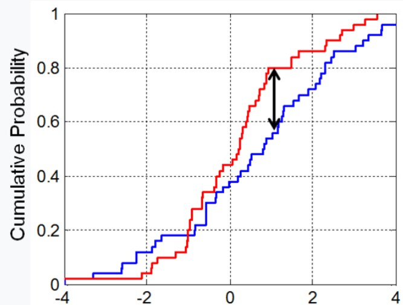
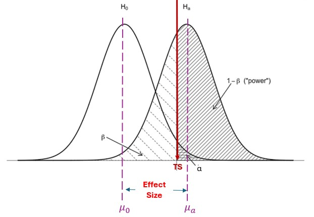
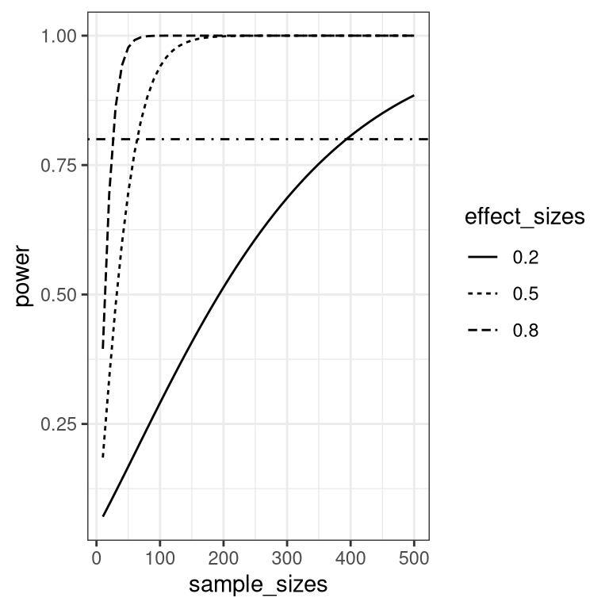
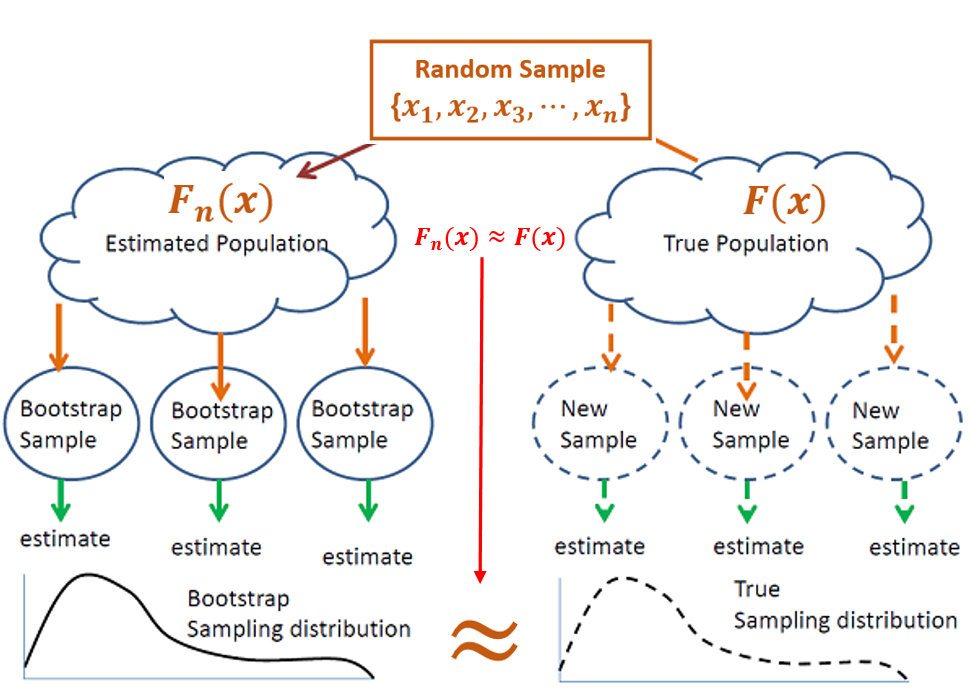
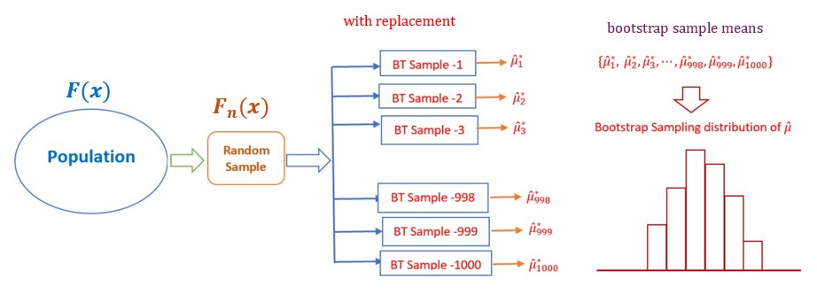
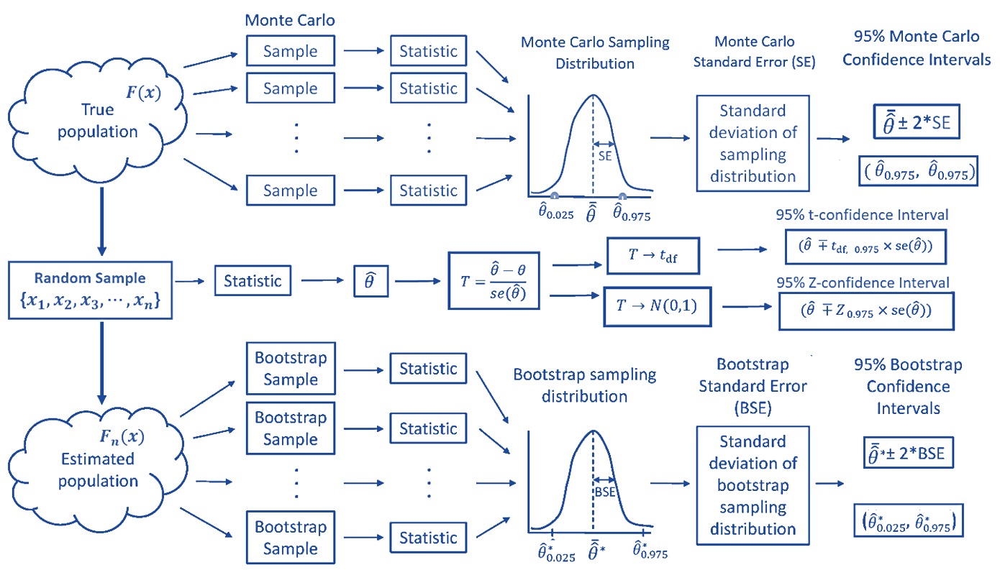

```{=html}

<style type="text/css">

/* Cascading Style Sheets (CSS) is a stylesheet language used to describe the presentation of a document written in HTML or XML. it is a simple mechanism for adding style (e.g., fonts, colors, spacing) to Web documents. */

h1.title {  /* Title - font specifications of the report title */
  font-size: 24px;
  font-weight:bold;
  color: DarkRed;
  text-align: center;
  font-family: "Gill Sans", sans-serif;
}
h4.author { /* Header 4 - font specifications for authors  */
  font-size: 20px;
  font-family: system-ui;
  color: DarkRed;
  text-align: center;
}
h4.date { /* Header 4 - font specifications for the date  */
  font-size: 18px;
  font-family: system-ui;
  color: DarkBlue;
  text-align: center;
}
h1 { /* Header 1 - font specifications for level 1 section title  */
    font-size: 20px;
    font-family: system-ui;
    font-weight:bold;
    color: navy;
    text-align: left;
}
h2 { /* Header 2 - font specifications for level 2 section title */
    font-size: 18px;
    font-weight:bold;
    font-family: "Times New Roman", Times, serif;
    color: navy;
    text-align: left;
}

h3 { /* Header 3 - font specifications of level 3 section title  */
    font-size: 16px;
    font-weight:bold;
    font-family: "Times New Roman", Times, serif;
    color: navy;
    text-align: left;
}

h4 { /* Header 4 - font specifications of level 4 section title  */
    font-size: 18px;
    font-family: "Times New Roman", Times, serif;
    color: darkred;
    text-align: left;
}

body { background-color:white; }

.highlightme { background-color:yellow; }

p { background-color:white; }

</style>
```


```{r setup, include=FALSE}
options(repos = list(CRAN="http://cran.rstudio.com/"))
# code chunk specifies whether the R code, warnings, and output 
# will be included in the output files.
if (!require("knitr")) {
   install.packages("knitr")
   library(knitr)
}

knitr::opts_chunk$set(echo = TRUE,       
                      warning = FALSE,   
                      result = TRUE,   
                      message = FALSE,
                      comment = NA)
```


\


# Introduction

In the previous notes, we talked about parametric distributions and studied their properties. The standard likelihood theory is the major tool to make inferences about the distribution (i.e., population). In the process of making inferences about a population, one way is to <b>hypothesize </b> that the population has a parametric distribution. To estimate the unknown parameters in the hypothesized distribution function (density function for continuous population or probability mass function for discrete population), we use the maximum likelihood method. However, two major questions need to be addressed are

1. How do we know the <b>hypothesized</b> distribution is appropriate for the population distribution? Since statistics is all about approximation, a related question is how do we know the choice of the <b>hypothesized </b> is the best.

2. If we assume that the parametric distribution is correct, we may want to know how good the MLE is.

To answer the above two questions, we need to discuss the goodness-of-fit test and the statistical simulation.


# Goodness-of-fit Tests

The objective of goodness-of-fit is to assess the proximity between the **hypothesized distribution** and the **true distribution**. The problem is we don't know the **true distribution**. To get this around, we need to define **empirical distribution** based on a random sample taken from the **true population** and use it as a proxy population distribution.

Let $F(x: \theta)$ be the true unknown population and $f(x) = F^\prime(x)$ be the density function if the population is continuous. We take a ransom sample $\{x_1, x_2, \cdots, x_n \}\sim F(x:\theta)$. We can use a histogram based on the sample to approximate the density function.

```{r fig.align='center', fig.width=5, fig.height=4}
datset = c(0.69, -1.16, -0.89, -0.13, 1.29, 1.69, 0.20, 1.52, -0.21,  0.77, 
            1.01, 1.73, -1.98, -0.19, 0.52, -0.03, 0.23, 1.29,  0.76, 0.76, 
            0.33, 0.95, -2.90, 0.61, 0.41, -0.46, 1.52, -0.15, 1.46, 1.04, 1.10, 
            1.19, 1.66, 0.70, -0.35, -0.59, -0.12, 1.31, 0.10, 1.42, -0.85, 
            -1.44, 0.93, 0.20, 0.40, -0.77, -0.20, 0.72, -0.16, -0.60, 0.57, 
            1.50, 0.49, 0.41, -0.71, 2.15, -0.21, 0.37, -1.18, 1.09, -1.33, 
            -0.24, 0.08, -1.27, 0.34, 1.10, -0.92, -0.95, -0.17, -0.51, 1.03, 
            0.08,  1.35, 0.09, 2.05, -0.64, 0.94, 0.36, 2.40, -0.67, -1.35, 
            1.24, 2.22, 0.14, 1.04, 0.61, 0.22, 0.19, 0.40, 2.06, -2.48, 2.72, 
            0.06, 0.78, -0.55, 0.76, -0.95, 0.92, -1.64, -0.99)
#hist(datset, breaks = 15, probability = T)
#lines(density(datset), col ="red")
##
hist.score=hist(datset,main='Histogram of the scores',
       breaks =15, col = 'gray', probability = T)
xaxis=c(min(hist.score$breaks),hist.score$mids,max(hist.score$breaks))
yaxis=c(0,hist.score$density,0)
lines(xaxis, yaxis,type='l', lwd = 2, col = "blue")
lines(density(datset), col ="red")
```

Assume that the smooth red curve is the true `unknown` density function $f(x)$. The blue line graph on the top of the histogram (commonly called `frequency polygon` - a graphical device for understanding the shapes of distributions) is based on the data set. **If the hypothesized distribution fits the data, we would expect the red curve to be close to the blue line graph.** We need a **statistical distance** to measure the **closeness** between the two curves. Note that the blue line graph is random since it is dependent on the random sample. This implies that the **statistical distance** will be a random variable. That is, the **statistical distance** should have a distribution.

To define a statistical distance algebraically, we need to know the mathematical expression for the **frequency polygon**, say $\hat{f}(x)$, in order to find the expression of **statistical distance** $|f(x) - \hat{f}(x)|$. However, the expression of the $\hat{f}(x)$ is a piece-wise function dependent on the ways of how to construct the histogram. For example, the following two histograms are constructed using the same data set.

```{r fig.align='center', fig.width=7, fig.height=3}
datset = c(0.69, -1.16, -0.89, -0.13, 1.29, 1.69, 0.20, 1.52, -0.21,  0.77, 
            1.01, 1.73, -1.98, -0.19, 0.52, -0.03, 0.23, 1.29,  0.76, 0.76, 
            0.33, 0.95, -2.90, 0.61, 0.41, -0.46, 1.52, -0.15, 1.46, 1.04, 1.10, 
            1.19, 1.66, 0.70, -0.35, -0.59, -0.12, 1.31, 0.10, 1.42, -0.85, 
            -1.44, 0.93, 0.20, 0.40, -0.77, -0.20, 0.72, -0.16, -0.60, 0.57, 
            1.50, 0.49, 0.41, -0.71, 2.15, -0.21, 0.37, -1.18, 1.09, -1.33, 
            -0.24, 0.08, -1.27, 0.34, 1.10, -0.92, -0.95, -0.17, -0.51, 1.03, 
            0.08,  1.35, 0.09, 2.05, -0.64, 0.94, 0.36, 2.40, -0.67, -1.35, 
            1.24, 2.22, 0.14, 1.04, 0.61, 0.22, 0.19, 0.40, 2.06, -2.48, 2.72, 
            0.06, 0.78, -0.55, 0.76, -0.95, 0.92, -1.64, -0.99)
#hist(datset, breaks = 15, probability = T)
#lines(density(datset), col ="red")
##
par(mfrow=c(1,2))
##

##
hist.score=hist(datset,main=' ', xlab=" ",
       breaks =15, col = 'gray', probability = T)
xaxis=c(min(hist.score$breaks),hist.score$mids,max(hist.score$breaks))
yaxis=c(0,hist.score$density,0)
lines(xaxis, yaxis,type='l', lwd = 2, col = "blue")
lines(density(datset), col ="red")
##
hist.score=hist(datset,main=' ', xlab=" ",
       breaks =6, col = 'gray', probability = T)
xaxis=c(min(hist.score$breaks),hist.score$mids,max(hist.score$breaks))
yaxis=c(0,hist.score$density,0)
lines(xaxis, yaxis,type='l', lwd = 2, col = "blue")
lines(density(datset), col ="red")
```

To avoid **nonuniqueness** of the definition of the **statistical distance** using frequency polygons, we consider the **empirical cumulative distribution function (ECDF)**, denoted by $\hat{F}(x)$ or $F_n(x)$, which is uniquely defined based on a given random sample.

The idea of the definition of $F_n(x)$ is simple. Assume the size of the given random sample is $n$, and each observation (including tied observations) is assigned a weight $1/n$. The definition $F_n(x)$ is defined as a step function in the following

$$
F_n(x) = \frac{1}{n}\sum_{i=1}^n \mathbb{I}(x_n < x)
$$

$\mathbb{I}(x)$ is an indicator function which defined as

$$
\mathbb{I}(x) = \left\{
\begin{array}{cc}
1, &  x_n < x,\\
0, &  x_n \le x. 
\end{array}
\right.
$$

Therefore, $\sum_{i=1}^n \mathbb{I}(x_n < x)$ is the number of data values that are less than $x$. The following figure represents the ECDF of the data set used to create the above histogram


```{r fig.align='center', fig.width=4, fig.height=4}
datset = c(0.69, -1.16, -0.89, -0.13, 1.29, 1.69, 0.20, 1.52, -0.21,  0.77, 
            1.01, 1.73, -1.98, -0.19, 0.52, -0.03, 0.23, 1.29,  0.76, 0.76, 
            0.33, 0.95, -2.90, 0.61, 0.41, -0.46, 1.52, -0.15, 1.46, 1.04, 1.10, 
            1.19, 1.66, 0.70, -0.35, -0.59, -0.12, 1.31, 0.10, 1.42, -0.85, 
            -1.44, 0.93, 0.20, 0.40, -0.77, -0.20, 0.72, -0.16, -0.60, 0.57, 
            1.50, 0.49, 0.41, -0.71, 2.15, -0.21, 0.37, -1.18, 1.09, -1.33, 
            -0.24, 0.08, -1.27, 0.34, 1.10, -0.92, -0.95, -0.17, -0.51, 1.03, 
            0.08,  1.35, 0.09, 2.05, -0.64, 0.94, 0.36, 2.40, -0.67, -1.35, 
            1.24, 2.22, 0.14, 1.04, 0.61, 0.22, 0.19, 0.40, 2.06, -2.48, 2.72, 
            0.06, 0.78, -0.55, 0.76, -0.95, 0.92, -1.64, -0.99)

plot(ecdf(datset),
     main = "ECDF",
     xlab = "data values (2 decimal places)",
     cex=0.1)
```

The jump size in the vertical direction represents the number of tied data values. To make it clearer, the plot of ECDF uses the same data set but keeps only one decimal place

```{r fig.align='center', fig.width=4, fig.height=4}
datset = c(0.69, -1.16, -0.89, -0.13, 1.29, 1.69, 0.20, 1.52, -0.21,  0.77, 
            1.01, 1.73, -1.98, -0.19, 0.52, -0.03, 0.23, 1.29,  0.76, 0.76, 
            0.33, 0.95, -2.90, 0.61, 0.41, -0.46, 1.52, -0.15, 1.46, 1.04, 1.10, 
            1.19, 1.66, 0.70, -0.35, -0.59, -0.12, 1.31, 0.10, 1.42, -0.85, 
            -1.44, 0.93, 0.20, 0.40, -0.77, -0.20, 0.72, -0.16, -0.60, 0.57, 
            1.50, 0.49, 0.41, -0.71, 2.15, -0.21, 0.37, -1.18, 1.09, -1.33, 
            -0.24, 0.08, -1.27, 0.34, 1.10, -0.92, -0.95, -0.17, -0.51, 1.03, 
            0.08,  1.35, 0.09, 2.05, -0.64, 0.94, 0.36, 2.40, -0.67, -1.35, 
            1.24, 2.22, 0.14, 1.04, 0.61, 0.22, 0.19, 0.40, 2.06, -2.48, 2.72, 
            0.06, 0.78, -0.55, 0.76, -0.95, 0.92, -1.64, -0.99)
datset01 = round(datset,1)
plot(ecdf(datset01),
     main = "ECDF",
     xlab = "data values (1 decimal place)",
     cex=0.1)
```

To compare the ECDF of the same data set with different precision of data values, we stack the two ECDFs in the following figure

```{r fig.align='center', fig.width=4, fig.height=4}
datset = c(0.69, -1.16, -0.89, -0.13, 1.29, 1.69, 0.20, 1.52, -0.21,  0.77, 
            1.01, 1.73, -1.98, -0.19, 0.52, -0.03, 0.23, 1.29,  0.76, 0.76, 
            0.33, 0.95, -2.90, 0.61, 0.41, -0.46, 1.52, -0.15, 1.46, 1.04, 1.10, 
            1.19, 1.66, 0.70, -0.35, -0.59, -0.12, 1.31, 0.10, 1.42, -0.85, 
            -1.44, 0.93, 0.20, 0.40, -0.77, -0.20, 0.72, -0.16, -0.60, 0.57, 
            1.50, 0.49, 0.41, -0.71, 2.15, -0.21, 0.37, -1.18, 1.09, -1.33, 
            -0.24, 0.08, -1.27, 0.34, 1.10, -0.92, -0.95, -0.17, -0.51, 1.03, 
            0.08,  1.35, 0.09, 2.05, -0.64, 0.94, 0.36, 2.40, -0.67, -1.35, 
            1.24, 2.22, 0.14, 1.04, 0.61, 0.22, 0.19, 0.40, 2.06, -2.48, 2.72, 
            0.06, 0.78, -0.55, 0.76, -0.95, 0.92, -1.64, -0.99)

plot(ecdf(datset),
     main = "ECDF",
     xlab = "data values",
     lty=1,
     cex=0.1,
     col = "red")
lines(ecdf(datset01),
      cex=0.1,
      col = "blue",
      lty=1)

legend("topleft", c("2 decimal places", "1 decimal place"), 
       col = c("red", "blue"), 
       lty=rep(1,2),
       cex = 0.8,
       bty = "n")
```

In the above figure, the blue curve (step function) has a larger jump size indicating more tied data values and the two curves are close to each other.

From now on, we pretend $F_n(x)$ to be the true CDF of the population from which the random sample was drawn. To be more precise, $F_n(x)$ is the proxy of the unknown population distribution $F(x)$. We now assume that the selected **hypothesized** distribution to fit the data has CDF $F_0(x)$. We can be defined in different ways. One particular definition is due to Andrey Kolmogorov and Nikolai Smirnov. It is customarily called the Kolmogorov-Smirnov test (or simply, K-S Test) which is graphically depicted in the following figure


```{r fig.align='center', out.width="40%"}

```

That is, the biggest vertical distance between the curves of ECDF $F_n(x)$ and the CDF of the hypothesized distribution $F_0(x)$. Mathematically,

$$
D_{\text{KS}} = \sup_x |F_n(x) - F_0(x)|.
$$

If the K-S distance $D_{\text{KS}}$ is small, we conclude that the $F_0(x)$ fits the data well. Otherwise, $F_0(x)$ does not fit the data well.

A statistical question is how **small** is considered **small**. Note that, $D_{\text{KS}}$ is random, if we know the distribution of $D_{\text{KS}}$, we can then justify whether $D_{\text{KS}}$ is small. 

Under null hypothesis that $F_0(x)$ fits the data (i.e., $F_0(x)$ is close to the true unknown $F(x)$), $D_{\text{KS}}$ follows **Kolmogorov distribution**. The characterization of the **Kolmogorov distribution** is out of the scope of this note. R has a built-in kolmogorov-Smirnov test

```{}
ks.test(x, y, ...,
        alternative = c("two.sided", "less", "greater"),
        exact = NULL, simulate.p.value = FALSE, B = 2000)
```


**Remarks** The K-S test compares two CDFs by looking at the statistical distance $D_{\text{KS}}$.

1. If $D_{\text{KS}} = \sup_{x}|F_n(x) - F(x)|$, the KS is called *goodness-of-fit test*.

2. If $D_{\text{KS}} = \sup_{x}|F_n^1(x) - F_n^2(x)|$, K-S is called *two-sample test* which tests whether the two samples were taken from the sample distribution.


**Example**. The following data set was taken from a normal distribution with density function $N(10, 2)$ with cumulative distribution function
$$
F(x) = \int_{-\infty}^x \frac{1}{\sqrt{2\pi}\times 2} e^{-\frac{(t-10)^2}{2\times 2^2}}dt
$$
```{}
9.18, 14.78, 7.22, 11.10, 12.94, 7.79, 11.08, 10.82, 8.80, 8.22, 8.06, 11.21, 
9.51, 6.98, 7.76, 13.78, 7.29, 10.77, 8.93, 10.92, 8.28, 12.39, 8.54, 9.46, 
8.36, 10.31, 11.13, 9.68, 6.31, 10.54, 6.85, 8.44, 10.18, 8.88, 10.61, 6.02, 
9.84, 8.00, 9.35, 10.06, 8.07, 12.74, 8.39, 12.36, 5.13, 12.79, 5.10, 9.20, 
9.80, 9.88, 10.90, 9.95, 11.57, 10.71, 10.46, 13.73, 7.09, 12.05, 14.02, 8.05, 
10.93, 9.14, 10.26, 11.14, 9.34, 12.85, 14.98, 8.50, 10.90, 11.51, 8.68, 10.65, 
9.13, 8.22, 4.72, 11.56, 5.31, 8.64, 11.14, 10.91, 9.35, 7.55, 9.36, 10.78,
7.22, 11.16, 6.02, 11.16, 11.86, 6.77, 8.20, 10.00, 8.20, 8.13, 7.16, 12.48, 
8.87, 3.70, 8.81, 11.72
```


R also has a built-in function to do the definite integral.

```{}
integrate(f, lower, upper, ..., subdivisions = 100L,
          rel.tol = .Machine$double.eps^0.25, abs.tol = rel.tol,
          stop.on.error = TRUE, keep.xy = FALSE, aux = NULL)
```

Next, we write R code to perform the K-S test. Before calling `ks.test`, we need to code CDF and evaluate sorted data points (i.e., the cumulative probability at each given data value). The following is the R code.

```{r}
normCDF = function(xvec, mu, sig){            # argument should be a vector
    CDFvec = NULL
    fn= function(x, mu, sig) {                           # density function
    (1/(sig*sqrt(2*pi)))*exp(-(x-mu)^2/(2*sig^2))
    }
    for (i in 1:length(xvec)){
    CDFvec[i] = integrate(fn, -Inf, xvec[i], mu, sig)  # definite integral!
    }
    as.numeric(CDFvec)                      # must be converted to numeric!
}
```

With the above R function of CDF, we now call `ks.test()` with the given CDF name and corresponding parameter values. Recall that, the null hypothesis K-S goodness-of-fit test is

$$
H_0: \text{Hypothesized distribution is true} \ \text{ v.s. } \ \ H_a: {\text{Hypothesized distribution is false}}
$$

This also implies that, under $H_0$, we would expect the K-S distance to be equal to zero. Therefore, the K-S goodness-of-fit is a two-sided test.


```{r}
xvec0=c(9.18, 14.78, 7.22, 11.10, 12.94, 7.79, 11.08, 10.82, 8.80, 8.22, 8.06, 11.21, 
9.51, 6.98, 7.76, 13.78, 7.29, 10.77, 8.93, 10.92, 8.28, 12.39, 8.54, 9.46, 
8.36, 10.31, 11.13, 9.68, 6.31, 10.54, 6.85, 8.44, 10.18, 8.88, 10.61, 6.02, 
9.84, 8.00, 9.35, 10.06, 8.07, 12.74, 8.39, 12.36, 5.13, 12.79, 5.10, 9.20, 
9.80, 9.88, 10.90, 9.95, 11.57, 10.71, 10.46, 13.73, 7.09, 12.05, 14.02, 8.05, 
10.93, 9.14, 10.26, 11.14, 9.34, 12.85, 14.98, 8.50, 10.90, 11.51, 8.68, 10.65, 
9.13, 8.22, 4.72, 11.56, 5.31, 8.64, 11.14, 10.91, 9.35, 7.55, 9.36, 10.78,
7.22, 11.16, 6.02, 11.16, 11.86, 6.77, 8.20, 10.00, 8.20, 8.13, 7.16, 12.48, 
8.87, 3.70, 8.81, 11.72)
###
ks.test(xvec0, "normCDF", mu=10, sig=2, alternative = "two.sided")
```

The p-value = 0.1386 implies that we fail to reject the null hypothesis that the data set is a sample of normal distribution $N(10, 2)$.

**A Comment on K-S Test**: The default K-S test is the two-sided goodness-of-fit test. It can be used to test the **stochastic order** between two distributions such as $F_n^1(x) > F_n^2(x)$. In this case, the test should be either a left-tailed test or a right-tailed test.

\

# Statistical Simulation Concept

In statistics, simulation studies are computer experiments that involve creating data by pseudo‐random sampling from **known probability distributions**. They are used to obtain empirical results about the performance of statistical methods in certain scenarios, as opposed to more general analytic (algebraic) results, which may cover many scenarios. It is not always possible or may be difficult, to obtain analytic results in statistics. Simulation studies are considered to be **numerical proofs**.

<font color = "darkred">**\color{red}The general purpose of a simulation study is to validate or assess the performance of new or existing statistical methods**</font>


**Simulation for validating A Statistical Procedure**: We discussed the maximum likelihood estimation (MLE) in earlier notes. However, we have not discussed whether MLE is valid. That is, we even don't know whether the **estimated value** of a parameter is close to the **true unknown parameter**. We have defined some validating measures such as bias and error of the estimates that involve **unknown parameters**. One of the most important results that are required to report in the methodology research is the coverage of measures of uncertainty which will be detailed later. The basic steps used for this type of simulation are summarized in the following

1. fit the model to the data

2. draw new random samples from the best-fit parameters or posterior distribution 

3. run inference on the simulated data

4. validate the model/procedure


**Simulation for Assessing the Performance of A Statistical Procedure**: It is not uncommon that multiple statistical procedures could be used to perform the same statistical task. The practical question is how to assess the performance of these multiple statistical procedures in order to choose the best one for implementation. As an example, the K-S goodness-of-fit test is only one such test for assessing how well a model fits into the data. Other general goodness-of-fit tests such as Anderson-Darling and Shapiro-Wilk tests can also be used for assessing the goodness-of-fit of the hypothesized distribution. 

The question is how the performance of a goodness-of-fit test is measured. A perfect K-S goodness-of-fit test meets two conditions: (1) if the hypothesized distribution is true, the K-S test concludes the null hypothesis; (2) if the hypothesized distribution is false, the K-S test rejects the null hypothesis.

**Recall the null hypothesis: $H_0$: The hypothesized distribution is true.**


$$
P(\text{K-S test concludes the null hypothesis} |{\text{Hypothesized distribution is true}}) = \text{Sensitivity}
$$
$$
P(\text{K-S test rejects the null hypothesis } |{ \text{Hypothesized distribution is false}}) = \text{Specificity}
$$
The specificity in the above definition is also called **power** of the K-S test based on the given *alternative hypothesis*. Ideally, we would like to have a formula to calculate the performance measures such as sensitivity and specificity of a test. In reality, such formulas do not exist for most of the cases in which a simulation study is needed to find the power and sensitivity. 

The steps for conducting a simulation for performance analysis are

1. design/create an inference model/procedure

2. simulate random samples from that model

3. run inference on the simulated data 

4. Check the performance of the simulated data with that of the true model. 


In both types of simulation studies, a crucial step is to generate random samples from a given model/procedure. Next, we discuss how to generate random samples from an assumed model.

\


# Random Number Generation

There are different methods for generating random variables. This note introduces two that are commonly used in statistical simulations: inverse transformation and rejection-and-acceptance methods.


## Inverse Transformation Method

We first state a theorem about the transformation of CDF and then use it to develop an algorithm to generate random numbers from a given distribution with an explicit cumulative distribution function. The algorithm involves uniform distribution as outlined below.

**Uniform Distribution on [$a$, $b$]**: A continuous uniform random variables defined on interval $[a, b]$ is denoted by $\mathbb{U}(a,b)$. The probability density function is given by

$$
f(u) = \left\{ 
       \begin{array}{ll}
        1, & \text{ if } u \in [a, b], \\
        0, & \text{ if } u \notin [a, b].
       \end{array}
       \right.
$$


The CDF of $U$ is defined to be

$$
F(u) = P[U<u] = \left\{ 
       \begin{array}{ll}
        1, & \text{ if } u \in (b, \infty), \\
        \int_a^u 1 dt = u, & \text{ if } u \in [a, b], \\
        0, & \text{ if } u \notin (-\infty, a).
       \end{array}
       \right.
$$

The following theorem explains the algorithm of inverse transformation for generating random numbers based on the given CDF.


**Theorem** Let $F(x)$, $x \in \mathbb{R}$, be the cumulative distribution function (cdf) of random variable $X$ (continuous or not). Then $0 \le F(X) \le 1$ is a uniform random variable defined on $[0, 1]$.

**Sketch of Proof**: Let $Y = F(X)$ be the transformed random variable (we discussed this in an earlier note). We only need to show that $Y$ is a uniform random variable on $[0, 1]$. By definition of CDF, 

$$
F(y) = P[Y < y] = P[F(X) < y] = P[X < F^{-1}(y)] = F[F^{-1}(y)] = y.
$$
This implies that $Y$ is the uniform distribution on $[0, 1]$.


**The Implication**: Let $U \in (0, 1)$ be the uniform distribution. Since $F(X) = U$ for any cumulative distribution function. If the explicit expression of the inverse of $F(\cdot)$ exists and is denoted by $F^{-1}(.)$. Then $X = F^{-1}(U) \to F(x)$. This means that, if we take a $\mathcal{U}(0,1)$ uniform random sample $\{u_1, u_2, \cdots, u_n \}$, then $\{x_1, x_2, \cdots, x_n \} \to F(x)$, where $x_i = F^{-1}(u_i)$.


**Example** Let $X \to \text{Weibull}(\lambda, k)$ with density function

$$
f(x) = \left\{
    \begin{array}{ll}
    \frac{k}{\lambda}\left(\frac{x}{\lambda} \right)^{k-1} e^{-(x/\lambda)^k}, & x\ge 0, \\
     0, & x < 0.
    \end{array}
    \right.
$$

The CDF of the above Weibull distribution is given by

$$
F(x) = \left\{ 
       \begin{array}{ll}
        1-e^{-(x/\lambda)^k}, & \text{ if } x \ge 0, \\
        0, & \text{ if } x< 0.
       \end{array}
       \right.
$$

To simulate random numbers from the above Weibull distribution, set $U = 1-e^{-(X/\lambda)^k}$ and solve for $X$

$$
X = \lambda [-\log(1-U)]^{1/k}.
$$

Assume that we want to simulate a random sample with 100 values from $\text{Weibull}(\lambda = 2,k = 0.5)$, then $X = 2[-\log(1-U)]^2$.

The following R code illustrates how to simulate the given Weibull random numbers. We then use the simulated values to make a histogram and compare it with true $\text{Weibull}(2,0.5)$.


```{r  fig.align='center', fig.width=6, fig.height=4}
Udat = runif(100)  # generate 100 uniform random numbers
WeibullDat = 2*(-log(1-Udat))^2
hist(WeibullDat, breaks=11, probability = T, ylim=c(0,0.25),
     main = "Simulated Weibull Random Numbers",
     xlab="Weibull Random Number")
dd=density(WeibullDat)
lines(dd, col = "blue", lty = 1, lwd =1)
## True Weibull density
xx=seq(0, 30, length=200)
k=0.5
lam = 2
yy = (k/lam)*(xx/lam)^(k-1)*exp(-xx/lam)^k
lines(xx,yy, lty=1, lwd=2, col = "red")
legend("topright", c("estimated density", "true density"), lty=rep(1,2), 
       col=c("blue", "red"), lwd=c(1,2), cex=0.8, bty="n")
```

The simulated density curve is similar to the true density curve.

In general, a CDF is always non-decreasing. For a discrete distribution, the CDF is a non-decreasing step function. For a continuous distribution, the CDF is always monotonically increasing. If a CDF is not monotonically increasing, we can define a generalized inverse as

$$
F^{-1}(p) = \inf \{ x \in \mathbb{R}: F(x) \ge p \}.
$$

\

## Acceptance-Rejection Method


The motivation for the acceptance-rejection method is that most CDFs cannot be inverted efficiently, which means that the inverse transform method has limited applicability.

Suppose $X$ and $Y$ are random variables with probability density function (PDF) or probability mass function (PMS) $f$ and $g$, respectively. Furthermore, suppose there exists a constant $c$ such that

$$
0 \le \frac{f(x)}{g(x)} \le c, \ \text{ or equivalently } \ \  0 \le \frac{f(x)}{cg(x)} \le 1.
$$

for every value of $x$, with $f(x) > 0$. To use the acceptance-rejection method to generate observations of the random variable $X$, using the algorithm below, first find a random variable $Y$ with PDF or PMF $g(y)$ from which we can easily simulate random numbers.


**Acceptance-Rejection Algorithm**: With the distributions $f(x)$ and $g(x)$ discussed earlier, we want to generate random sample $\{x_1, x_2, \cdots, x_n \} \sim f(x)$. Given that it is difficult to simulate data from $f(x)$.  It is easy to simulate a random sample from $g(x)$. The following steps will generate the desired sample. 

**Step 1** - Generate an observation $y$ from a random variable $Y$ with PDF/PMF $g(y)$;

**Step 2** - Generate an observation $u$ from a random variable $U\sim \mathcal{U}(0,1)$;

**Step 3** - If $u < \frac{f(y)}{cg(y)}$, accept $x = y$; otherwise reject $y$ as an observation of the random variable $X$ and go back to step 1.


To show how the **acceptance-rejection algorithm** works, we only need to show that the conditional probability holds for continuous random variable 

$$
P(X \le x) = P[Y \le x | \text{accept } Y] = P\left[Y \le x \bigg| U \le \frac{f(Y)}{cg(Y)} \right].
$$

Using the definition of conditional probability $P(A|B) = P(A\cap B)/P(B)$, we have

$$
P(X \le x) = P\left[Y \le x \bigg| U \le \frac{f(Y)}{cg(Y)} \right] = \frac{P\left[Y \le x \cap  U \le \frac{f(Y)}{cg(Y)}\right]}{P\left[ U \le \frac{f(Y)}{cg(Y)}\right]}.
$$

Note that

$$
P\left[ U \le \frac{f(Y)}{cg(Y)} \right] = \int_{-\infty}^\infty P\left[ U \le \frac{f(Y)}{cg(Y)}\bigg| Y = y  \right] g(y) dy
$$

$$
= \int_{-\infty}^\infty P\left[ U \le \frac{f(y)}{cg(y)}\right] g(y) dy = \int_{-\infty}^\infty    \frac{f(y)}{cg(y)} \times g(y) dy = \frac{1}{c}.
$$

Using the same trick, we have

$$
P\left[Y \le x \cap  U \le \frac{f(Y)}{cg(Y)}\right] = \int_{-\infty}^\infty P\left[Y \le x \cap  U \le \frac{f(Y)}{cg(Y)}\bigg| Y=y  \right] g(y) dy
$$

$$
= \int_{-\infty}^\infty P\left[y \le x \cap  U \le \frac{f(y)}{cg(y)} \right] g(y) dy = \int_{-\infty}^x P\left[ U \le \frac{f(y)}{cg(y)} \right] g(y) dy = \frac{1}{c}\int_{-\infty}^x f(y)dy.
$$


Therefore,

$$
P\left[Y \le x \bigg| U \le \frac{f(Y)}{cg(Y)} \right] = \frac{P\left[Y \le x \cap  U \le \frac{f(Y)}{cg(Y)}\right]}{P\left[ U \le \frac{f(Y)}{cg(Y)}\right]} =\frac{ {\frac{1}{c}\int_{-\infty}^x f(y) dy}}{\frac{1}{c}} = \int_{-\infty}^x f(y) dy = F(x).
$$
The above conditional cumulative distribution implies that the **acceptance-rejection algorithm** generates the desired samples. The condition $U \le f(Y)/[c g(Y)]$ is the condition used in the **acceptance-rejection algorithm**. 

\

**Example**  Consider generating random samples from a population with density function $f(x) =60x^3(1-x)^2, 0 \le x \le 1$.

We can show that this is a legitimate density in the following

$$
\int_0^1 60x^3(1-x)^2 dx = \int_0^1 60x^3(1-2x+x^2) dx = \int_0^1 (60x^3-120x^4 + 60x^5)dx
$$

$$
=(15x^4 - 24x^5 + 10x^6)\bigg|_0^1 = 15-24+10 = 1.
$$

The CDF function is 

$$
F(x) = \int_0^x f(t)dt = 15x^4 - 24x^5 + 10x^6.
$$

Finding the explicit expression of the inverse of 6-th order polynomial function is not straightforward. The **acceptance-rejection algorithm** is appropriate in this case.

To proceed, we need to find an easy density $g(x)$ and a constant $c$ such that $t(x) = cg(x) \ge f(x)$ for all $x \in [0,1]$. To make it more intuitive, we draw the density curve of $f(x)$ and the candidate easy density $g(x)$ and $t(x) = c g(x)$ that majorizes $f(x)$.

```{r fig.align='center', fig.width=4, fig.height=4}
xx = seq(0,1, length=100)
yy = 60*xx^3*(1-xx)^2
plot(xx,yy, type = "l", 
     lty=1, 
     lwd=2,
     col="blue",
     xlim=c(0,1),
     ylim = c(0,2.5),
     xlab = "x", 
     ylab = "f(x)",
     main="Acceptance-Rejection Demo")
lines(c(0,1), c(1,1), 
      lty = 1,
      lwd = 2, 
      col = "darkred")
segments(0, 2.1, 1,2.1,
      lty = 1,
      lwd = 2, 
      col = "purple")
segments(c(0,1),c(0, 0), c(0, 1), c(2.1, 2.1),
      lty = 2,
      lwd = 1, 
      col = "darkgreen")
##
legend("bottom", c("f(x)", "g(x)", "t(x)"),
       lty=rep(1,3),
       col=c("blue", "darkred", "purple"),
       cex = 0.8,
       lwd=rep(2,3),
       bty="n")
```


The above figure has shown the choice of $g(y) \sim \mathcal{U}(0,1)$ and $c = 2.1$. Note the unique maximum on [0, 1] is less than 2.1. Therefore. $t(x) = 2.1 \mathbb{I}(0\le x \le 1) \ge f(x)$. Next, we use the configurations of $c$ and $g(y) = \mathbb{I}(0\le x \le 1)$.


```{r fig.align='center', fig.width=6, fig.height=5}
fnx = function(x){60*x^3*(1-x)^2}
cgx = function(x){2.1}
n = 100
##
sampleX = rep(NA,n)  # define a zero vector to store valid simulated values
n = 100
i = 1
while (i < 101){   # need to use while loop since some generated values will be 
                   # rejected.
  u0 = runif(1)
  u = runif(1)
  if (u < fnx(u0)/cgx(u0)) {
       sampleX[i] = u0
       i = i + 1} else {
       i=i
  }
}
###
hist(sampleX, probability = TRUE,
     ylim=c(0,2.8),
     main = "Simulated vs True Density")
lines(density(sampleX), 
      col = "blue",
      lty=1,
      lwd = 2)
##
xx = seq(0,1, length=100)
yy = 60*xx^3*(1-xx)^2
lines(xx,yy, 
     lty=2, 
     lwd=1,
     col="red")
legend("topright", c("simulated density","true density"),
       lty=c(1,2),
       lwd=c(2,1),
       col= c("blue", "red"),
       cex= 0.8,
       bty = "n")
```

There are some other methods for simulating random numbers, the inverse transformation and acceptance and rejection methods are commonly used in practice.

We have discussed maximum likelihood estimator (MLE) in the previous notes. When we choose a distribution to fit into a data set, the numerical method generates an estimated value of the population parameter, but we don't know whether the estimated values are close to the **unknown true value** because we even don't know whether the selected model is valid. If we fit the model/distribution into the simulated data, we will have a better idea of whether the MLE is close to the true values.

In the next two sections, we discuss two major types of simulation studies in MLE-based parametric methodological research: coverage probability for validating the estimators and power curve analysis for the performance of hypothesis tests.

\

# Coverage Probability

In statistical estimation theory, the **coverage probability** is the probability that a confidence interval or confidence region will include the true value (parameter) of interest. In Monte Carlo simulation studies, it refers to the proportion of confidence intervals that contain the true value of the parameter being estimated. 

In the context of Monte Carlo simulations, we need to know several concepts:


1. the **coverage probability** measures how often the true parameter value falls within the constructed confidence intervals across multiple simulations with a pre-set **nominal level**.


2. the **nominal level**  often refers to the desired level of confidence or significance for a statistical test or confidence interval.


3. The purpose of using coverage probability** is to assess the accuracy and reliability of the confidence intervals method, especially when the underlying data distribution is unknown or complex. It is also used to compare two different methods for constructing confidence intervals.


4. **The coverage probability is estimated** by repeatedly sampling from the data and constructing confidence intervals, the coverage probability is approximated by the fraction of intervals that include the true parameter value.


The logic of using **coverage probability** is based on the following:

The **(true) coverage probability** is the actual probability that the interval contains the parameter. If all assumptions used in deriving a confidence interval are met, the nominal coverage probability will equal the coverage probability. If any assumptions are not met, the actual coverage probability could either be less than or greater than the nominal coverage probability.

When the actual coverage probability is greater than the nominal coverage probability, the interval is termed a conservative (confidence) interval; if it is less than the nominal coverage probability, the interval is termed anti-conservative, or permissive.

In summary, **coverage probability** is a way to assess confidence intervals. The usual way to choose a coverage probability is by convention or best judgment, with 90%, 95%, and 99% being typical choices.


**Example**: We consider the coverage probabilities of MLE of Weibull parameters. The specific parametrization of the Weibull in this example has the following form

$$
f(x) = \alpha\beta x^{\beta-1}e^{-\alpha x^{\beta}}.
$$

To find the coverage probability of the MLE of the parameters $\alpha$ and $\beta$, we need to proceed in the following steps:

1. Choose values of $\alpha$ and $\beta$, say $\alpha = 2$ and $\beta = 0.5$

2. Find CDF and use the inverse transformation method to simulate the random samples with a pre-selected sample size $n_0$

3. Use the maximum likelihood estimation to find the MLE model parameters.

4. Construct $95\%$ asymptotic confidence intervals for $\alpha$ and $\beta$ based on the Monte Carlo samples. $\alpha = 0.95$ is called the nominal level.

5. Check the percentage of confident intervals that contain $\alpha = 2$ and $\beta = 0.5$, respectively.


We first the random number generator in the following

$$
F(x) = \int_0^x \alpha\beta y^{\beta -1} e^{-\alpha y^{\beta}}dy = -e^{-\alpha y^{\beta}}\bigg|_0^x = 1-e^{-\alpha x^{\beta}}.
$$

The inverse of $F(x)$ is given below.

$$
F^{-1}(x) =  \left[-\frac{\alpha}{\log [1-x]}\right]^{1/\beta}.
$$

The random number generator is

$$
X = \left[-\frac{\log [1-U]}{\alpha}\right]^{1/\beta}, \text{ where } U\sim \mathcal{U}(0,1).
$$

Recall that the asymptotic distribution of the MLE is given by

$$
\sqrt{n}(\hat{\theta} - \theta) \stackrel{\text{approx}}{\rightarrow_p} \mathcal{N}\left[\mathbf{0}, \mathbb{I}_0^{-1}(\theta)\right] \text{ or equivalently } (\hat{\theta} - \theta) \stackrel{\text{approx}}{\rightarrow_p} \mathcal{N}\left[\mathbf{0}, \mathbb{I}_n^{-1}(\theta)\right]
$$

where $\mathbb{I}_n(\theta)$ is the **Fisher Information matrix** based on the entire observations. Since we will use either `optim()` or `nlm()` to find the MLE and Hessian, we use the following form of the asymptotic normality

$$
(\hat{\theta} - \theta) \stackrel{\text{approx}}{\rightarrow_p} \mathcal{N}\left[\mathbf{0}, \mathbb{I}_n^{-1}(\theta)\right].
$$


For the two parameter cases, we denote

$$
\mathbb{I}_n^{-1}(\theta, \theta_2) =\begin{pmatrix}
      \sigma_1^2  & \sigma_{12} \\
      \sigma_{12} & \sigma_2^2
     \end{pmatrix}.
$$
The asymptotic result is explicitly expressed in the following


$$
\begin{pmatrix}
   \hat{\theta}_1   \\
   \hat{\theta}_2 
\end{pmatrix} \stackrel{\text{approx}}{\rightarrow_p}
\mathcal{N}_2
\left[
     \begin{pmatrix}
      \theta_1 \\
      \theta_2
     \end{pmatrix},
      \begin{pmatrix}
      \sigma_1^2  & \sigma_{12} \\
      \sigma_{12} & \sigma_2^2
     \end{pmatrix}
\right],
$$

where

$$
\text{var}(\hat{\theta}_1) = \sigma_1^2, \ \ \text{var}(\hat{\theta}_2) = \sigma_2^2, \ \  \text{ and } \ \ \text{cov}(\hat{\theta}_1, \hat{\theta}_2) = \sigma_{12}.
$$

The two-sided $95\%$ confidence intervals for $\theta_1$ and $\theta_2$ are given respectively in the following

$$
\hat{\theta}_1 \pm Z_{0.975}\sqrt{\hat{\sigma}_1^2} \ \ \text{ and } \ \ \hat{\theta}_1 \pm Z_{0.975}\sqrt{\hat{\sigma}_2^2}.
$$

Next, we use R to implement the above procedure.


```{r}
## empty vectors to store lower and upper confidence limits
## of the two parameters for each 95% confidence intervals
amin = NULL
amax = NULL
bmin = NULL
bmax = NULL
## empty vectors to store the MLE calculated from each simulated sample
aa=NULL
bb=NULL
n = 100
### will simulated samples to construct 1000 95% confidence intervals
for (i in 1:1000){
##
x = (-log(1-runif(n))/2)^2   # Simulated data set!
## log-likelihood
negLogLik = function(A){
  a = A[1]
  b = A[2]
  n*log(a) + n*log(b) + (b-1)*sum(log(x)) - a*sum(x^b)
}
## gradient function
grFun = function(A){
  a = A[1]
  b = A[2]
  ga = n/a - sum(x^b)
  gb= n/b +sum(log(x)) -a*sum(x^b*log(x))
  c(ga,gb)
}
## calling R function optim()
results = optim(par = c(2,.5), 
                fn = negLogLik, 
                gr = grFun, 
                method = "BFGS", 
                control = list(maxit = 20000,
                               fnscale = -1), 
                hessian = TRUE)
###
MLE = results$par
Counts = results$counts
Convergence = results$convergence
Hessian = results$hessian
I0.inv = - solve(Hessian)
sdpar = sqrt(diag(I0.inv))
##
aa[i] = MLE[1]
bb[i] = MLE[2]
##
amin[i] = MLE[1] - 2*sdpar[1]
amax[i] = MLE[1] + 2*sdpar[1]
bmin[i] = MLE[2] - 2*sdpar[2]
bmax[i] = MLE[2] + 2*sdpar[2]
}
cover.a = sum(amin < 2 & amax > 2)/1000
cover.b = sum(bmin < 0.5 & bmax > 0.5)/1000
###
c(cover.a = cover.a, cover.b = cover.b)
```

This simulation study is based on a sample size $n=100$. In practice, we want to assess the validity of new/existing procedures under small sample settings. When calculating coverage probabilities, we choose a sequence of different sample sizes including some very small sizes to see how small sample sizes affect coverage probabilities. At the same time, the choice of parameters in the simulation may also impact the coverage probabilities. In statistical methodological research, a table of coverage probabilities that reflects different choices of sample sizes, different nominal levels, and different values of parameters are reported in the simulation studies.

\

# Statistical Power of Hypothesis Tests

We have discussed using coverage probability to validate the confidence intervals. This section discusses statistical power to assess the performance of a hypothesis test. Statistical powers are only used to compare multiple hypothesis tests. The power is a global performance measure. Since statistical power involves several important concepts, we start with basic ones.

\

## Type I and Type II Errors

Any statistical decision process will involve two potential errors that cause wrong decisions. For illustration, we consider the following testing hypothesis about a population mean $\mu$ in the following

$$
H_0: \mu = \mu_0 \ \ \ \text{ v.s. } \  \ H_a: \mu > \mu_0. \ \ (\text{ say, } \ \ \mu = \mu_a)
$$

The probability (rates) of committing the two types of errors is defined as

1. **Type I Error** is to reject $H_0$ while it is true. It is a conditional event: <font color = "red">**\color{red}Reject Ho | Ho is true**</font>. The probability of committing a type I error is defined to be

$$
\alpha = P[\text{type I error}] = P[\text{Reject Ho} | \text{ Ho is true}]
$$ 

2. **Type II Error** is to conclude Ho while it is false. It is also a conditional even: <font color = "red">**\color{red}Fail to reject Ho | Ho is false**</font>. The probability of committing type II error is defined to be

$$
\beta = P[\text{type II error}] = P[\text{Fail to reject Ho} | \text{ Ho is false}]
$$ 

3. **Power of A Hypothesis Test** is defined to be $1 - \beta$. That is,

$$
\text{Power} = P[\text{ reject Ho } | \text{ Ho is false }] = 1 - \beta.
$$

The above quantities are depicted in the following figure.


```{r fig.align='center', out.width="50%", out.height="40%"}

```

\

## Power Curves


Recall that the test statistic (TS) for testing population mean $\mu$ in the above hypotheses with a random sample $\{x_1, x_2, \cdots, x_n \}\sim f(x)$ is defined as $TS = \bar{x}$. From the above figure, we see that type I and II error probabilities are impacted by **sample size** and the **effect size**. We can find closed-form expressions for type I and II error probabilities when testing normal population means. 

Because the power of the test is dependent on the sample size and the alternative hypothesis, so we plot a power curve with different sample sizes. We could also make a power curve based on the different values of the alternative hypothesis. The following figure shows power curves based on different configurations of sample sizes and effective sizes.


```{r fig.align='center', out.width="50%", out.height="40%"}

```

\

## A Simulation Study - Power Analysis

In this subsection, we illustrate how to calculate the power of Wald and likelihood ratio tests for testing the hypothesis on the shape parameter of the following Weibull distribution with CDF

$$
F(x) = \left\{ 
       \begin{array}{ll}
        1-e^{-\gamma x^\beta}, & \text{ if } x \ge 0, \\
        0, & \text{ if } x< 0.
       \end{array}
       \right.
$$

To simulate random numbers from the above Weibull distribution, set $U = 1-e^{-(X/\gamma)^\beta}$ and solve for $X$

$$
X = \left[-\frac{1}{\gamma}\log(1-U)\right]^{1/\beta}.
$$

The hypothesis to be considered is

$$
H_0: \beta = 1 \ \ \ \text{versus} \ \ \ H_a: \beta \ne 1.
$$

**The Set-up Simulation**: The two tests we will compare with each other are the Wald and Likelihood Ratio tests. The following are different choices of parameters, simulated sample sizes, and nominal levels.

1. Choose $\gamma = 2$.

2. Choose a sequence of $\beta = 0.4, 0.6, 0.8, 1, 1.2, 1.4, 1.6$.

3. Choose a few sample sizes $n = 30, 100$ (we only choose 2 different sample sizes for illustrative purposes).

4. Choose nominal level $\alpha = 0.05$.

The configurations in the simulations are: $(n, \gamma, \beta) =$ (30, 2, 0.2), (30, 2, 0.6), (30, 2, 0.8), (30, 2, 1), (30, 2, 1.2), (30, 2, 1.4), (30, 2, 1.6), (100, 2, 0.2), (100, 2, 0.6), (100, 2, 0.8), (100, 2, 1), (100, 2, 1.2), (100, 2, 1.4), (100, 2, 1.6).

5. For each configuration, we simulate 1000 Monte Carlo samples with the same size calculate the power, and store it in the following power table.


| $\beta$  | $n=30$  | $n=30$ | $n=100$  | $n=100$ |
|:-------:|:-------:|:-------:|:-------:|:-------:|
|0.4   | X  |  X  | X  |  X  |
|0.6   |  X |  X  | X  |  X  |
|0.8   | X  |  X  | X  |  X  |
|1.0   | X  |  X  | X  |  X  |
|1.2   | X  |  X  | X  |  X  |  
|1.4   | X  |  X  | X  |  X  |  
|1.6   | X  |  X  | X  |  X  | 

With the above shell table in mind, we run the following simulation. Note that the log-likelihood function of the Weibull distribution


$$
l(\alpha, \beta) = n[\log(\alpha) + \log (\beta)] + (\beta -1)\sum_{i=1}^n\log (x_i)-\alpha\sum_{i=1}^n x_i^\beta.
$$

Before drafting the code, we briefly explain how to calculate the power of the following hypothesis

$$
H_0: \beta = 1 \ \ \ \text{ versus } \ \ \ H_a: \beta \ne 1.
$$

We choose some $\beta$ values around 1 (i.e., some of them are less than 1 and some of them are bigger than 1) in the simulation. This means that $H_0: \beta = 1$ should be rejected when $\beta \ne 1$ or, equivalently, the true $\text{p-value} < 0.05$ (the true p-value is called **nominal level**). If the p-value of the test based on the simulated sample is also less than $0.05$, the resulting statistical decision is correct. 

Each of the 1000 Monte Carlo samples generates a p-value. The percentage of Monte Carlo p-values is

$$
\#(\text{ p-value } < 0.05)/1000 \approx P\left[ \text{ reject null hypothesis of exponential } | \text{ given Weibull } \right] = \text{ power}
$$

With the above explanation, we only need to calculate the p-value for each Monte Carlo sample and count the number of p-values that are less than 0.05 to get the power.

Next, we draft an R function with arguments: `scale`, `shape`, and `sample size`.

```{r}
#G = 2
#B = 1
#n = 100
##
powCalc = function(G, B, n){
  # G = parameter gamma 
  # B = parameter beta
  # n = sample size
  pval.lrt = NULL         # NULL vector to store p-values for LRT
  pval.W = NULL           # NULL vector to store p-values for Wald
  for (i in 1:1000){
   ## Random Number Generator
   Udat = runif(n)                  # generate 100 uniform random numbers
   x = (-(1/G)*log(1-Udat))^(1/B)   # Random numbers based on given pars
   ##
   ## log-likelihood
   negLogLik = function(A){         # log-likelihood function
      g = A[1]
      b = A[2]
      n*log(g) + n*log(b) + (b-1)*sum(log(x)) - g*sum(x^b)
   }
   ## gradient function
   grFun = function(A){             # gradient vector
      g = A[1]
      b = A[2]
      dg = n/g - sum(x^g)
      db= n/b +sum(log(x)) -g*sum(x^b*log(x))
      c(dg,db)
   }
   ##
   ## calling optim()
   result = optim(par = c(G,B),     # the optimization 
                  fn = negLogLik, 
                  gr = grFun, 
                  method = "BFGS", 
                  control = list(maxit = 20000,fnscale = -1), 
                  hessian = TRUE)
     ###
     ###
     PAR = result$par
     ### Likelihood Ratio Test
     ## Restricted MLE
     rG = 1/mean(x)
     rlgLik = n*log(rG) - rG*sum(x)
     ## Full likelihood
     flgLik = n*log(PAR[1]) + n*log(PAR[2]) + (PAR[2]-1)*sum(log(x)) - PAR[1]*sum(x^PAR[2])
     #  negLogLik(A = results$par)
     LRT = -2*(rlgLik-flgLik)           # likelihood ratio test statistic
     #cat("LRT = ", LRT, " rlgLik =", rlgLik, " flgLik =", flgLik, "\n PAR = ", PAR, "\n")
     pval.lrt[i] = 1-pchisq(LRT,1)
     ###
     ###
     ## Wald Test
     MLE = result$par                    # MLE ....
     Counts = result$counts
     Convergence = result$convergence  # This should be checked....
     Hessian = result$hessian          # Hessian matrix based on the entire data
     In.inv = -solve(Hessian)          # The covariance matrix of the MLE
     
     ###
     ###
     W = (MLE[2]-1)^2/In.inv[2,2]      # Wald statistic with df = 1
     pval.W[i] = 1 - pchisq(W,1)       # right-tailed test
    } 
   pow.lrt = sum(pval.lrt < 0.05)/1000 # Power = P( Reject Ho in simulated data | Model is false)
   pow.W = sum(pval.W < 0.05)/1000
   c(n = n, B = B, pow.lrt = pow.lrt, pow.W = pow.W)   # output information
}
```

### Fixed Sample Size with Different Shape

```{r}
BB = seq(0.6, 1.4, by = 0.05)
N = c(30, 50, 70)
Shp.pow.30 = matrix(0, ncol=4, nrow = 17)
Shp.pow.50 = matrix(0, ncol=4, nrow = 17)
Shp.pow.70 = matrix(0, ncol=4, nrow = 17)

for(i in 1:17){
    Shp.pow.30[i,] = powCalc(G =2, B=BB[i], n=30)
}
for(i in 1:17){
    Shp.pow.50[i,] = powCalc(G =2, B=BB[i], n=50)
}
for(i in 1:17){
    Shp.pow.70[i,] = powCalc(G =2, B=BB[i], n=70)
  }
```

```{r}
Shp.pow.50
```
```{r fig.align='center', fig.width=5, fig.height=5}
plot(Shp.pow.30[,2], Shp.pow.30[,3], 
     xlim=c(0.5, 1.5), 
     ylim=c(0,1),
     xlab="shape parameter",
     ylab = "Power",
     type = "l",
     lty=1,
     col="blue",
     main = "Comparison of Power Curves")
lines(Shp.pow.30[,2], Shp.pow.30[,4],
      lty=2,
      col = "blue")
lines(Shp.pow.50[,2], Shp.pow.50[,3],
      lty=1,
      col = "red")
lines(Shp.pow.50[,2], Shp.pow.50[,4],
      lty=2,
      col = "red")
lines(Shp.pow.70[,2], Shp.pow.70[,3],
      lty=1,
      col = "turquoise4")
lines(Shp.pow.70[,2], Shp.pow.70[,4],
      lty=2,
      col = "turquoise4")
##
abline(h=0.05)
legend("top", c("LRT.30", "Wald.30", "LRT.50", "Wald.50", "LRT.70", "Wald.70"),
       lty=c(1,2,1,2,1,2),
       col=c("blue","blue", "red", "red", "turquoise4","turquoise4"),
             cex = 0.8,
             bty="n")
```

When reading the power curves, two overall patterns need to be described: 

1. The impact of the sample sizes on the power curves: **As the sample size increases, the power increases**.

2. The impact of effective sizes on the power curves: **As the effect size increases, the power increases**.

We should also report the power curves between two tests: **The power curve of the Wald test is above the likelihood ratio test across sample sizes**.

<font color = "red">**\color{red}Tell as many stories as you can from the power curves**.</font>

\

# Non-parametric Simulations

Before this section, we simulate data from a population with a known distribution function. If we don't know the explicit distribution functions of the population, how can we simulate data from that population? This section discusses methods of simulating samples from finite populations.

Assume that we take a random sample from a population with **unknown** cumulative distribution function $F(x)$. We cannot use the Monte Carlo simulation method to simulate random samples. We have introduced using empirical distribution function $F_n(x)$. That is, $F_n(x) \approx F(x)$. We can then take samples from $F_n(x)$.


## Bootstrap Sampling

Assume that $\{x_1, x_2, \cdots, x_n \} \sim F(x)$ and assume that $F_n(x)$ is the cumulative empirical distribution function (ECDF). Since the random sample $\{x_1, x_2, \cdots, x_n \}$ is a finite data set. There two basic sampling plans: **sampling with and without replacement**.

```{r echo=FALSE, fig.align ="center", fig.cap="ECDF vs CDF", out.width="95%"}

```

**Sampling with Replacement**: selecting a sample from a given data set or population, the sample is returned to the data set or population, making it eligible for selection again. This technique can be mathematically represented as a sequence of independent and identically distributed (IID) random variables. Using this replacement sampling, the resulting random sample is called <font color = "red">**\color{red}Bootstrap sample**</font>.


To illustrate, we consider the sampling distribution of sample mean based on a random sample $\{ x_1, x_2, \cdots, x_n\} \sim F(x)$ with $F(x)$ being unknown. Define the sample mean $\bar{x} = \left(\sum_{i=1}^n x_i\right)/n$. Using the central limit theorem (CLT), if the sample size is large,

$$
\bar{x} \sim N\left(\mu, \frac{\sigma^2}{n} \right)
$$
With the above sampling distribution, we can construct $95\%$ confidence interval

$$
\bar{x} \pm Z_{\alpha/2}\frac{\sigma}{\sqrt{n}}.
$$


If we don't know what sample size is considered to be large, how do we find the sampling distribution and confidence interval?

Under some mild conditions, we can use bootstrap method to simulate the sampling distribution and confidence intervals - bootstrap sampling distribution and bootstrap confidence interval.


* **Bootstrap Sampling** with the assumption that the sample yields a good approximation of the population distribution, we can take bootstrap samples from the **actual** sample. Let

$$
\{x_1, x_2, \cdots, x_n\} \to F(x:\theta)
$$ 
be the actual random sample taken from the population. A **bootstrap sample** is obtained by taking a sample **with replacement** from the original data set (not the population!) with the same size as the original sample. Because **with replacement** was used, some values in the bootstrap sample appear once, some twice, and so on, and some do not appear at all. 


* **Notation of Bootstrap Sample**. We use $\{x_1^{(i*)}, x_2^{(i*)}, \cdots, x_n^{(i*)}\}$ to denote the $i^{th}$ bootstrap sample. Then the corresponding mean is called bootstrap sample mean and denoted by $\hat{\mu}_i^*$, for $i = 1, 2, ..., n$.


*	**Bootstrap sampling distribution** of the sample mean can be estimated by taking a large number, say B, of bootstrap samples. The resulting B bootstrap sample means are used to estimate the sampling distribution. Note that, in practice, B is bigger than 1000.


The above Bootstrap sampling process is illustrated in the following figure.

```{r echo=FALSE, fig.align ="center", fig.cap="Steps for the Bootstrap sampling distribution of a point estimator of the population parameter", out.width="95%"}

```

The relationship between Bootstrap and Monte Carlo simulations are described in the following figure.

```{r echo=FALSE, fig.align ="center", fig.cap="Bootstrap simulation vs Monte Carlo simulation.", out.width="95%"}

```


* **Example**. Consider a hypothetical data set with with 81 observations. We want to use the Bootstrap method to estimate the sampling distribution of the sample means and construct $95\%$ bootstrap confidence interval for the population mean. 


```{r}
### read the delimited data from URL
wcu.height = read.table("https://raw.githubusercontent.com/pengdsci/sta321/main/ww02/w02-wcuheights.txt", 
                        header = TRUE)
# taking the original random sample from the population
original.sample = sample( wcu.height$Height,    # population of all WCU students heights
                       81,                      # sample size = 81 values in the sample
                       replace = FALSE          # sample without replacement
                 )                              
### Bootstrap sampling begins 
bt.sample.mean.vec = NULL      # define an empty vector to hold sample means of repeated samples.
for(i in 1:1000){              # starting for-loop to take bootstrap samples with n = 81
  ith.bt.sample = sample( original.sample,    # Original sample with 81 WCU students' heights
                       81,                    # sample size = 81 MUST be equal to the sample size!!
                       replace = TRUE         # MUST use WITH REPLACEMENT!!
                 )                            # this is the i-th Bootstrap sample
  bt.sample.mean.vec[i] = mean(ith.bt.sample) # calculate the mean of i-th bootstrap sample and 
                                              # save it in the empty vector: sample.bt.mean.vec 
  }
```


The following histogram shows the bootstrap sampling distribution of sample means with size $n=81$.


```{r fig.align='center', fig.cap = "Bootstrap sampling distribution of sample means"}
hist(bt.sample.mean.vec,                                         # data used for histogram
     breaks = 14,                                                # specify number of vertical bars
     xlab = "Bootstrap sample means",                            # change the label of x-axis
     main="Bootstrap Sampling Distribution \n of Sample Means")   # add a title to the histogram
```

The $95\%$ confidence interval is given by

```{r}
CI = quantile(bt.sample.mean.vec, c(0.025, 0.975))
CI
```

**Example 2**: Sampling distribution of correlation coefficient and its $95\%$ bootstrap confidence intervals. We use the well-known iris data set to illustrate the steps.

**Bootstrapping Data Set** There are different ways to take bootstrap samples. **The key point is that we cannot sample individual variables in the data frame separately to avoid mismatching!** The method we introduce here is also called bootstrap sampling cases. Here are the basic steps:

* Assume the data frame has $n$ rows. We define the vector of row $ID$. That is, $ID = \{1, 2, 3, ..., n\}$.

* Take a bootstrap sample from $ID$ (i.e., sampling with replacement) with same size = n, denoted by $ID^*$. As commented earlier, there will be replicates of $ID^*$ and some values in $ID$ are not in $ID^*$.

* Use $ID^*$ to select the corresponding rows to form a bootstrap sample and then perform bootstrap analysis.

Here is an example of taking the bootstrap sample from the original sample with multiple variables. The data set we use here is well-known and is available at <https://raw.githubusercontent.com/pengdsci/sta321/main/ww02/w02-iris.txt>


```{r}
# read data into R from the URL
iris = read.table("https://raw.githubusercontent.com/pengdsci/sta321/main/ww02/w02-iris.txt", 
                  header = TRUE)
n = dim(iris)[1]    # returns the dimension of the data frame, 1st component is the number of rows            
bt.ID = sample(1:n, replace = TRUE)   # bootstrap IDs, MUST use replacement method!
sort(bt.ID)                 # check the content of bt.ID. I sort the bt.ID to see replicate easily
```

Next, we use the above bt.ID to take the bootstrap sample from the original data set **iris**.

```{r results = FALSE}
bt.iris = iris[bt.ID,]   # taking bootstrap cases (or rows, records) using the bt.ID
bt.iris                  # display the bootstrap sample
```

## Confidence Interval of Coefficient Correlation

In this section, we construct a 95% bootstrap percentile confidence interval for the coefficient correlation between the SepalLength and SepalWidth given in **iris**. Note that R built-in function **cor(x,y)** can be used to calculate the bootstrap correlation coefficient directly. The R code for constructing a bootstrap confidence interval for the coefficient correlation is given below.

```{r}
iris = read.table("https://raw.githubusercontent.com/pengdsci/sta321/main/ww02/w02-iris.txt", 
                  header = TRUE)
n = dim(iris)[1]        # returns the dimension of the data frame, 1st component 
                        # is the number of rows            
##
bt.cor.vec = NULL    # empty vector bootstrap correlation coefficients
for (i in 1:5000){   # this time I take 5000 bootstrap samples for this example.
  bt.ID.i = sample(1:n, replace = TRUE)  # bootstrap IDs, MUST use replacement method!
  bt.iris.i = iris[bt.ID.i, ]            # i-th bootstrap ID
  # i-th bootstrap correlation coefficient
  bt.cor.vec[i] = cor(bt.iris.i$SepalLength, bt.iris.i$SepalWidth)   
}
bt.CI = quantile(bt.cor.vec, c(0.025, 0.975) )
bt.CI
```

**Interpretation:** We are 95% confident that there is no statistically significant correlation between sepal length and sepal width based on the given sample. This may be because the data set contains three different types of iris. 

Next, we make two plots to visualize the relationship between the two variables.

```{r fig.align='center', fig.height=3, fig.width=6, fig.cap="Left panel: histogram of the bootstrap coefficient of correlation. Right panel: the scatter plot of the sepal length and width."}
par(mfrow=c(1,2))   # layout a plot sheet: 1 row and 2 columns
## histogram
hist(bt.cor.vec, breaks = 14, 
       main="Bootstrap Sampling \n  Distribution of Correlation",
      xlab = "Bootstrap Correlation Coefficient")
## scatter plot
plot(iris$SepalLength, iris$SepalWidth,
     main = "Sepal Length vs Width",
     xlab = "Sepal Length",
     ylab = "Sepal Width")
```


